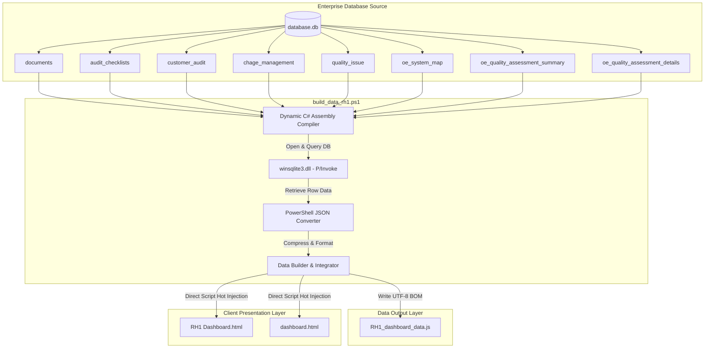

# 글로벌 완성차 OEM 품질 통합 관리 플랫폼 기술 명세서 (RH1 Dashboard Technical Manual)

본 문서는 글로벌 타이어 생산 공장 관리 및 완성차 OEM 품질 요구사항 수행 리스크를 사전에 예방하기 위해 구축된 **글로벌 완성차 OEM 품질 통합 관리 플랫폼 (RH1 Dashboard)**의 시스템 아키텍처, 핵심 계산 로직, UI/UX 디자인 시스템 및 기능 구조를 상세히 기술하는 공식 기술 명세서입니다.

---

## 1. 플랫폼 개요 (System Overview)

본 플랫폼은 글로벌 8대 타이어 생산 공장(KP, DP, JP, CP, HP, IP, MP, TP)의 다차원 품질 정보(인프라 시스템 구축 레벨, 사내 실제 현장 평가 부합률, 글로벌 완성차 고객사 부적합 지적사항, 사내 품질 불만 클레임)를 단일 스크린에서 비교 분석하고, 잠재적인 완성차 부적합 리스크를 사전에 식별하도록 구축된 고성능 인터랙티브 품질 통합 시스템입니다.

### 디자인 시스템 및 사용자 경험 설계 (Design Aesthetics)
* **사이버네틱 다크 테마 (Cybernetic Dark Theme)**: 장시간 모니터링 시 시각적 피로도를 극대화로 억제하고 데이터의 가독성을 최상으로 끌어올리기 위해, 심해의 깊은 블랙(배경: `rgba(6, 9, 19, 0.95)`)과 차콜 네이비 색상을 기본 테마로 채택하였습니다.
* **글래스모피즘 (Glassmorphism)**: 대시보드를 구성하는 주요 카드 패널은 반투명 아크릴 레이어 효과(`backdrop-filter: blur(12px)`)와 극도로 정밀하게 정의된 경계 보더(`border: 1px solid rgba(255, 255, 255, 0.05)`)를 설정하여, 하이테크 미래지향적이고 입체적인 레이아웃 질감을 완성합니다.
* **다이내믹 네온 인디케이터 (Dynamic Neon Indicators)**: 위험 경보 등급과 분석 등급에 부합하도록 네온 그린(안정), 네온 블루(우수), 네온 옐로우(중위 보완), 네온 핑크(고위험 취약) 광원 글로우 효과를 카드 보더와 계량 차트에 유기적으로 사용하여 탁월한 직관성을 보장합니다.
* **실시간 동기화 인터랙티브 (Synchronized Interactive Engine)**: 공장 선택 셀렉터, 상단 공정 필터 리본, 하단 검사 필터가 연동되어 사용자의 클릭 단 한 번만으로 차트 좌표, 히트맵 하이라이트, 마스터 요구사항 테이블이 전체 동기화되어 즉각 반응합니다.

---

## 2. Integrated Risk Compass (Tab 1)

Tab 1은 각 글로벌 생산 공장의 종합 품질 건강도 및 공정별 취약점을 정량 수학 모델로 계산하고 시각화하는 메인 관리 콘솔입니다.

### 2.1 종합 품질 리스크 지수 (CRI, Composite Risk Index) 산출 로직
CRI는 공장의 취약 위험도를 계량화하는 대표 지수입니다. 지수가 **높을수록 리스크가 크고 조치 시급성이 높은 취약 공장**임을 의미하며, 가중 평가 모델을 기반으로 작동합니다.

$$\text{CRI} = 0.4 \times (100 - \text{System Level}) + 0.3 \times (100 - \text{Assessment Score}) + 0.3 \times \min(100, \text{Issues} \times 10)$$

#### ① OE Quality System Level (품질 인프라 구축도 - 가중치 40%)
* **정의**: 글로벌 완성차 OEM 오딧 통과를 위해 기본적으로 구축해야 하는 10대 핵심 제조 공정 내의 총 260개 상세 품질 보증 인프라 요건 충족률입니다.
* **데이터 소스**: `oe_system_map` 테이블
* **계산 공식**: 개별 조건 항목은 3점(완벽 구축), 2점(부분 구축), 1점(미흡/취약), 0점(미구축)으로 평가되며, 해당 공정이나 공장에 적용 불가능한 항목은 `'N/A'`로 처리합니다.
  > [!NOTE]
  > 계산 결과 왜곡 및 가중치 희석을 방지하기 위해 `'N/A'` 처리된 항목은 분모와 분자의 연산 모수에서 완전히 제외 처리(Filtering Out)합니다.
  $$\text{System Level (\%)} = \left( \frac{\sum \text{개별 요건 획득 점수 (0~3점)}}{\sum \text{유효 요건 개수} \times 3} \right) \times 100$$

#### ② OE Quality Assessment Score (현장 실사 합격률 - 가중치 30%)
* **정의**: 사내 품질 진단 전문가 그룹이 직접 공장을 방문하여 현장 설비, 공정 프로세스, 표준 검증 상태를 감사(Audit)하여 평가한 실질적인 품질 상태 등급입니다.
* **데이터 소스**: `oe_quality_assessment_summary` 테이블
* **계산 공식**: 10대 생산 공정 전체 실사 종합 레코드(`process = 'Total'`)를 기준으로 설정하고, 핵심 5대 평가 차원(System, Infra, 4M, Field, Document)에 대한 평점(10점 만점)의 평균값에 10을 곱해 백분율로 환산합니다.
  $$\text{Assessment Score (\%)} = \left( \frac{\sum_{i=1}^{5} \text{차원별 실사 평점 (0~10점)}}{5} \right) \times 10$$

#### ③ CQMS Issues Penalty (품질 불만 및 클레임 감점 패널티 - 가중치 30%)
* **정의**: 최근 시장 또는 완성차 OEM 공장 단계(0 km 클레임) 및 완성차 주행 과정에서 확인된 중대 결함 컴플레인 건수에 대한 위기 패널티 가중치입니다.
* **데이터 소스**: `quality_issue` 테이블
* **계산 공식**: 접수된 유효 건당 10점의 패널티 점수를 누적 적용합니다. 단, 특정 공장에 클레임이 비정상적으로 집중되는 경우 전체 리스크 지수가 왜곡될 위험이 있어 패널티 최댓값 한계치(Upper Limit)를 100점(클레임 10건 이상 단계)으로 강제 제한 설계했습니다.
  $$\text{Issue Penalty Score} = \min(100, \text{누적 이슈 건수} \times 10)$$

### 2.2 리스크 등급 분류 및 경보 체계 (UI Alert Mapping)
산출 완료된 CRI 지수에 입각하여 글로벌 8대 공장은 실시간으로 3가지 경보 등급군으로 자동 배정되며, 메인 대시보드 인터페이스의 네온 테두리 및 인디케이터 컬러가 동적으로 제어됩니다.

| 리스크 그룹 명칭 | CRI 점수 범위 | 대응 네온 테마 및 CSS 스타일링 | 진단 가이드 및 비즈니스 조치 수준 |
| :--- | :---: | :--- | :--- |
| <span style="color:#ff0055">**CRITICAL HIGH RISK**</span> | $\text{CRI} \ge 41.1$ | 네온 핑크 (`#ff0055`) / 강한 네온 박스 글로우 | 품질 인프라 미비 및 실외 중대 클레임 집중 단계. 즉각적인 공정 개선 및 원인 규명 긴급 실사 처방 권고. |
| <span style="color:#ffb800">**MODERATE RISK**</span> | $38.1 \le \text{CRI} < 41.1$ | 네온 옐로우 (`#ffb800`) / 중간 수준의 황색 글로우 | 준수율 변동 및 잠재적 리스크 보존 단계. 분기별 추적 관찰 및 현장 문서 정합성 점검 추천. |
| <span style="color:#00ff66">**LOW RISK**</span> | $\text{CRI} < 38.1$ | 네온 그린 (`#00ff66`) / 안정적인 녹색 글로우 | 품질 인프라 구축 완비 및 현장 실사 합격 상태. 정기 표준 준수 모니터링 수행 가능. |

---

### 2.3 10대 공정 진단 레이더 차트 (10-Process Diagnosis Radar)
* **기능**: 선택된 개별 공정의 시스템 완성도를 종합 분석하고, 동시에 글로벌 8대 공장의 전체 평균 수준을 한눈에 대조하여 격차 분석(Gap Analysis)을 제공합니다.
* **레이더 차트 10대 핵심 축 (10-Process Axes)**:
  1. 수입 검사 (Incoming)
  2. 정련 공정 (Mixing)
  3. 압출 공정 (Extruding)
  4. 압연 공정 (Calendering)
  5. 재단 공정 (Cutting)
  6. 비드 공정 (Bead)
  7. 성형 공정 (Building)
  8. 가류 공정 (Curing)
  9. 완성검사 (Inspection)
  10. 물류 출하 (Shipping)
* **데이터 산출 로직**:
  * **Selected Factory (선택 공장 레벨 - 계열 실선)**: 선택된 특정 공장($K$)에 대해 각 공정($P$)의 매핑된 요건 중 `N/A`를 필터링 제외한 최종 충족 백분율 점수를 산출합니다.
    $$\text{Process Completeness (\%)} = \left( \frac{\sum \text{공정 P의 개별 요건 스코어 (0~3점)}}{\sum \text{유효 요건 개수} \times 3} \right) \times 100$$
  * **Global Average (글로벌 생산 공장 평균 - 계열 점선)**: 8대 공장 전체가 획득한 각 공정별 점수를 총합 산술 평균하여 글로벌 표준선으로 비교 도출합니다.
* **차트 범위 고정 규칙**: 중심축 대비 왜곡 없는 방사형 구조를 보증하기 위해, 차트 축 범위를 최소 `0%`에서 최대 `100%`로 명시 고정하고 20% 간격(`0%, 20%, 40%, 60%, 80%, 100%`)의 가이드를 렌더링합니다.

---

### 2.4 10대 공정별 품질 매트릭스 히트맵 (10-Process Quality Heatmap Matrix)
* **기능**: 글로벌 8대 공장(가로축 8개)과 10대 제조 공정(세로축 10개) 전체의 매트릭스 관계 속에서 취약 공장의 공정별 사각지대를 직관적으로 도출합니다.
* **임계 기준 색상 설계**:
  - **Perfect ($\ge 95\%$)**: 네온 그린 반투명 배경 (`rgba(0, 255, 102, 0.15)`) 및 밝은 녹색 보더
  - **Good ($\ge 90\%$)**: 네온 블루 반투명 배경 (`rgba(0, 191, 255, 0.15)`) 및 사이언 블루 보더
  - **Warn ($\ge 85\%$)**: 네온 옐로우 반투명 배경 (`rgba(255, 184, 0, 0.15)`) 및 네온 황색 보더
  - **Critical ($< 85\%$)**: 네온 핑크 반투명 배경 (`rgba(255, 0, 85, 0.18)`) 및 네온 핑크 보더
  - **N/A**: 회색 반투명 처리
* **인터랙티브 연동**: 대시보드 전반에 지정된 "현재 선택된 공장"의 열 전체를 굵은 사이드 네온 아웃라인 글로우로 실시간 맵핑 처리하여 비교 분석 편의성을 극대화합니다.

---

## 3. OE Quality System Level (Tab 2)

Tab 2는 공정별 품질 시스템 인프라 구축 현황과 실제 현장 작동 부합률의 격차를 실증 분석하는 고차원 분석 레이아웃입니다.

### 3.1 공정별 품질 인프라 및 부합도 2D 산점도 차트 (System Map - 2D Scatter Plot)
각 공정의 시스템 인프라 기반을 튼튼히 갖추었는지(X축: Infra Score), 그리고 그에 걸맞게 실제 생산 현장에서 부합하게 수행하고 있는지(Y축: Process Compliance)에 대한 2차원 위상 격차를 시각화합니다.

```
       [Y축: Process Compliance (%) - 실제 현장 표준 이행 및 프로세스 수행도]
        ▲  110% ──────────────────────────────────────────┐ (시각적 여유 공간)
        │                                                 │
        │                                 Perfect         │
        │                     Warning    (Green)          │
    80% ┼ - - - - - - - - - - - - - - - ┌─────────────────┤
        │                               │                 │
    60% ┼ - - - - - - - - - - - - - - - ┼ - - - - - - - - ┤
        │      Critical                 │  (Yellow)       │
        │      (Red)                    │                 │
    30% └──────────┼────────────────────┴─────────────────┴► [X축: Infra Score (%)]
                   50%                  80%               110%
```

#### ① 축별 지표 도출 공식
* **X축 (Infrastructure Score %)**: `oe_system_map` 요건 중 카테고리 코드 `'I'` (Infra) 항목들의 공장별 획득 평점 백분율입니다.
  $$\text{Infra (\%)} = \left( \frac{\sum \text{category 'I' 개별 스코어 (0~3점)}}{\text{category 'I' 유효 요건 개수} \times 3} \right) \times 100$$
* **Y축 (Process Compliance %)**: `oe_system_map` 요건 중 카테고리 코드 `'P'` (Process) 항목들의 공장별 획득 평점 백분율입니다.
  $$\text{Process (\%)} = \left( \frac{\sum \text{category 'P' 개별 스코어 (0~3점)}}{\text{category 'P' 유효 요건 개수} \times 3} \right) \times 100$$

#### ② 산점도 포인트 3대 등급 분류 기준 (Dot Color Mapping)
* **Perfect (안정 우수: <span style="color:#00ff66">네온 그린 Dot</span>)**:
  * **조건**: $\text{Infra} \ge 80\%$ **AND** $\text{Process} \ge 80\%$
  * **설명**: 설비 인프라와 표준 표준서 이행 모두 모범적으로 정착된 이상적인 글로벌 탑티어 표준 공정 상태.
* **Warning (보완 필요: <span style="color:#ffb800">네온 옐로우 Dot</span>)**:
  * **조건**: $\text{Infra} \ge 60\%$ **AND** $\text{Process} \ge 60\%$ (Perfect 범주 제외)
  * **설명**: 설비와 표준 프로세스의 정합성은 무난하나 일부 부합도 변동 요인이 잔존하여 주기적인 보강이 요구되는 중간 정비 상태.
* **Critical (고위험 취약: <span style="color:#ff0055">네온 핑크 Dot</span>)**:
  * **조건**: $\text{Infra} < 60\%$ **OR** $\text{Process} < 60\%$ (어느 한 축이라도 기준 미달 시 즉시 지정)
  * **설명**: 품질 인프라가 미비하거나, 서류상 표준은 존재하나 생산 현장에서 실질적으로 지켜지지 않아 잠재적인 대형 품질 클레임을 촉발할 수 있는 긴급 개선 대상 상태.

#### ③ 차트 안정성 및 해상도 최적화 설계
* **X/Y축 30% 하한선 고정**: 인프라나 부합도가 지나치게 낙후된 가상 좌표가 생성되어 그래프 하단에 뭉치는 현상을 차단하고 시각적 식별 해상도를 보장하기 위해 축의 최소 한계값을 **`30%`**로 축소 제어했습니다.
* **X/Y축 110% 상한선 버퍼 설계**: 100% 만점을 달성한 완벽한 공정의 레이블 텍스트와 원형 포인트가 차트 캔버스 가장자리 경계면에 밀착하여 절단되는 왜곡 현상을 방지하기 위해 최대 범위를 **`110%`**로 연장했습니다.
* **초과 레이블 필터 링킹**: 차트상의 110% 축 영역에 지저분하게 110% 숫자가 렌더링되지 않도록, 차트 그리드 레이블 출력 시 값이 100을 초과하면 공백문자가 강제 반환되도록 처리했습니다.
* **지능형 레이블 지시선 설계 (Custom Leader Line Plugin)**: 산점도 좌표의 레이블이 한곳에 중첩되는 인접 공정 간의 겹침 현상을 원천 배제하고자 포인터의 차트 캔버스상 X축 위상 위치를 스캔하여 좌측 반구에 위치한 점은 우하향 방향으로, 우측 반구의 점은 좌하향 방향으로 지시 선 (Leader Line)을 자동으로 뻗어나가며 정렬해 가독성을 비약적으로 높였습니다.

---

### 3.2 OE Quality Process Compliance (현장 실사 진단 현황 - Bar Chart)
* **기능**: 사내 품질 진단 기준에 따른 제조 공정별 실제 현장 평가 득점 수위를 수직 막대 차트로 입체 배열하여 공정 간 성숙도 편차를 도출합니다.
* **Y축 30% 하한선 설정**: 미세 편차 분석력 증대를 위해 Y축 최소 범위를 `30%`로 지정하고 최대 `100%` 한계선을 부여합니다.
* **등급별 막대 컬러 설계 (Threshold Bar Grading)**:
  - **Perfect (네온 그린막대 `#00ff66`)**: 점수 **`95% 이상`** 단계
  - **Warning (네온 옐로우막대 `#ffb800`)**: 점수 **`85% 이상 ~ 95% 미만`** 단계
  - **Critical (네온 핑크막대 `#ff0055`)**: 점수 **`85% 미만`** 단계
* **막대 가이드 범례(Bar Legend)**: 차트 하단 영역에 X축 그래프 범례와 병렬 배치된 3단 네온 컬러 가이드 기준표를 상시 노출하여 분석 정확도를 확보하였습니다.

---

## 4. AI Custom Audit (Tab 3)

Tab 3은 가장 복잡하고 강력한 오딧 대비 준비 기능으로, 완성차 고객사 감사 지적 이력과 사내 현장 실사 진단 미흡점을 연동해 원클릭으로 최적의 우선 개선 가이드를 자동 조합해 주는 지능형 패널입니다.

### 4.1 상단 대화형 통합 컨트롤 바 (Integrated Control Bar)
완성차 오딧 대응 실무자가 출무 계획에 부합하는 요건을 즉시 반영하여 타겟 체크시트를 빌드할 수 있도록 최상단에 고정 배치된 하이테크 컨트롤 패널입니다.
* **공장지 선택 (Factory Selector)**: 글로벌 8개 공장 중 자사 분석 대상 공장을 즉시 스위칭합니다.
* **감사 일정 달력 (Date Picker)**: 시작일과 종료일 입력 시 단순 텍스트 타이핑이 아닌 직관적인 모던 브라우저 시스템 달력(Calendar) 인터페이스를 즉시 활성화하여 날짜를 손쉽게 바인딩합니다.
* **완성차 고객사 셀렉터 (Customer Dropdown)**: 데이터베이스(`database.db` 내의 `customer_audits` 테이블)에 등록된 모든 글로벌 OEM 메이커 목록(`car_maker`)을 고유 식별자로 추출하여 드롭다운 리스트에 자동 파싱 주입합니다. 이에 추가로 특수 오딧 요건 분석을 지원하기 위해 **`HQ (본사 주관 종합감사)`** 옵션과 **`Internal (사내 보증 자가진단)`** 전용 드롭박스 옵션을 강제로 자동 탑재 설계하였습니다.
* **감사 목적 셀렉터 (Purpose Selector)**: 감사 유형에 따라 `Customer audit (완성차 고객 감사)`, `Internal Audit (사내 정기 보증 진단)`, `Quality Issue (품질 결함 특별 오딧)`, `Etc. (기타 수시 점검)`를 분류 지정해 하단 정보를 동기화합니다.

---

### 4.2 11대 핵심 생산 공정 리본 필터 (11-Process Ribbon Filters)
* **제조 프로세스 전면 반영**: 제조 공정 분석 흐름을 완전 커버하기 위해, 기존 8개 분류에서 세분화하여 **`All Process (전체 공정)`**, **`Incoming (수입 검사)`**, **`Mixing (정련)`**, **`Extruding (압출)`**, **`Calendering (압연)`**, **`Cutting (재단)`**, **`Bead (비드)`**, **`Building (성형)`**, **`Curing (가류)`**, **`Inspection (완성검사)`**, **`Shipping (물류 출하)`**의 11개 공정 전용 리본 필터 버튼 바를 구현했습니다.
* **실시간 필터 트리거**: 리본 필터 클릭 시 전역 상태 변수(`state.tab3Process`)가 업데이트되며 하단의 지적 사항 이력 테이블과 오딧 현장 실사 가이드가 밀리초 단위로 초고속 렌더링 갱신됩니다.

---

### 4.3 상하 분할 레이아웃 및 교차 추천 로직 (Vertical Layout & Cross recommendation Engine)

화면을 복잡하게 좌우로 나누지 않고 상하로 명확히 분할 배치하여 텍스트 데이터의 세부 파싱 정보와 보증 가이드라인의 시인성을 한계까지 보장합니다.

#### ① 상단 화면: 완성차 고객사 감사 지적 이력 기반 맞춤형 체크시트 (Customer Audit Checklist)
지정된 공장과 고객사에 특화된 지적 이력 데이터를 호출합니다. 만약 신규 론칭 공장이라서 해당 공장에 대상 고객사 감사 이력이 부재한 상황일 경우, 사용자가 혼란 없이 철저히 대비할 수 있도록 강력한 **우선순위 지능형 폴백 참조 알고리즘(Prioritized Fallback Reference Mode)**을 탑재했습니다.

* **이력 추출 우선순위 체계 (Fallback Priority Cascade)**:
  - **1순위 (최우선)**: 선택한 현재 공장에서 수행된 해당 완성차 고객사의 실제 오딧 지적 이력을 추출합니다.
  - **2순위 (대안 참조)**: 만약 1순위 데이터가 전무할 경우, 타 생산 공장 전수 데이터를 검색하여 해당 완성차 고객사로부터 지적받았던 실제 이력과 당사 대책 데이터를 실시간 긴급 백업 참조 도출합니다.
  - **3순위 (표준 오딧)**: 1, 2순위 데이터가 모두 부재하여 분석 신뢰성이 저하될 수 있는 최극단 상황의 경우, 글로벌 완성차 3대 지표인 **`Ford / BMW / Hyundai`**의 종합 지적 이력 데이터를 자동 롤백 및 결합 도출하여 빈틈없는 대비 장벽을 구축합니다.
* **교차 참조 시각적 오버레이 알림 (Notice Banner)**: 1순위 데이터가 부재하여 2, 3순위 폴백 참조 모드로 전환 도출된 경우, 테이블 바로 상단에 "⚠️ [안내] 해당 공장에는 해당 고객사의 감사 이력이 부재하여 타 공장의 실제 감사 이력을 매핑한 벤치마킹 데이터셋을 표출 중입니다."라는 옐로우 시인성 네온 경고 패널을 동적으로 자동 개설하여 실무자가 데이터 성격을 즉시 규명할 수 있도록 보증합니다.

#### ② 하단 화면: 현장 품질 실사 취약점 진단 분석 (Actual OE Quality Assessment Items)
사내 실제 품질 실사 결과를 기반으로 오딧 통과를 가로막는 취약 요소를 완벽히 교정하기 위해, 상하 2단으로 세분화한 격차 극복 테이블 레이아웃을 구현했습니다.

* **A. 최우선 준비 아이템 테이블 (상단 배치 - High-Priority Prep Items)**:
  - **기준**: 현장 실사 진단 지표 스코어가 **`6점 이하`**인 위태로운 취약 항목만 한정 필터링 추출합니다.
  - **우선 조비 정렬**: 실무자가 오딧 전 가장 시급하게 개선해야 하는 영역을 한눈에 식별할 수 있도록, **`공정 오더 순서 순`**으로 정렬하되 동점의 경우 **`점수가 가장 낮은 취약 항목(Worst Score)을 최상단`**으로 먼저 배치하는 최적의 정렬 조건으로 정렬하여 렌더링합니다.
  - **개선 코멘트 및 동적 벤치마킹 포인트 매핑**:
    - **자동 개선 코멘트**: 6점 이하인 해당 요건에 최적화된 프로세스 점검 가이드(예: 선입선출 표준 점검, 설비 정밀 캘리브레이션 등)를 실시간 동적으로 처방 매핑해 제공합니다.
    - **글로벌 우수 모범사례 매핑(Peer Benchmarking)**: 당사 8대 공장 전체 데이터셋을 실시간 크로스 조인 스캔하여, 현재 개선이 필요한 요건 항목에 대해 **실제 10점 만점을 득점한 우수 모범 공장 명칭과 그 공장의 우수 관리 상태 및 고득점 비결 가이드라인**을 동적으로 도출해 벤치마킹용 모범 답안으로 즉시 가이드합니다.
* **B. 표준 우수 항목 테이블 (하단 배치 - Standard Excellent Items)**:
  - **기준**: 진단 평점 스코어가 **`8점 이상 10점 이하`**인 비교적 안전한 관리 상태의 현황 데이터를 하단에 나열합니다.
  - **N/A 전면 제외**: 유효하지 않은 보증 준비 혼선을 종식하기 위해 평가 부적합 대상인 `'N/A'` 항목은 연산 및 출력 테이블에서 철저히 영구 차단합니다.

---

### 4.4 오딧 전략 인사이트 위젯 종단 확장 (Intelligent Decision Widgets)
화면 하단에 탑재된 인사이트 가이드 패널들이 다량의 데이터와 긴 가이드 텍스트로 인해 가독성이 저하되던 물리적 한계를 완전히 극복하기 위해, 해당 위젯 프레임의 세로 높이 제한을 비약적으로 확장(대형 세로 종단 뷰포트 확보)하여 시인성과 가독성을 혁신했습니다.
* **Top 20 개선 권고 과제 (Top 20 Improvement Recommendations)**: 단순 Top 3 요약을 뛰어넘어, 오딧 합격을 위해 반드시 선결되어야 하는 공정 내 최우선 교정 요건 및 취약 항목을 최대 **20대 어젠다(Top 20)**로 정교하게 필터 정렬 도출하여 대규모 표준 로드맵을 선사합니다.
* **AI 권고 조치 가이드라인 (AI Recommended Operational Actions)**: 사내 품질 시스템 구축 맵, 사외 완성차 고객 지적 사안, 현장 실사 결과, 사내 품질 이슈 수위를 복합적으로 해석하여, 현재 선택한 공장의 종합 등급(CRI) 수준과 공정에 대응하는 입체적인 종합 액션 플랜을 AI 요약본으로 실시간 매칭 조율해 지시합니다.

---

### 4.5 원클릭 오딧 리포트 CSV/Excel 내보내기 엔진 (Client-Side CSV Export Engine)
오딧 실무자가 회의록을 작성하거나 협력업체 공유 및 오프라인 회람용 오딧 체크시트 인쇄가 용이하도록, 순수 클라이언트사이드 자바스크립트 엔진으로 구동하는 대형 데이터 내보내기 기능을 각 세부 테이블 상단 우측에 최적의 네온 버튼 형태로 탑재했습니다.
* **3대 개별 다운로드 허브 버튼 개설**:
  1. **[고객 오딧 이력 다운로드]** (btn-export-customer-audit)
  2. **[최우선 준비 항목 다운로드]** (btn-export-priority-prep)
  3. **[전체 체크시트 다운로드]** (btn-export-remaining)
* **엑셀 한글 깨짐 완전 원천 방지 (UTF-8 BOM Injection)**: 한글 운영체제 기반의 MS Excel 환경에서 CSV 파일을 오픈할 때 인코딩 미스매치로 인해 발생하는 끔찍한 한글 깨짐 현상을 원천 방지하기 위해, 파일 스트림의 가장 첫머리에 3바이트 of UTF-8 BOM 바이트 마크(`\uFEFF`)를 강제 삽입 설계하여 어떤 오프라인 환경에서도 한글이 100% 명확하게 오픈되도록 품질을 보증했습니다.

---

## 5. 데이터 파이프라인 및 Standalone 고속 연산 (Technical Core)

대형 데이터베이스 연동과 대용량 데이터 전송에 의한 네트워크 지연 요인을 제거하고 모바일 태블릿, 폐쇄망 공장 PC 등 어떠한 특수 보안 환경에서도 0.1초 이내에 로딩 및 즉각 연산이 보장되도록 오프라인 단일 파일 아키텍처(Standalone Local Embedded Architecture)를 취합니다.

### 5.1 고성능 임베디드 데이터 구조
`oe_system_map`의 260개 마스터 기준, `oe_quality_assessment_details`의 1,512개 전수 점수 정보, `customer_audits`의 완성차 지적 내역, 그리고 `documents` 표준 매뉴얼 등 수천 행의 엔터프라이즈급 원본 레코드 테이블들을 하나의 자바스크립트 구조체(`RH1_dashboard_data.js`)로 압축 직렬화하여 파일 내부에 직접 내장시켰습니다.

### 5.2 winsqlite3.dll 연동 C# 고속 빌더 (`build_data_rh1.ps1`)

로컬 윈도우 환경에 별도의 SQLite 엔진 설치 없이도 윈도우 시스템 기본 라이브러리인 `winsqlite3.dll`을 P/Invoke 방식으로 결합 호출하는 고성능 C# 래퍼 코드가 PowerShell 파이프라인 컴파일 엔진 내부용으로 직접 설계되었습니다.

1. **P/Invoke 선언 및 DLL 바인딩**:
   C# 스크립트는 `winsqlite3.dll`의 표준 API 함수(`sqlite3_open16`, `sqlite3_prepare16_v2`, `sqlite3_step`, `sqlite3_column_count`, `sqlite3_column_name`, `sqlite3_column_text`, `sqlite3_column_type` 등)를 참조하며, Unicode(Hangeul) 호스트 및 시스템 세팅에서 문자가 왜곡되지 않도록 `CharSet = CharSet.Unicode` 및 UTF-8 바이트 어레이 포인터 수동 디코딩 구조체 함수(`UTF8PtrToString`)를 명시 구현하였습니다.
2. **다중 테이블 초고속 일괄 질의**:
   PowerShell 컴파일러 실행 시 `database.db` 파일로부터 다음 8개 핵심 테이블 데이터를 실시간 고속 인출합니다:
   * `documents` (686개 마스터 감사 기준서 원천)
   * `audit_checklists` (체크리스트 질문 요건 세부 사항)
   * `customer_audit` (완성차 OEM 실제 오딧 지적 이력)
   * `chage_management` (공장별 4M 변경 이력)
   * `quality_issue` (품질 불만 및 클레임 위기 원천)
   * `oe_system_map` (인프라 구축도 원천 데이터)
   * `oe_quality_assessment_summary` (실사 결과 오행 평가 요약 데이터)
   * `oe_quality_assessment_details` (실사 상세 득점 및 지적 사항 데이터)
3. **JSON 정규화 직렬화 및 자동 인젝션**:
   추출된 각 테이블 데이터 행은 PowerShell의 `ConvertTo-Json` 파이프라인을 통과하며 딥 뎁스 레벨(`-Depth 10`) 및 압축 모드(`-Compress`)로 초고속 구조화 변환됩니다. 완성된 대용량 데이터 구조체는 `RH1_dashboard_data.js` 파일로 출력 저장되는 것과 동시에, `RH1 Dashboard.html` 및 `dashboard.html` 본문 소스 내의 정적 `<script>` 태그 영역을 정규식 매칭기(`(?s)<script>\s*/\*\*\s*\* AUTOMATICALLY GENERATED DATABASE EXPORT.*?</script>`)로 식별하여 **실시간 핫 인젝션(Direct Inline Hot Injection)** 방식으로 직접 업데이트 주입됩니다. 이로써 외부 네트워크 연결이나 로컬 웹 서버 구동 없이도 실행 가능한 완벽한 **100% Standalone 단일 파일 플랫폼**이 완성됩니다.

---

### 5.3 데이터 계보 및 파이프라인 연동 흐름 (Data Lineage & Pipeline Flow)

본 플랫폼의 데이터 정제 및 최종 렌더링에 이르는 엔드투엔드(End-to-End) 데이터 흐름은 다음과 같습니다.



---

## 6. 플랫폼 구동 및 데이터 업데이트 매뉴얼 (Operations & Data Update Guide)

본 시스템은 현업 실무자나 시스템 관리자가 복잡한 개발 인프라 없이도 품질 정보를 정밀 수시 업데이트할 수 있도록 초간편 1-클릭 실행 환경을 제공합니다.

### 6.1 데이터베이스 구조 가이드 (Database Schema Map)
업데이트 시 참고해야 하는 `database.db` 내 핵심 3대 테이블 구조와 레코드는 다음과 같습니다:
1. **`oe_system_map`**: 공장별 10대 공정의 260개 인프라 구축 점수 (0~3점 및 N/A)를 기입합니다.
2. **`oe_quality_assessment_details`**: 사내 현장 실사 진단의 상세 지적 문항, 득점(0~10점), 권고 가이드 등을 저장합니다.
3. **`customer_audit`**: 실제 완성차 OEM 오딧의 지적 내용(`point_out`), 분석 원인(`root_cause_analysis`), 조치 대책(`counter_measure`), 진행 상태(`status`)를 기록합니다.

### 6.2 1-클릭 초고속 컴파일 가이드 (Update Step-by-Step)
데이터 수치가 새로 등록되거나 품질 클레임이 변동될 시, 다음 단계에 의거하여 즉각 플랫폼에 동기화할 수 있습니다:
1. **데이터 편집**: SQLite DB 편집기(예: DB Browser for SQLite)로 `database.db`에 접속하여 추가되거나 변경된 품질 실사 기록, 공정 체크리스트, 또는 클레임 내역을 업데이트하고 저장(Write Changes)합니다.
2. **배치 컴파일러 실행**: 윈도우 탐색기에서 `C:\Users\HANTA\Desktop\gemini\Run_Data_Build.bat`를 마우스 우클릭하여 **'관리자 권한으로 실행'** 하거나, PowerShell 콘솔에서 아래 스크립트를 입력 실행합니다:
   ```powershell
   powershell -ExecutionPolicy Bypass -File C:\Users\HANTA\Desktop\gemini\build_data_rh1.ps1
   ```
3. **Standalone 배포 확인**: 컴파일이 1초 내에 완료되며, 콘솔 창에 각 테이블의 행(Row) 정보 로드 현황 및 HTML 내 임베디드 직접 주입 결과가 성공 메시지로 출력됩니다.
4. **대시보드 구동**: 갱신 완료된 `RH1 Dashboard.html`을 웹 브라우저(Chrome, Edge 등)에서 더블 클릭으로 구동하여 최신 분석 수치 및 벤치마킹 데이터가 반영된 실시간 인터랙티브 대시보드를 시청각 검증합니다.

---

## 7. UI/UX 디자인 시스템 및 스타일 명세 (Design Systems & Styling Spec)

본 플랫폼은 시각적 가독성 극대화와 프리미엄 하이테크 감성을 완벽 구현하기 위해, 세밀하게 정의된 사이버네틱 다크 테마 디자인 토큰을 강제 탑재하였습니다.

### 7.1 핵심 하이테크 타이포그래피 (Typography System)
* **숫자 및 계량 값**: 미래지향적이고 테크니컬한 가독성을 제공하는 구글 웹폰트 **`Rajdhani`** (Semibold, Bold) 체계를 바인딩하여, 차트 좌표 및 점수 계판의 시인성을 한계까지 향상시켰습니다.
* **주요 위젯 타이틀 및 영문 레이블**: 사이버네틱 무드를 고양시키는 고해상도 테크 폰트 **`Orbitron`** (Bold)을 선별 채택하였습니다.
* **본문 및 설명 텍스트**: 정적이고 정합성 높은 한글/영문 고딕 서체인 **`Inter`** 및 시스템 기본 폰트(Segoe UI, "맑은 고딕")를 계층형 안티앨리어싱 설계하여 최상의 가독성을 보증합니다.

### 7.2 다이내믹 네온 인디케이터 컬러 맵 (Color Tokens & Glow Effects)
대시보드에 사용되는 광원 지표는 위기 수준 및 등급에 연동되어 동적인 CSS 글로우 박스 필터와 보더 아웃라인으로 렌더링됩니다.

| 디자인 지표명 | 대표 헥사코드 (HEX) | 대표 RGB 수치 | CSS 박스 글로우 필터 (Box Glow Style) | 시각적 적용 대상 및 컴포넌트 |
| :--- | :---: | :--- | :--- | :--- |
| <span style="color:#ff0055">**Neon Pink**</span> (위험) | `#ff0055` | `rgb(255, 0, 85)` | `box-shadow: 0 0 10px rgba(255, 0, 85, 0.4)` | CRI 고위험 경보 보더, 히트맵 임계값 미달 쉘, 6점 이하 최우선 개선 항목 등 점수 표출 영역 |
| <span style="color:#ffb800">**Neon Yellow**</span> (경고) | `#ffb800` | `rgb(255, 184, 0)` | `box-shadow: 0 0 10px rgba(255, 184, 0, 0.4)` | CRI 중위험 경보 보더, 히트맵 보완 경고 쉘, 7~8점대 차트 막대 및 산점도 주의 Dot |
| <span style="color:#00ff66">**Neon Green**</span> (안정) | `#00ff66` | `rgb(0, 255, 102)` | `box-shadow: 0 0 10px rgba(0, 255, 102, 0.4)` | CRI 저위험 안전 보더, 히트맵 모범 쉘, 9~10점대 합격점 막대 및 우수 항목 만족 뱃지 |
| <span style="color:#00f2fe">**Neon Cyan**</span> (주요 포커스) | `#00f2fe` | `rgb(0, 242, 254)` | `box-shadow: 0 0 10px rgba(0, 242, 254, 0.4)` | 글로벌 공장 리본 선택 아웃라인, 인터랙티브 매칭 뱃지, 히트맵 하이라이트 경계 보더 |

### 7.3 글래스모피즘 아크릴 보드 구현 상세 (Glassmorphism Specifications)
모든 카테고리 카드 패널과 다이어그램 컨테이너는 심해의 깊은 다크 배경 위에 투명 유리를 얹어 놓은 듯한 프리미엄 글래스모피즘 효과가 적용되어 있습니다:
* **백그라운드 블러 효과**: `backdrop-filter: blur(12px) saturate(180%)`
* **반투명 카드 배경**: `background: rgba(16, 21, 38, 0.65)` 또는 `rgba(10, 14, 28, 0.8)`
* **입체형 베벨 엣지 보더**: `border: 1px solid rgba(255, 255, 255, 0.04)` 및 `border-top: 1px solid rgba(255, 255, 255, 0.08)`를 혼합하여 물리적 두께감을 극적으로 암시합니다.

---
본 가이드는 최고 권위의 완성차 글로벌 오딧 수검 및 품질 자가 진단 역량을 비약적으로 향상시키기 위한 시스템 운영 사양서입니다. 플랫폼의 데이터 정합성과 디자인 시스템 무결성을 준수하기 위하여 본 명세 사양서 지침에 의거한 관리를 강력하게 지향합니다.
