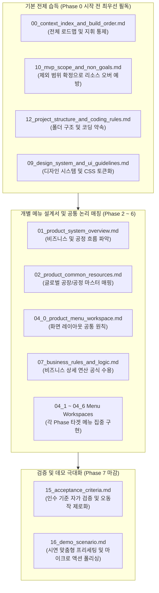

# 🗺️ 00 Context Index and Build Order

## 1. Purpose

본 문서는 사내 해커톤(Hackathon)용 **Risk-Based Audit Checklist System** 개발을 위한 통합 인덱스 가이드 및 단계별 빌드 순서 정의서입니다. 

자율적 코드 작성을 수행하는 AI 코딩 에이전트(바이브코딩 도구)가 설계의 전체적인 로드맵과 맥락을 완벽히 파악하도록 조율하며, 한 번에 모든 시스템을 무리하게 구현하지 않고 **점진적인 단계(Phase)**를 거쳐 무결하게 동작하는 MVP(Minimum Viable Product)를 구축할 수 있도록 제어하는 지휘 본부 역할을 수행합니다.

---

## 2. Product Goal

### ① 시스템 본연의 목적
**Risk-Based Audit Checklist System**은 정형화된 완성차 고객사(OEM) 규격서 데이터와 제조 현장의 실제 품질 리스크 이력(과거 품질 실패 QI, 4M 공정 변경점, 감사 지적사항 Audit Findings)을 지능적으로 유기 융합하는 **차세대 위험 기반 감사(Risk-Based Auditing) 모니터링 및 실무 대응 웹 대시보드**입니다. 
공장별로 실시간 축적되는 리스크 가중치를 연산하여 취약 공정을 자동으로 도출하고, 이에 특화된 '현장 맞춤형 자체 감사 체크리스트' 및 'AI 조치 계획(SOP 개정안 및 합치 증적 가이드)'을 도출함으로써 품질 보증 역량을 극대화합니다.

### ② 해커톤 MVP 목표
본 해커톤 프로젝트의 최우선 순위는 **"HTML5, CSS3, Vanilla JavaScript 기반의 고성능 정적 프론트엔드 단일 페이지 웹앱(SPA) 구축 및 로컬 정적 데이터셋 비동기 fetch와 브라우저 로컬 저장소(localStorage) 기반 자가 데이터 영속성 증명"**입니다. 
따라서 무거운 백엔드 미들웨어 서버 및 실제 SQLite DB 연동으로 발생할 수 있는 시연 당일의 오동작 확률을 원천 배제하되, 클라이언트 단에서의 무지연 고속 데이터 가공 및 필터링 알고리즘, 그리고 정교하고 설득력 있는 Mock AI 가상 응답 체계를 통해 극도의 심미성(Premium Aesthetics, Aesthetic WOW)과 최상위 하이엔드 테크 감각을 완성도 있게 증명합니다.

---

## 3. Context Document Map

본 시스템의 전체 설계, 정책, 화면 요건 및 구현 경로를 설명하는 17개 표준 컨텍스트 문서의 마스터 맵입니다.

| No. | File | Category | Purpose | Used In Phase |
| :---: | :--- | :---: | :--- | :---: |
| **00** | [00_context_index_and_build_order.md](file:///home/jumasi/risk_hunter/context/00_context_index_and_build_order.md) | **Index** | 전체 설계 문서의 목차, 단계별 빌드 오더 및 바이브코딩 AI 지침 정의 | **All Phases** |
| **01** | [01_product_system_overview.md](file:///home/jumasi/risk_hunter/context/01_product_system_overview.md) | **Product Context** | 전체 비즈니스 배경, 타겟 생산 공장/공정 마스터 및 전체 업무 흐름 개요 | Phase 0, 1, 2, 7 |
| **02** | [02_product_common_resources.md](file:///home/jumasi/risk_hunter/context/02_product_common_resources.md) | **Product Context** | 자사 8대 공장 정보, 15대 표준공정, 4M 요소, 공통 증적 유형 등 참조 마스터 데이터 정의 | Phase 1, 2, 3, 5 |
| **03** | [03_product_database_schema.md](file:///home/jumasi/risk_hunter/context/03_product_database_schema.md) | **Product Context** | 통합 DB(database.db) 스키마 구조, 데이터 흐름도 및 공장 리스크 가중치 산출 공식 정의 | Phase 1, 3, 4, 7 |
| **04_0** | [04_0_product_menu_workspace.md](file:///home/jumasi/risk_hunter/context/04_0_product_menu_workspace.md) | **Menu Context** | 전체 메뉴 통합 및 화면/업무 상세 설계 개요 (5대 메인 메뉴 + 플로팅 및 SQL 콘솔 화면 구성 사양) | **All (Reference)** |
| **04_1**| [04_1_menu_dashboard.md](file:///home/jumasi/risk_hunter/context/04_1_menu_dashboard.md) | **Menu Context** | 1. Dashboard - 전체 Audit 현황, D-Day 타임라인, 리스크 통계 요약 화면 설계서 | Phase 2 |
| **04_2**| [04_2_menu_audit_planning.md](file:///home/jumasi/risk_hunter/context/04_2_menu_audit_planning.md) | **Menu Context** | 2. Audit Planning - 일정 등록, 기간별 가이드 피드 및 준비 체크리스트 화면 설계서 | Phase 3 |
| **04_3**| [04_3_menu_plant_risk_action.md](file:///home/jumasi/risk_hunter/context/04_3_menu_plant_risk_action.md) | **Menu Context** | 3. Plant Risk & Action - 공장별 이력 및 리스크 분석, 지적사항 수검 및 조치 입력 화면 설계서 | Phase 4 |
| **04_4**| [04_4_menu_ai_action_advisor.md](file:///home/jumasi/risk_hunter/context/04_4_menu_ai_action_advisor.md) | **Menu Context** | 4. AI Action Advisor - 부적합 상황 8D 개선안 도출 및 SOP 수정 제안 화면 설계서 | Phase 5 |
| **04_7**| [04_7_menu_admin_settings.md](file:///home/jumasi/risk_hunter/context/04_7_menu_admin_settings.md) | **Menu Context** | Admin Settings - 사용자, 권한 매트릭스, 감사 로그 및 가상 SQL 콘솔 설계서 | Phase 7 |
| **05** | [05_product_ai_features.md](file:///home/jumasi/risk_hunter/context/05_product_ai_features.md) | **Rule Context** | 의무조항 식별 룰, 오픈엔드 질문 가공 기준, 공정 키워드 매퍼 추천 로직 명시 | Phase 3, 5 |
| **06** | [06_product_policy_permission.md](file:///home/jumasi/risk_hunter/context/06_product_policy_permission.md) | **Rule Context** | 상태값 표준 코드, 3단계 통합 권한(RBAC) 및 사용자 DB 정책, AI 제안 데이터 승인 프로세스 명시 | Phase 4, 6 |
| **07** | [07_business_rules_and_logic.md](file:///home/jumasi/risk_hunter/context/07_business_rules_and_logic.md) | **Rule Context** | 공정 매핑 키워드 매칭 우선순위, 리스크 점수 상한 클램핑 및 동적 뱃지 룰 정의 | Phase 1, 2, 4, 5 |
| **08** | [08_domain_terms_glossary.md](file:///home/jumasi/risk_hunter/context/08_domain_terms_glossary.md) | **Rule Context** | 품질 보증 및 자동차 제조 공정 전문 도메인(SOP, OCAP, VDA, IATF 등) 해설 용어집 | **All (Reference)** |
| **09** | [09_design_system_and_ui_guidelines.md](file:///home/jumasi/risk_hunter/context/09_design_system_and_ui_guidelines.md) | **Rule Context** | HSL 프리미엄 다크 테마 컬러 팔레트, 글래스모피즘 CSS 스타일, 반응형 레이아웃 가이드 | Phase 0, 2~7 |
| **10** | [10_mvp_scope_and_non_goals.md](file:///home/jumasi/risk_hunter/context/10_mvp_scope_and_non_goals.md) | **Build Context** | 해커톤 단기 납품을 위해 집중할 핵심 기능군 및 제외 범위(Non-Goals) 선언 | **All (Reference)** |
| **11** | [11_implementation_sequence.md](file:///home/jumasi/risk_hunter/context/11_implementation_sequence.md) | **Build Context** | 각 Phase별 세부 개발 절차, 컴포넌트 마일스톤 및 실시간 마이그레이션 이정표 | **All (Reference)** |
| **12** | [12_project_structure_and_coding_rules.md](file:///home/jumasi/risk_hunter/context/12_project_structure_and_coding_rules.md) | **Build Context** | 폴더 구조 표준화, 바닐라 CSS 우선 가이드, 파일 분할 및 전역 예외 처리 코딩 룰 | **All (Reference)** |
| **13** | [13_prompt_templates.md](file:///home/jumasi/risk_hunter/context/13_prompt_templates.md) | **Build Context** | 8D 영구 대책 수립, 공정 SOP 표준 가공 등 Gemini 프롬프트 엔지니어링 룰셋 | Phase 5 |
| **14** | [14_sample_queries_and_test_data.md](file:///home/jumasi/risk_hunter/context/14_sample_queries_and_test_data.md) | **Build Context** | 정적 CSV/JSON 목업 데이터 셋 및 실시간 조인 쿼리 뷰어용 정밀 예시 스크립트 | Phase 1, 7 |
| **15** | [15_acceptance_criteria.md](file:///home/jumasi/risk_hunter/context/15_acceptance_criteria.md) | **Build Context** | 각 메뉴별 마우스 호버 동작, 필터 연동, 파일 다운로드 성공 여부의 무결성 검증 기준 | **All (Reference)** |
| **16** | [16_demo_scenario.md](file:///home/jumasi/risk_hunter/context/16_demo_scenario.md) | **Demo Context** | 해커톤 심사위원을 WOW하게 만들기 위한 "스토리 기반 3단계 시연 시나리오" 시크릿 스크립트 | Phase 7 |
| **18** | [18_document_library_db_transition_spec.md](file:///home/jumasi/risk_hunter/context/18_document_library_db_transition_spec.md) | **Product Context** | 완성차(OEM) 기술 조항의 타이어 제조공정 역해석 매핑 스펙 및 정적 데이터베이스 전환 가이드 | Phase 1, 6 |

---

## 4. Recommended Reading Order

바이브코딩 AI 에이전트가 완벽한 품질의 코드를 일관성 있게 집필할 수 있도록 유도하는 문서 탐독 순서입니다.



> [!TIP]
> **AI 프롬프트 인젝션 팁**: 특정 메뉴의 기능을 구현할 때, 전체 문서를 대책 없이 다 읽히면 맥락 유실(Context Truncation)이나 엉뚱한 부수 효과(Side Effect)가 발생할 수 있습니다. 
> 반드시 **현재 타겟 Phase에 정렬된 '최소 참조 목록'만 인계**하여 개발 효율과 안전성을 비약적으로 높이십시오.

---

## 5. Build Principles

성공적인 해커톤 결과물 도출을 위한 핵심 빌드 가이드라인입니다.

*   **100% 클라이언트 사이드 싱글 페이지 애플리케이션(SPA) 구동 원칙**: Node.js, Python, FastAPI 등 외부 백엔드 서버 없이 웹 표준 브라우저가 직접 페이지를 렌더링하고 로직을 실행하는 고성능 프론트엔드-온리 환경을 지향합니다.
*   **정적 JSON 비동기 Fetch 및 localStorage 기반 영속성**: 물리 DB 커넥션을 여는 대신, `data/` 디렉토리에 적재된 마스터 데이터 JSON 파일들을 비동기 fetch하여 클라이언트 인메모리에 적재 연산하고, 사용자가 입력 및 변경한 결과는 브라우저 영속 보관함(`localStorage`)에 저장 및 동기화합니다.
*   **정교한 Mock AI Response 및 로딩 시뮬레이션**: 외부 API 인프라나 인터넷 차단 상황에서도 중단 없이 초고속 실무 대응 계획을 도출하는 딕셔너리 기반의 가상 AI 대응 모듈을 탑재하고, 개선 대기 시간을 체감하도록 우아한 로딩 스피너 및 프로그레스 바를 연출합니다.
*   **보안 SQL-like 샌드박스 장착**: SQL 에뮬레이팅을 통해 SELECT 쿼리 템플릿 탐색 결과를 메모리에서 직접 렌더링하고, 파괴성 구문(`INSERT`, `UPDATE`, `DELETE`, `DROP`, `ALTER`, `CREATE`, `REPLACE` 등) 입력 시 정규식 패턴 검사로 즉각 경고창을 인서트하여 원천 데이터 보호 요건을 증명합니다.
*   **안정적인 예외 처리**: 파일 미탐지, 잘못된 JSON 파싱 등의 장애 상황에서도 화면 전체가 멈추지(White-out) 않도록 우아한 글래스모피즘 에러 바운더리 알럿을 노출합니다.
*   **Gemini 준수 사항 연계**: 코딩 아키텍처 및 에이전트 행동 제한 룰은 프로젝트 루트의 **[GEMINI.md](file:///home/jumasi/risk_hunter/GEMINI.md)** 정책을 전적으로 적용하며 항상 상위 지침으로 준수합니다.

---

## 6. Phase Overview

해커톤 MVP 빌드를 지탱하는 8대 Phase의 점진적 릴리즈 지도입니다. 각 단계는 완전히 구동 및 확인 가능한 결과물을 생산하며 단절 없이 매끄럽게 흐릅니다.

| Phase | Goal | Main Documents | Expected Output | Exit Criteria |
| :---: | :--- | :--- | :--- | :--- |
| **Phase 0** | **Static Project Scaffold** | `04`, `09`, `10`, `12` | `index.html`, `styles.css`, `app.js` 기본 뼈대, 신규 5대 메뉴 전환 탭, 플로팅 챗봇 버튼 및 ADMIN 전용 SQL 콘솔 레이아웃 구축 | `index.html`을 브라우저에 직접 구동했을 때 HSL 다크 테마 기반의 레이아웃이 미려하게 그려지며 신규 5대 탭 전환과 ADMIN 선택 시 SQL Explorer 메뉴 노출이 정상 작동할 것. |
| **Phase 1** | **Data Loading & Common Resources** | `02`, `03`, `07`, `14` | `data/` 디렉토리에 정적 JSON 마스터 데이터(공장, 예정 감사 일정, 마스터 체크리스트, 과거 지적사항 등) 배치, 비동기 데이터 fetch 엔진 장착, 사이드바 글로벌 필터 동적 생성 | 정적 JSON 데이터 파일들이 비동기 파싱되어 전역 변수에 적재되고, 사이드바 필터에 "ALL", "DP" 등의 옵션이 마스터와 정밀히 연계되어 동적 로드될 것. |
| **Phase 2** | **Dashboard** | `04_1`, `01`, `07`, `09` | 상단 전사/공장/공정 Audit 현황 요약 카드, 예정 Audit D-Day 일정 위젯, 주요 품질 리스크 분배 도넛/바 차트, 개선조치 진행률 게이지 바 개발 | 필터 조작 시 대시보드 요약 지표와 차트가 동적 갱신되고, 예정 감사 일정 카드 및 조치 비율 지표가 흐트러짐 없이 미려하게 렌더링될 것. |
| **Phase 3** | **Audit Planning** | `04_2`, `02`, `09` | Audit 일정 등록 모달창, 기간별 준비 가이드 타임라인 피드, 사전 준비 필수 체크리스트 테이블 그리드 및 로컬스토리지 완료 상태 연동 | 신규 Audit 일정을 팝업창에서 기입하여 등록 시 리스트에 반영되고, 기간별 가이드라인 피드가 시각적으로 우아하게 흐르며, 사전 체크리스트 토글 상태가 브라우저를 새로고침해도 유지될 것. |
| **Phase 4** | **Plant Risk & Action** | `04_3`, `01`, `03`, `07` | 공장별 Audit 이력 타임라인, 다차원 리스크 현황 보드, 품질 지적사항(QI, 4M, Audit Findings) 목록 조회, 신규 지적사항 등록 및 조치 완료/미결 토글 인터랙션 | 특정 공장 클릭 시 과거 이력이 동적으로 바인딩되고, 지적사항 행별로 조치 전환 버튼을 누를 시 로컬스토리지에 조치 완료 여부가 즉시 저장되어 상태 뱃지가 실시간 변경될 것. |
| **Phase 5** | **AI Action Advisor** | `04_4`, `05`, `13` | 지적사항 선택/직접 입력 대화형 카드, [개선 조치 가이드라인 생성] 버튼, 8D Report 기반 영구 개선 대책/SOP 개정 가이드/필수 합치 증적의 Mock/API 생성 피드 | 지적 질문을 넣고 생성 버튼을 눌렀을 때, 글래스모피즘 피드에 실감 나고 실무 적합성이 극대화된 영구 시정 대책안 및 구체적 SOP 대응 가이드라인이 에러 없이 우아하게 노출될 것. |
| **Phase 6** | **Library & Floating Assistant** | `04_5`, `02`, `06`, `09` | 3중 서브 탭(마스터 체크리스트, OEM 규격 요구사항 요약 및 다운로드, Requirement Mapping), 화면 우측 하단 상시 플로팅 AI Assistant 챗봇 연동 | 서브 탭 전환이 무지연 구동되고 규격 요약 다운로드가 안전하게 내려받아지며, 플로팅 챗봇 아이콘 클릭 시 현재 활성화된 탭에 특화된 인사말과 감사 지침 Q&A 가이드가 채팅 피드에 렌더링될 것. |
| **Phase 7** | **Admin Settings & Demo Polishing** | `04_7`, `03`, `14`, `16` | (ADMIN 전용) Admin Settings 통합 관리자 센터 (사용자 프로필 관리, 역할 권한 맵, 실시간 감사 로그 타임라인, 가상 SQL Explorer) 및 전체 시연 시나리오 정합성 마이크로 튜닝 | ADMIN 프로필 상태에서만 Admin Settings 탭이 노출되고, 사용자 전환 및 권한 맵 설명 호버, 실시간 로깅 및 SQL 탐색 결과 출력이 완벽히 조화되어 작동할 것. 전체 시연 동선에서 데이터 유실 및 레이아웃 마찰이 제로일 것. |

---

## 7. Phase-Specific Context Loading Guide

특정 마일스톤 구현을 수행할 때, AI 코딩 에시스턴트의 컨텍스트 윈도우 오염을 원천 방지하고 개발 생산성을 500% 이상 끌어올리기 위한 **페이즈별 최적 참조 파일 세트**입니다.

### 🏁 Phase 0: Static Project Scaffold
*   `00_context_index_and_build_order.md` (전체 가이드라인)
*   `04_0_product_menu_workspace.md` (통합 메뉴 화면/업무 상세 설계 및 조작 제어 개요)
*   `09_design_system_and_ui_guidelines.md` (프리미엄 컬러 토큰 및 글래스모피즘 CSS 명세)
*   `10_mvp_scope_and_non_goals.md` (MVP 경계 설정)
*   `12_project_structure_and_coding_rules.md` (바닐라 CSS 및 단일 파일 정렬 약속)

### 📊 Phase 1: Data Loading and Common Resources
*   `02_product_common_resources.md` (8대 공장코드, 15대 공정분류 참조 마스터)
*   `03_product_database_schema.md` (데이터 구조 및 관계 설계의 흐름)
*   `07_business_rules_and_logic.md` (공정 매핑 우선순위 및 룰)
*   `14_sample_queries_and_test_data.md` (테스트용 목업 데이터 파싱 구조)

### 📈 Phase 2: Dashboard
*   `01_product_system_overview.md` (품질 이력 종합 배경)
*   `04_1_menu_dashboard.md` (대시보드 세부 레이아웃 및 KPI 차트 사양)
*   `07_business_rules_and_logic.md` (리스크 점수 공식 및 동적 게이지 연산)
*   `09_design_system_and_ui_guidelines.md` (글래스모피즘 KPI 카드 및 테마 컬러)

### 📅 Phase 3: Audit Planning
*   `02_product_common_resources.md` (공장 및 담당자 속성 정의)
*   `04_2_menu_audit_planning.md` (준비 가이드 및 모달창 사양)
*   `09_design_system_and_ui_guidelines.md` (모달 팝업 및 타임라인 피드 CSS)

### 📋 Phase 4: Plant Risk & Action
*   `01_product_system_overview.md` (과거 품질 실패 QI 및 변경점 이력 배경)
*   `03_product_database_schema.md` (지적사항 테이블 및 상태 속성 정의)
*   `04_3_menu_plant_risk_action.md` (공장 이력 및 지적사항 로깅 UI 가이드)
*   `06_product_policy_permission.md` (상태값 변경 및 저장 규칙)

### 🔍 Phase 5: AI Action Advisor
*   `04_4_menu_ai_action_advisor.md` (어드바이저 피드 화면 및 입력창 사양)
*   `05_product_ai_features.md` (8D Report 가공 규칙)
*   `13_prompt_templates.md` (AI 가상 대응 가이드를 조율하는 프롬프트 원문)

### 📁 Phase 6: Library & Floating Assistant
*   `02_product_common_resources.md` (4M 마스터 및 규격 조항 속성)
*   `04_5_menu_library.md` (통합 라이브러리 및 3중 서브 탭, 플로팅 챗봇 기획안)
*   `05_product_ai_features.md` (자연어 도움말 매핑 조건)

### ⚙️ Phase 7: Admin Settings & Demo Polishing
*   `03_product_database_schema.md` (테이블 스키마 및 컬럼 참조)
*   `04_7_menu_admin_settings.md` (통합 관리자 센터 사양 및 실시간 감사 로그 명세)
*   `14_sample_queries_and_test_data.md` (실행용 템플릿 쿼리 사전)
*   `16_demo_scenario.md` (심사위원 대상 3단계 스토리 시연 가이드라인)

---

## 8. Non-Goals for MVP

해커톤 본질 및 백엔드 프로토타입 범위에 집중하기 위해 개발 범위에서 철저하고 명확하게 제외(Non-Goals)하는 대상입니다.

*   **Server-side Authentication**: 백엔드 기반 다중 유저 보안 인증 및 계정 관리 서버 로직은 구현하지 않으며, 클라이언트 사이드 프로필 선택기 및 `data/users.json` 마스터 데이터를 통해 프론트엔드 모의 세션 상태로 전환 및 동기화합니다.
*   **Complex Multi-department Approval Workflows**: 3단계 권한(Admin, Manager, Viewer)에 따른 실시간 탭 차단 및 쓰기 작업 가드 인터랙션은 프론트엔드에서 완전히 보장하나, 복잡한 사내 다중 조직도 결재 승인선, 원격 LDAP 동기화 및 실제 DB 수준의 세분화된 보안 통제는 구현 범위에서 제외합니다.
*   **Multi-user Editing**: 웹소켓 등을 활용한 동시 다중 접속자 체크리스트 실시간 협업 및 동기화 처리 기술은 제외합니다.
*   **Production Deployment Security**: Google Cloud Deploy 표준 이외의 개별 데이터 양방향 암호화, SSL 인증 제어, 엄격한 CORS 방어 대책 등 상용 프로덕션 수준의 보안 설계는 제외합니다.
*   **Complex Frontend Build Pipeline**: Webpack, Rollup, Babel, Sass 컴파일 등 무거운 프론트엔드 빌드 체인은 일체 생략하고 심플한 바닐라 HTML/JS 호출을 극대화합니다.

---

## 9. Vibe Coding Instruction Template

특정 Phase를 시작할 때 바이브코딩 도구(AI 코딩 어시스턴트)에 그대로 주입할 수 있는 검증된 인젝션 프롬프트 템플릿입니다. 이 형식은 AI가 불필요하게 다른 코드를 오염시키거나 과도한 작업을 설계하여 크래시를 유발하는 현상을 철저히 차단합니다.

```text
================================================================================
[Vibe Coding Instruction]
================================================================================

[Input]
Phase No.: {여기에_Phase_번호만_입력}

[Role]
당신은 사내 해커톤을 위해 HTML/CSS/Vanilla JavaScript 기반 static 웹 대시보드를 제작하는 수석 프론트엔드 엔지니어입니다.

[Core Instruction]
이번 작업에서는 전체 시스템을 한 번에 구현하지 않습니다.
오직 [Input]에 입력된 Phase No.에 해당하는 작업만 수행합니다.

[Phase Resolution Rule]
1. 먼저 `GEMINI.md`를 읽고 프로젝트의 상시 작업 규칙을 확인하십시오.
2. 그 다음 반드시 `context/00_context_index_and_build_order.md`를 읽으십시오.
3. `context/00_context_index_and_build_order.md` 문서의 Phase Overview, Phase-Specific Context Loading Guide, Context Document Map을 기준으로 입력된 Phase No.가 어떤 Phase인지 해석하십시오.
4. 해당 Phase에 필요한 컨텍스트 문서 번호와 실제 파일명을 `context/00_context_index_and_build_order.md` 문서에서 스스로 확인하십시오.
5. 사용자가 컨텍스트 문서 번호나 파일명을 별도로 제공하지 않아도, `context/00_context_index_and_build_order.md` 문서 기준으로 필요한 문서만 참조하십시오.
6. 입력된 Phase와 무관한 컨텍스트 문서, 메뉴, 기능은 임의로 읽거나 구현하지 마십시오.
7. Phase No.가 `context/00_context_index_and_build_order.md` 문서에 정의되어 있지 않으면 구현하지 말고, 정의되지 않은 Phase라고 보고하십시오.

[Strict Rule]
1. 현재 Phase 목표만 구현하십시오.
2. 타겟 외 메뉴나 기능은 placeholder 상태로 유지하십시오.
3. 현재 Phase와 무관한 코드, 데이터, 문서, 스타일을 수정하지 마십시오.
4. 기존 공통 코드와 리소스 데이터 모델을 오염시키거나 삭제하지 마십시오.
5. 서버 백엔드, 복잡한 build pipeline, 프레임워크 전환은 하지 마십시오.
6. 결과물은 `index.html` 직접 열기 또는 간이 정적 웹 서버로 확인 가능해야 합니다.
7. 불확실한 부분은 과하게 확장하지 말고 MVP 기준으로 단순화하십시오.

[Conflict Priority]
문서 간 내용이 충돌할 경우 우선순위는 다음과 같습니다.

1순위: `GEMINI.md`  
2순위: `context/00_context_index_and_build_order.md`  
3순위: 기존 코드 구조

[Output Requirements]
작업 완료 시 다음 항목을 보고하십시오.

1. 해석한 Phase No.와 Phase Name
2. 참조한 컨텍스트 문서 번호 및 파일명 목록
3. 생성/수정한 파일 경로 목록
4. 각 파일별 변경 요약
5. 브라우저에서 확인하는 절차
6. 검증에 사용할 입력값 또는 클릭 경로
7. Chrome DevTools Console 에러 유무
8. 현재 한계 또는 다음 Phase에서 처리할 항목

================================================================================
```

---

## 10. Definition of Done

본 **`context/00_context_index_and_build_order.md`** 문서가 완전하게 생성되고 완결성을 지녔음을 보장하는 최종 도달 기준입니다.

*   **독립적 완결성 확보**: 이 마스터 인덱스 문서 하나만 독파하더라도 사내 해커톤 Risk-Based Audit Checklist System의 전반적인 기획 아키텍처, 구현 원칙, 한계 범위(Non-Goals)를 지연 없이 즉각 수용할 수 있어야 합니다.
*   **페이즈별 추적성 보장**: 8대 빌드 페이즈(`Phase 0` ~ `Phase 7`)마다 개발 목표, 산출될 물리 파일, 구체적인 마감 완료 기준(Exit Criteria) 및 해당 단계에서 읽어내야 할 정확한 컨텍스트 문서 연결고리가 수동 대조 가능할 정도로 명확해야 합니다.
*   **바이브코딩 에이전트 제어권 수립**: AI 어시스턴트가 스스로 오버엔지니어링하거나 전체 코드를 무질서하게 난도질하는 오류를 방어할 수 있도록 실용적이고 단호한 전용 주입 프롬프트 템플릿과 빌드 원칙 가이드라인을 제공해야 합니다.
