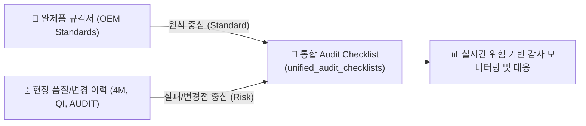
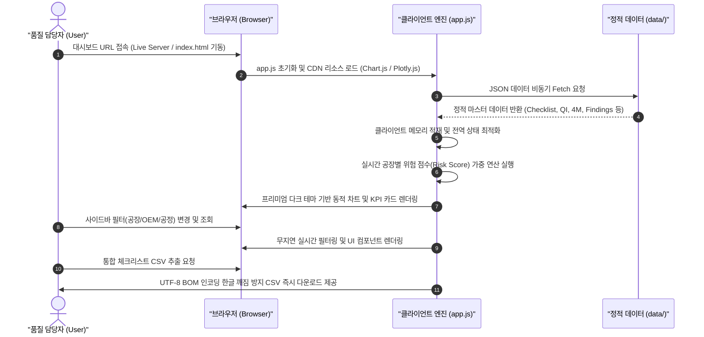

# 🚗 [Context 1] 시스템 전체 개요 문서 (System Overview)

본 문서는 완성차 고객사(OEM) 완제품 규격서(OE Requirements) 및 생산 공장별 품질 이력 데이터를 기반으로, 현장 맞춤형 감사 대응 질문을 자동 생성하는 **차세대 위험 기반 감사(Risk-Based Auditing) 지원 시스템**의 전사적 개요와 아키텍처를 정의한 최상위 컨텍스트 문서입니다.

---

## 🌟 1. 시스템 개발 목표 및 배경

글로벌 완성차 고객사(BMW, GM, Audi, 현대/기아 등)의 수검 요구조건은 점차 다양화되고 정교화되는 반면, 실제 생산 현장에서는 표준화된 규격 점검 수준의 수동 감사에 그치고 있습니다. 

본 플랫폼은 **단순한 규격서 텍스트 뷰어**를 넘어, 자동차 완성차 규격 요구사항과 제조 현장의 과거 품질 리스크(품질 실패 이력, 4M 변경점, 과거 지적사항)를 유기적으로 융합하여, **공장별 위험도(Plant Risk)가 반영된 완성도 높은 Audit Checklist를 자동으로 도출**하는 것을 개발 목표로 합니다.



---

## 🧭 2. 시스템 범위 및 대상 영역

### ① 대상 제조사 및 공장 범위
*   **자사 공장 자원**: 전 세계 8개 생산 거점 (`DP`, `KP`, `JP`, `HP`, `CP`, `MP`, `IP`, `TP`)
*   **분석 관점**:
    *   **전사 현황 관점**: 8개 공장 전체의 Checklist 생성 건수, 항목 분포, 소스 누락 여부 모니터링.
    *   **공장별 현황 관점**: 특정 공장의 공정/카테고리별 세부 위험도 점수 및 집중 검증 대상 조항 식별.

### ② 대상 제조공정 및 카테고리 범위
감사 질문 및 요구 조건의 성격에 따라 **물리적 제조 공정(Process)**과 **시스템 보조 영역(Category)**을 분리하여 일관성 있게 관리합니다.

```
[제조 부문 - Process]
Incoming (수입검사) ➔ Mixing (배합) ➔ Extrusion (압출) ➔ Calendaring (캘린더링) ➔ Cutting (재단) ➔
Bead (비드) ➔ Building (성형) ➔ Curing (가류) ➔ Re-work (재작업) ➔ Inspection (검사) ➔ Special (Form/Sealant)

[시스템 부문 - Category]
Design (설계/개발) ➔ Test (신뢰성시험) ➔ System (품질보증/교육/4M변경) ➔ Logistics (물류/외주창고)
```

---

## 💻 3. 대시보드 메뉴 구성 및 사용자 경험

HTML5, CSS3, Vanilla JavaScript 기반의 고성능 싱글 페이지 애플리케이션(SPA) 인터랙티브 웹 UI는 공장별 Audit 준비상태를 첫눈에 인지할 수 있는 프리미엄 디자인 요소를 제공합니다.

| 메뉴 번호 | 메뉴 명칭 | 주요 제공 기능 | 실무 활용 시나리오 |
| :---: | :--- | :--- | :--- |
| **01** | **Risk Assessment** | 공장별 품질 이슈(QI), 4M 변경점, 과거 감사 지적사항(Audit Findings) 데이터를 종합 연산하여 고위험 공정 및 실시간 리스크 항목 시각화 출력 | 대시보드 진입 시 전사 및 개별 공장의 취약 공정과 위협 요인을 한눈에 식별하고 선제 수검 대응 체계 마련 |
| **02** | **OE Requirement Library** | 완성차 고객사(OEM)별 규격 문서의 메타데이터 필터링, AI 핵심 검토 요약(Review Summary) 제공 및 오리지널 규격 파일 다운로드 기능 | 신규 규격서의 의무 주기 및 핵심 제약 조건을 빠르게 확인하고 실물 규격서를 즉시 원클릭으로 다운로드하여 대조 |
| **03** | **Self-Audit & Master Checklist** | 데이터베이스 기반의 통합 체크리스트 마스터 뷰어. 공장별, OEM별, 공정별 조건 다중 실시간 필터링 및 UTF-8 BOM CSV 내보내기 | 자체 공정 감사(Self-Audit)나 수검 준비 시 특정 공장/공정 맞춤형 점검표를 생성하고 현장 확인용 실사 점검 시트로 출력 |
| **04** | **AI Action Plan** | 실제 OEM 공정 감사 수검 완료 후, 체크리스트를 기반으로 현장 개선 방향, SOP 수정 가이드, 시정 조치 대응 가이드를 AI로 분석해 제안 | 오디트 지적 사항에 대응하는 구체적인 SOP 보완 조치안과 합치 증빙 리스트(SOP, 예방보전일지 등) 실행 가이드라인 확보 |
| **05** | **SQL Console** | 안전한 SELECT 전용 실시간 비정형 쿼리 편집기, 원클릭 유용한 쿼리 템플릿 로드, 위험 유발 쓰기 구문(INSERT/DELETE 등) 완벽 차단 | 데이터 엔지니어 및 고급 사용자의 비정형 이력 통계 산출, 원천 데이터 가공 및 테이블 정합성 검증 |

---

## 🔄 4. 업무 프로세스 흐름 (Business Workflow)

시스템을 통한 표준적이고 자동화된 감사 Checklist 구축의 주기적인 흐름입니다.



---

## ⚙️ 5. 플랫폼 시스템 아키텍처 및 강점

### ① 아키텍처 구성 요소
*   **HTML5 & Semantic Markup**: 대시보드의 골격과 각 기능별 워크스페이스 레이아웃을 구성하는 모던 웹 표준 시멘틱 태그 사용.
*   **Vanilla CSS3 (Design System)**: HSL 글로벌 컬러 변수 시스템, 프리미엄 글래스모피즘(Glassmorphism) 효과, 이징(Easing) 트랜지션 및 완벽한 레이아웃 구조 설계.
*   **Vanilla JavaScript (Client-side Engine)**: 비동기 Fetch 데이터 파이프라인, 전역 셀렉터 상태 동적 관리, 클라이언트 브라우저 단에서의 고속 연산(공장 리스크 가중치 연산 및 3중 필터링 알고리즘).
*   **Static Database Engine**: `data/` 디렉토리에 적재된 모의 데이터를 기반으로, 물리적인 데이터 파괴 명령어 및 DB 오버헤드를 배제하고 브라우저 온디맨드 메모리 단에서 작동하는 초정밀 샌드박스 데이터 환경.
*   **CDN Charts & AI Sandbox**: 무거운 프레임워크나 외부 REST API 오류 상황에서도 중단되지 않고 즉시 가상 응답을 제어하는 `Mock AI Response Engine` 및 최적화된 시각화 차트 연동.

### ② 시스템의 차별화된 강점 (Technical Excellence)
1.  **제로 의존성 (Zero External Overhead)**: Node.js, Python 백엔드, Webpack 번들러 등의 복잡한 인프라가 필요 없으며, 브라우저가 직접 로드하여 무지연(Zero-latency)으로 즉각 기동합니다.
2.  **보안 샌드박스 장착**: 클라이언트 단에서 파괴성 명령어(`INSERT`, `UPDATE`, `DELETE` 등)를 사전 감지 및 차단하는 SELECT 전용 SQL 모의 에뮬레이터를 탑재하여 원천 자원 무결성을 보존합니다.
3.  **한글 깨짐 없는 완벽한 내보내기**: Excel 실행 시 한국어가 깨지는 레거시 브라우저 인코딩 문제를 해결하기 위해, CSV 바이트 스트림 앞에 UTF-8 BOM(`\uFEFF`) 마커를 주입하는 지능형 내보내기 모듈이 장착되어 있습니다.
