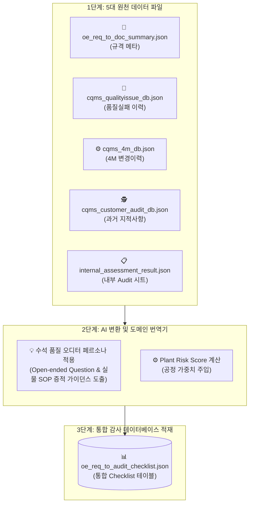

# 🗄️ [Context 3] 통합 가상 JSON DB 구축 및 스키마 정의서

본 문서는 완성차 고객사(OEM) 기술 규격서(OE Requirements) 및 생산 공장별 품질 실패 이력(QI), 공정 변경 이력(4M), 과거 감사 지적사항(AUDIT), 그리고 공장 자체 진단 이력인 **내부 Audit 시트(Internal Audit Sheet)** 데이터를 포함하는 **시스템의 전체 8대 가상 데이터베이스 목록(DB List) 및 논리/물리 스키마 사양**을 정의합니다.

사내 해커톤 MVP 구동 및 브라우저 온디맨드 초고속 연산을 보증하기 위해, 본 문서에 기재된 모든 데이터 사양은 `data/` 디렉토리에 위치한 **정적 JSON 파일(`*.json`) 데이터 구조와 100% 철저히 부합**하도록 동기화되었습니다. 모든 클라이언트 렌더링, 필터링 및 AI 변환 알고리즘은 본 기준 정의를 상속 및 적용합니다.

---

## 🌟 1. 가상 데이터베이스 목록 (DB List Overview)

플랫폼을 구성하는 핵심 데이터 자원은 `data/` 디렉토리 아래 총 **8대 정적 JSON 파일**의 테이블 구조로 관리됩니다.

| No. | 물리적 파일명 | 논리적 테이블명 | 주요 보관 정보 및 역할 |
| :---: | :--- | :--- | :--- |
| **①** | `users.json` | `users` | 로그인 사용자 정보, 역할 권한(Role) 및 소속/담당 공정 마스터 |
| **②** | `common_codes.json` | `common_codes` | 8대 생산 공장, 15대 표준 공정, 4M 분류 및 소스 구분용 공통 코드셋 |
| **③** | `oe_req_to_doc_summary.json` | `document_library` | 최신 OEM 기술 규격서 메타데이터 및 타이어 도메인 역해석 매스터 데이터 |
| **④** | `cqms_qualityissue_db.json` | `cqms_qualityissue_db` | 공장별 과거 발생 품질 실패(QI), 현상(D2), 원인(D4) 및 8D 영구조치 대책(D5) |
| **⑤** | `cqms_4m_db.json` | `cqms_4m_db` | 생산 현장의 설비, 공정, 재료, 작업 표준(4M) 변경 이력 신청/승인 건 |
| **⑥** | `cqms_customer_audit_db.json` | `audit_findings` | 과거 외부 완성차 고객사 및 제3자 Audit 지적사항(Point out) 및 시정 계획 |
| **⑦** | `internal_assessment_result.json` | `internal_audit_sheets` | **[내부 Audit 시트]** 공장 자체 진단 점검 항목, 부적합 세부 결과 및 예방조치안 |
| **⑧** | `oe_req_to_audit_checklist.json` | `unified_audit_checklists` | **[통합 Checklist]** 규격서(DOCUMENT) 및 현장 이력(DATABASE) 기반 AI 추출 질문 통합 저장소 |

---

## 🔄 2. 데이터 흐름 및 AI 질문 변환 파이프라인

원천 데이터셋(QI, 4M, 감사지적, 내부 Audit)이 수집되면, 클라이언트 엔진 또는 AI Extractor를 통해 **"실무 감사 질문"** 및 **"합치 증적 서류명"**으로 구조화된 감사 체크리스트로 가공되어 `oe_req_to_audit_checklist.json`에 집결합니다.

---

## 🗄️ 3. 테이블별 상세 스키마 정의 (JSON Schema Specs)

`data/` 아래 적재된 실물 JSON 파일 객체들이 준수해야 하는 상세 필드 속성 및 물리 데이터 모델입니다.

### ① `users` (`data/users.json`)
*   **설명**: 플랫폼 로그인 및 세션 관리, 사용자 역할 권한(Role-Based Access Control)을 위한 사용자 계정 정보입니다.
*   **스키마 구성**:

| Key | 데이터 타입 | 설명 | 예시 |
| :--- | :--- | :--- | :--- |
| `id` | INTEGER (PK) | 사용자 일련번호 | `1`, `2` |
| `username` | TEXT | 사용자 로그인 아이디 | `"admin"`, `"manager"`, `"viewer"` |
| `password` | TEXT | 비밀번호 (평문 문자열) | `"admin123"`, `"manager123"` |
| `name` | TEXT | 사용자 성명 및 직책 | `"박정호 수석"`, `"이현우 책임"`, `"최선아 연구원"` |
| `role` | TEXT | 권한 역할 식별자 (`admin` / `manager` / `viewer`) | `"admin"`, `"manager"`, `"viewer"` |
| `role_name` | TEXT | 권한 역할 국/영문 표시 명칭 | `"Lead Auditor"`, `"Quality Manager"`, `"Quality Viewer"` |
| `badge` | TEXT | 화면 상 표시될 역할 구분 뱃지 텍스트 | `"ADMIN"`, `"MANAGER"`, `"VIEWER"` |
| `avatar_color` | TEXT | 사용자 아바타의 테마 배경색 (CSS 헥사 코드) | `"#ff3b30"`, `"#ef4444"`, `"#a1a1a1"` |
| `department` | TEXT | 소속 부서명 | `"품질보증그룹"`, `"품질기획팀"`, `"생산기술센터"` |

---

### ② `common_codes` (`data/common_codes.json`)
*   **설명**: 전사 필터 연동, 분류 및 데이터 일관성을 지휘하는 글로벌 기준 코드셋(마스터 딕셔너리)입니다.
*   **구성 객체**:
    *   `plants`: 자사 8대 공장 정의 (code, name, location, desc, is_active)
    *   `categories`: 보조 시스템 카테고리 정의 (code, name, english_name, desc)
    *   `processes`: 타이어 12대 표준 물리 공정 정의 (code, name, english_name, desc)
    *   `dimensions_4m`: 4M 분류 기준 정의 (code, name, desc)
    *   `source_types`: 체크리스트 질문 원천 마스터 정의 (code, name, desc)

---

### ③ `document_library` (`data/oe_req_to_doc_summary.json`)
*   **설명**: 완성차 브랜드별 최신 기술 규격 요구사항 정보 및 해당 문서를 타이어 7대 물리 공정으로 정밀 역해석한 도메인 매퍼를 보존합니다.
*   **스키마 구성**:

| Key | 데이터 타입 | 설명 | 예시 |
| :--- | :--- | :--- | :--- |
| `id` | INTEGER (PK) | 규격 등록 고유 번호 | `1` |
| `filename` | TEXT | 물리적인 규격서 파일 명칭 (Unique) | `"BMW_GS_98000.pdf"` |
| `customer` | TEXT | 완성차 브랜드 (OEM) | `"BMW"`, `"Audi"`, `"Hyundai"`, `"GM"` |
| `doc_code` | TEXT | 규격 문서 관리 코드 | `"GS 98000"`, `"ES52930-01"` |
| `doc_name` | TEXT | 규격서 국/영문 공식 제목 | `"Statistical Process Capability Studies"` |
| `revision_date` | TEXT | 규격 제정 및 개정 일자 | `"2024-11-19"` |
| `doc_type` | TEXT | 규격 문서 종류 | `"품질 표준"`, `"화학 물질 표준"` |
| `file_size` | TEXT | 물리 규격서 파일 크기 | `"3.03 MB"` |
| `review_summary` | OBJECT | AI 기반 구조화된 규격 검토 요약 객체 | `{"overview": "...", "applicable_processes": [...], ...}` |
| `review_summary.overview` | TEXT | 규격서 핵심 제약 조건 및 목적 개요 | `"BMW 부품 공급 시 공정능력(Cpk>=1.33) 보증 기준"` |
| `review_summary.applicable_processes` | ARRAY | 연관 표준 제조 공정 목록 | `["Mixing", "Extrusion", "Curing"]` |
| `review_summary.required_evidences` | ARRAY | 오디트 통과를 위해 협력사가 구비해야 할 서류들 | `["공정별 일일 SPC 트래킹 차트"]` |
| `tire_process_translation` | OBJECT | **[도메인 역해석]** 범용 OEM 표준을 타이어 공정으로 기하학적 매핑한 정보 객체 | `{"focus_process": "...", "process_param_check": "...", ...}` |
| `tire_process_translation.focus_process` | TEXT | 타이어 현장 집중 가용 대상 공정 | `"전 공정 공통 (Site-Wide Process Capability)"` |
| `tire_process_translation.process_param_check` | TEXT | 각 공정별 타이어 설비 제어 파라미터 점검 기준 | `"배합(Mixing) Mooney 점도 Cpk 제어..."` |
| `tire_process_translation.quality_defect_risk` | TEXT | 규격 요구사항 이탈 시 타이어 결함 및 주행 리스크 | `"고무 균일성 파괴 및 고속 드럼 주행 중 파열 박리..."` |
| `tire_process_translation.action_sop_guide` | TEXT | 공장 작업 표준서(SOP) 내 의무적 반영/개정 수립 가이드 | `"공장 종합 SPC 지침 내 4M 파라미터별 점검 제정..."` |
| `processed_at` | TEXT | 시스템 해석 등록 일자 | `"2026-05-26 17:45:00"` |

---

### ④ `cqms_qualityissue_db` (`data/cqms_qualityissue_db.json`)
*   **설명**: 공장별 과거 발생 품질 실패(Claim, 필드 반품, 공정 불량) 이력과 8D 시정 대책을 담은 마스터 데이터셋입니다.
*   **스키마 구성**:

| Key | 데이터 타입 | 설명 | 예시 |
| :--- | :--- | :--- | :--- |
| `DOC_NO` | TEXT (PK) | 품질 이슈 관리 번호 | `"QI-2026-00134"`, `"QI-2025-0812"` |
| `PLANT` | TEXT | 발생 자사 공장 코드 | `"KP"`, `"DP"`, `"MP"` |
| `STAGE` | TEXT | 이슈 최초 인지 단계 | `"Field Claim"`, `"Development"`, `"Mass Production"` |
| `OEM` | TEXT | 연관 완성차 고객사 브랜드 | `"BMW"`, `"Hyundai"`, `"Benz"` |
| `VEH` | TEXT | 장착 및 클레임 차량 모델 명칭 | `"GV80"`, `"3 series"` |
| `PJT` | TEXT | 연관 개발 및 양산 프로젝트 코드 | `"JX1 FL"`, `"NA0/NA1"` |
| `OCC_DATE` | TEXT | 불량 최초 발생 일자 | `"2025-01-20"` |
| `REG_DATE` | TEXT | 시스템 최초 등록 일자 | `"2025-01-22"` |
| `RETURN_YN` | TEXT | 실물 타이어 반품 수검 여부 (`Y` / `N`) | `"Y"` |
| `RTN_DATE` | TEXT | 반품 자재 입고/접수 일자 | `"2025-01-25"` |
| `CTM_DATE` | TEXT | 대고객 시정 조치 회신 데드라인 | `"2025-02-10"` |
| `HK_FAULT_YN` | TEXT | 자사 제조 원인 귀책 확정 여부 | `"Y"` |
| `COMP_DATE` | TEXT | 8D 대책 최종 승인 및 Closed 종결일 | `"2025-02-12"` |
| `STATUS` | TEXT | 현재 대책 처리 상태 코드 | `"Closed"`, `"On-going"` |
| `LOCATION` | TEXT | 고장 및 파열 손상 물리적 위치 | `"트레드 접지부"`, `"Side-wall"` |
| `MARKET` | TEXT | 판매 및 고장 접수 국가 정보 | `"USA"`, `"Europe"`, `"Korea"` |
| `M_CODE` | INTEGER/TEXT | 자사 완제품 파트 식별 코드 | `1033534`, `"M-255-45R19-99V"` |
| `TYPE_NAME` | TEXT | 대분류 불량 카테고리 | `"외관 불량"`, `"Performance"` |
| `CAT_NAME` | TEXT | 중분류 불량 유형 명칭 | `"기포 (Blister)"`, `"Lab test"` |
| `SUB_CAT_NAME` | TEXT | 소분류 상세 불량 명칭 | `"가류 성형 기포"`, `"RR"` |
| `D2_PROBLEM` | TEXT | 고객 클레임 현지 리포트 원문 및 불량 현상 기술 | `"Tread blister observed on GV80... "` |
| `D0_EMERGENCY` | TEXT | 유출 방지를 위한 긴급 방어 조치 내용 | `"동일 로트 출하 보류 및 보관 재고 100% 검사"` |
| `D4_SMMY` | TEXT | D4 단계 품질 정밀 기술 분석 요약 | `"타이어 성형 중 Air 배출 불충분"` |
| `D4_ROOT_CAUSE` | TEXT | 발생 근본 원인 분석 결과 | `"가류 금형의 Air 배출 벤트 홀 막힘"` |
| `D5_COUNTERMEASURE` | TEXT | 영구 재발 방지 및 시정 조치 대책 내용 | `"벤트핀 세정 주기 단축 및 성형 공정 모니터링 강화"` |
| `D8_RESULT` | TEXT | 시정 대책 실행 후 유효성 검증 데이터 결과 | `"가류 벤트핀 세정 주기 단축으로 기포 재발 제로"` |
| `URL` | TEXT | 사내 품질이슈 포털 개별 상세 링크 | `"https://egqms.hankooktech.com/..."` |

---

### ⑤ `cqms_4m_db` (`data/cqms_4m_db.json`)
*   **설명**: 공장 내부의 설비 기구 변경, 작업 표준 개정, 수입 원자재 코드 교체 등 제조 변동점에 대한 상세 이력입니다.
*   **스키마 구성**:

| Key | 데이터 타입 | 설명 | 예시 |
| :--- | :--- | :--- | :--- |
| `DOC_NO` | TEXT (PK) | 4M 변동점 신청 고유 문서 번호 | `"MANA-DOC-2026-00123"`, `"4M-2025-DP-0024"` |
| `PLANT` | TEXT | 변동 대상 자사 공장 코드 | `"HP"`, `"KP"`, `"DP"` |
| `PURPOSE` | TEXT | 변경 추진 대표 목적 분류 | `"The others"`, `"Improve Quality"`, `"Cost Down"` |
| `SUBJECT` | TEXT | 4M 변동점 추진 핵심 제목 | `"BYD 215/65R16V IK41A HS → HM 生产变更..."` |
| `STATUS` | TEXT | 4M 신청 관리 결재 승인 상태 | `"Complete"`, `"Approved"`, `"Request"` |
| `PROGRESS` | TEXT | 변경 수검 검증 프로세스 단계 | `"Complete"`, `"양산 적용 및 검증"` |
| `REQUESTER` | INTEGER/TEXT | 신청자 사번 또는 소속 성명 | `81100266`, `"홍길동 과장(대전성형기술팀)"` |
| `REG_DATE` | TEXT | 변경 승인 최초 등록 일자 | `"2026-05-22"`, `"2025-02-15"` |
| `COMP_DATE` | TEXT | 최종 검증 및 사후 승인 완료일 | `"2026-05-22"`, `"2025-03-10"` |
| `URL` | TEXT | 사내 글로벌 4M 변동점 시스템 개별 링크 | `"https://egqms.hankooktech.com/..."` |
| `CHANGE_ITEM` | TEXT | 변경 대상 4M 상세 항목 카테고리 | `"Building Set"`, `"설비 기구부 변경"` |
| `CHANGE_CONTENT` | TEXT | 변경 전후 세부 물리적/공정 기술 대조 내용 | `"HS → HM 生产变更邀请"`, `"롤러 재질 우레탄에서 스틸로 변경"` |
| `MTL` | INTEGER/TEXT | 연관 자재 분류 코드 | `1`, `"MTL-RUBBER-012A"` |

---

### ⑥ `audit_findings` (`data/cqms_customer_audit_db.json`)
*   **설명**: 완성차 OEM 및 제3자 전문 심사 위원이 제기한 과거 공정 감사 부적합 지적사항 목록입니다.
*   **스키마 구성**:

| Key | 데이터 타입 | 설명 | 예시 |
| :--- | :--- | :--- | :--- |
| `TYPE` | TEXT | 감사 성격 구분 종류 | `"Project"`, `"Customer Audit"`, `"VDA 6.3"` |
| `SUBJECT` | TEXT | 감사 공식 명칭 또는 평가 코드 | `"2026-BMW-G50-01"`, `"Benz V520 Process Audit"` |
| `START_DT` | TEXT | 감사 개시 시작 일자 | `"2026-05-21"`, `"2024-05-10"` |
| `END_DT` | TEXT | 감사 평가 최종 종료일 | `"2026-05-21"`, `"2024-05-12"` |
| `OWNER_ID` | INTEGER/TEXT | 수검 및 개선 활동 사내 귀책 담당자 | `21300315`, `"이순신 팀장(대전품질)"` |
| `REG_DT` | TEXT | 지적사항 시스템 최초 등록일 | `"2026-05-21"` |
| `COMP_DT` | TEXT | 대책 보완 및 최종 Close 합격 완료일 | `"2026-05-21"` |
| `STATUS` | TEXT | 지적 건 개선 프로세스 처리 상태 | `"On-going"`, `"Closed"`, `"Overdue"` |
| `PLANT` | TEXT | 오디트 수검을 받은 대상 공장 코드 | `"MP"`, `"JP"`, `"DP"` |
| `CAR_MAKER` | TEXT | 심사를 주관한 오디터 고객 완성차 명칭 | `"BMW"`, `"Benz"`, `"Audi"` |
| `PROJECT` | TEXT | 수검 대상 타이어 부품 개발 프로젝트명 | `"G50"`, `"V520"`, `"G45"` |
| `M_CODE` | TEXT | 지적 대상 타이어 규격 파트 코드 | `"1036705"`, `"M-225-50R18"` |
| `PROCESS` | TEXT | 과거 감사 지적사항 연계 제조 공정/도메인 구분 | `"Inspection"`, `"Logistics"`, `"Incoming"`, `"Mixing"` |
| `POINT_OUT` | TEXT | **[부적합 지적 현상]** 오디터 코멘트 및 구체적 지적 원문 내용 | `"압출 튜브 냉각수 온도 조절 장치의 제어 편차가 ±5°C 이상 발생"` |
| `ROOT_CAUSE_ANALYSIS` | TEXT | 지적 사항 유발 근본 제조 원인 분석 원문 요약 | `"자동 유량 조절 피드백 밸브의 제어 응답 속도 저하 및 오작동"` |
| `COUNTER_MEASURE` | TEXT | 시정 및 예방 조치 재발 방지 대책 원문 요약 | `"정밀 비례 전자 유량 제어 밸브로 전면 교체 적용"` |
| `POINT_OUT_KO` | TEXT | 부적합 지적 현상 (한국어 번역 컬럼) | `"압출 튜브 냉각수 온도 조절 장치의 제어 편차가 ±5°C 이상 발생"` |
| `POINT_OUT_EN` | TEXT | 부적합 지적 현상 (영어 번역 컬럼) | `"The control deviation of the extrusion tube cooling water temperature control device is more than ±5°C."` |
| `POINT_OUT_ZH` | TEXT | 부적합 지적 현상 (중국어 번역 컬럼) | `"挤出管冷却水温调节装置控制偏差达±5℃以上"` |
| `ROOT_CAUSE_KO` | TEXT | 근본 제조 원인 분석 (한국어 번역 컬럼) | `"자동 유량 조절 피드백 밸브의 제어 응답 속도 저하 및 오작동"` |
| `ROOT_CAUSE_EN` | TEXT | 근본 제조 원인 분석 (영어 번역 컬럼) | `"Control response delay and malfunction of automatic flow control feedback valve"` |
| `ROOT_CAUSE_ZH` | TEXT | 근본 제조 원인 분석 (중국어 번역 컬럼) | `"自动流量调节反馈阀控制响应速度变慢及误动作"` |
| `COUNTER_MEASURE_KO` | TEXT | 시정 및 재발 방지 대책 (한국어 번역 컬럼) | `"정밀 비례 전자 유량 제어 밸브로 전면 교체 적용"` |
| `COUNTER_MEASURE_EN` | TEXT | 시정 및 재발 방지 대책 (영어 번역 컬럼) | `"Full replacement with precision proportional electronic flow control valve"` |
| `COUNTER_MEASURE_ZH` | TEXT | 시정 및 재발 방지 대책 (중국어 번역 컬럼) | `"全面更换为精密比例电子流量控制阀"` |
| `URL` | TEXT | 사내 글로벌 Audit 시스템 지적사항 상세 링크 | `"https://egqms.hankooktech.com/..."` |

---

### ⑦ `internal_audit_sheets` (`data/internal_assessment_result.json`)
*   **설명**: **[★사용자 핵심 추가 데이터]** 공장별 자체 공정 감사(Self-Audit) 및 주기적인 내부 상시 진단을 통해 식별된 점검 상세 리스트 및 현장 개선 조치 기록입니다.
*   **스키마 구성**:

| Key | 데이터 타입 | 설명 | 예시 |
| :--- | :--- | :--- | :--- |
| `id` | INTEGER (PK) | 내부 감사 평가 항목 고유 번호 | `1`, `7` |
| `plant` | TEXT | 자체 진단을 실행한 자사 공장 코드 | `"CP"`, `"DP"`, `"KP"` |
| `process` | TEXT | 대상 점검 제조 물리 공정 대분류 | `"Incoming"`, `"Mixing"`, `"Curing"`, `"Inspection"` |
| `section_no` | INTEGER | 내부 심사 평가 영역 섹션 고유 번호 | `1` (공정관리), `2` (시스템관리) |
| `category` | TEXT | 진단 성격 대분류 구분 | `"Process"`, `"System"` |
| `item_no` | INTEGER | 각 공정 세부 점검 항목 일련번호 | `1`, `2`, `7` |
| `area` | TEXT | 진단 대상 물리적 세부 공간 및 업무 도메인 | `"Preparation"`, `"Inspection"`, `"NCF handling"` |
| `check_item` | TEXT | 자체 감사원이 평가 체크 시 사용한 점검 기준 질의 | `"Do you have any separated area for NG parts? ..."` |
| `guidance` | TEXT | 현장에서 수검 시 제시되어야 할 가이드라인 및 기준 | `"- MR zone : separated & fenced zone with locking system"` |
| `findings` | TEXT | **[자체 진단 지적 현상]** 현장 실사 및 면담을 통한 실질적 위반/관찰 이력 | `"MR zone 존재, 펜스 및 현황판 관리 양호. 펜스 시건장치 부족..."` |
| `score` | TEXT/INTEGER | 평가 항목 획득 점수 (10점 만점 기준) | `"10"`, `"8"`, `"6"` |

---

### ⑧ `unified_audit_checklists` (`data/oe_req_to_audit_checklist.json`)
*   **설명**: 규격서(DOCUMENT) 및 과거 4대 제조 이력(QI, 4M, Audit Findings, 내부 Audit 지적)을 AI가 수석 감사원 시각으로 기하학적으로 연계하여 동적 변환한 최종 통합 질문 데이터베이스입니다.
*   **스키마 구성**:

| Key | 데이터 타입 | 설명 | 예시 |
| :--- | :--- | :--- | :--- |
| `id` | INTEGER (PK) | 최종 체크리스트 질문지 고유 번호 | `1` |
| `source_type` | TEXT | 질문이 기원한 소스 구분 (`DOCUMENT`, `DATABASE_QI`, `DATABASE_4M`, `DATABASE_AUDIT`, `DATABASE_INTERNAL_AUDIT` 등) | `"DOCUMENT"`, `"DATABASE_QI"` |
| `source_id` | TEXT | 최초 기원 원천 문서코드 및 이력 관리번호 | `"LAH 893 010"`, `"QI-2025-0812"` |
| `plant_code` | TEXT | 적용 가용 대상 자사 공장 코드 | `"ALL"` (전사공통), `"KP"`, `"DP"` |
| `customer` | TEXT | 연관 고객사 완성차 브랜드 명칭 | `"Audi"`, `"Hyundai"`, `"BMW"` |
| `doc_code` | TEXT | 원본 수검 규격 문서 코드 (이력 기반의 경우 `null` 가능) | `"LAH 893 010"`, `"ES52930-01"` |
| `doc_name` | TEXT | 원본 수검 규격 공식 명칭 또는 관련 표준 제목 | `"Audi LAH 893 010 Q Lastenheft der AUDI AG..."` |
| `section` | TEXT | 세부 점검 조항 및 공정 단계 | `"Clause 1.0 (General Specifications)"`, `"Curing (가황공정)"` |
| `requirement` | TEXT | 원천 표준 규격 조항 요약문 또는 과거 발생 실패/지적 현상 핵심 기술 | `"가류 후 기포(Blister) 발생 및 필드 반품 클레임 제기"` |
| `audit_question` | TEXT | **[AI 제안]** 공감 감사원이 현장에서 작업자에게 질의해야 할 개방형 질문 | `"벤트핀 막힘 유무를 교대조별로 전수 확인하는 실시간 프로세스가 작동합니까?"` |
| `evidence_compliance` | TEXT | **[AI 제안]** 수검팀이 대응으로 반드시 제시해야 할 실제 실물 SOP/대장 명칭 | `"설비별 벤트핀 점검 체크리스트 및 주간 금형 세정 일지"` |
| `audit_method` | TEXT | 감사 행위 방식 기법 지정 | `"치수 측정 장비 실사 및 치수 성적서 대조 검토 (Inspection)"` |
| `requirement_type` | TEXT | 요구사항의 기능적 카테고리 분류 | `"검사"`, `"재발방지 (Recurrence Prevention)"` |
| `process_category` | TEXT | 연관 15대 표준 공정 카테고리 지정 | `"Inspection"`, `"Curing"` |
| `related_4m` | TEXT | 4M의 가장 근본적인 연관 원인 차원 | `"Method"`, `"Machine"` |
| `priority` | TEXT | 리스크에 따른 점검 중요도 등급 | `"High"`, `"Medium"`, `"Low"` |
| `plant_risk_score` | REAL | 실시간 계산된 공장별 공정 위험 가중 점수 (0.0 ~ 5.0) | `4.5`, `0.0` |
| `processed_at` | TEXT | 데이터 해석 및 적재 완료 시점 | `"2026-05-28 15:19:56"` |

---

## 📈 4. 공장별 위험도(Plant Risk Score) 연산 동적 맵

플랫폼 대시보드 및 체크리스트의 우선순위는 **8대 JSON 데이터베이스의 연간 이벤트 누적치**를 바탕으로 실시간 동적 계산되어 정합성을 유지합니다.

$$R_{P,C} = \min \left( 5.0, \;\; w_{\text{QI}} \times N_{\text{QI}}(P, C) + w_{\text{4M}} \times N_{\text{4M}}(P, C) + w_{\text{Audit}} \times N_{\text{Audit}}(P, C) + w_{\text{Internal}} \times N_{\text{Internal}}(P, C) \right)$$

*   $N(P,C)$: 특정 공장 $P$의 특정 공정 $C$에 대한 연간 등록 건수
*   **유형별 가중치 계수 ($w$)**:
    *   $w_{\text{QI}}$ (품질이슈 중요도) = **0.3** (고객 클레임 직결)
    *   $w_{\text{Audit}}$ (과거 감사 지적사항 리스크) = **0.2** (수검 재발 방지 대상)
    *   $w_{\text{Internal}}$ (내부 Audit 시트 지적 가중치) = **0.15** (상시 위배 사항)
    *   $w_{\text{4M}}$ (공정변경 위험도) = **0.1** (변경 초기 안정화 리스크)

이 공식을 통해 계산된 점수($R_{P,C}$)가 **3.5점을 상회하는 위험 공정 조항**은 `unified_audit_checklists`가 화면에 로드될 때 자동으로 우선순위가 **`High`** 등급으로 상향 조정되며, 대시보드의 실시간 경고 지도에 적색 글로우 애니메이션 마커와 함께 경보 보드로 팝업됩니다.

