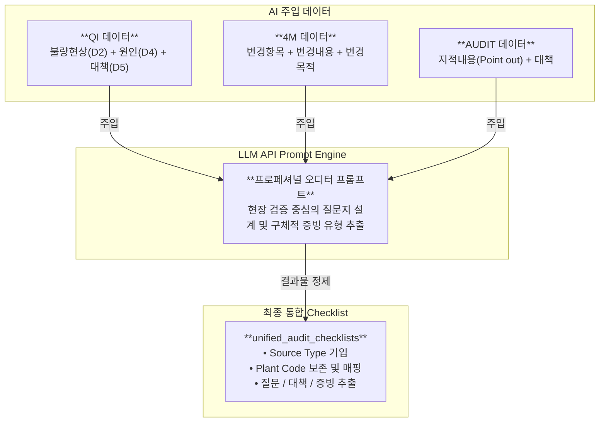

# 🗄️ [Context 3] 통합 DB 구축 컨텍스트 문서 (database.db)

본 문서는 완성차 고객사(OEM) 완제품 규격서(OE Requirements) 및 생산 공장별 품질 이슈(QI), 변경 이력(4M), 과거 감사 지적사항(AUDIT) 데이터를 AI 기술과 결합하여, **공장별 위험도(Plant Risk)가 반영된 차세대 통합 Audit Checklist 데이터베이스(`database.db`)**를 설계하고 구축하는 기술 가이드입니다.

---

## 🌟 1. 통합 데이터베이스 설계 개요 및 방향성

본 플랫폼은 단순한 규격 문서 뷰어가 아닌, 완성차 표준 요구사항과 제조 현장의 리스크를 융합하는 **위험 기반 감사(Risk-Based Auditing) 시스템**을 지향합니다. 이를 위해 다변화된 데이터 원천을 하나의 통합 모델로 병합하도록 설계되었습니다.

### 💡 핵심 설계 방향 (Architectural Strategy)

1.  **Checklist 이원화 및 병합 (Unified Checklist)**:
    *   **규격 기반(Document-Driven)**: OEM 표준서에서 AI가 추출한 일반 품질 시스템 및 표준 공정 준수 조항.
    *   **이력 기반(Database-Driven)**: 과거 품질 실패(QI), 설비/공정 변경(4M), 감사 지적(AUDIT) 테이블에서 AI가 현장 맞춤형으로 실시간 추출한 예방 검증 조항.
    *   이 두 가지 체크리스트를 단일 스키마인 **`unified_audit_checklists`** 테이블로 추후 완벽히 병합할 수 있도록 확장 설계합니다.
2.  **공장별 위험도(Plant Risk) 계량화**:
    *   규격 표준서는 전사 공통으로 적용되나, 이력 데이터는 **8개 자사공장(DP, KP, JP, HP, CP, MP, IP, TP)**별로 독립적입니다.
    *   테이블 설계 시 공장 코드(`plant_code`)를 필수 식별자로 지정하고, 공정별 이벤트 빈도와 심각도를 기반으로 한 **공장별 리스크 점수(`plant_risk_score`)** 컬럼을 배치하여 감사 조항의 우선순위를 동적으로 조정(Dynamic Boosting)합니다.
3.  **DB 기반 AI Checklist 추출 프로세스 도입**:
    *   정형화된 DB 필드(현상, 원인, 대책)를 LLM 프롬프트에 주입하여 "감사원이 현장에서 검증해야 할 실질적인 감사 질문과 증빙 리스트"를 자동 생성해 냅니다.

---

## 🔄 2. 통합 데이터 흐름 및 AI 파이프라인 (Data & AI Flow)

문서 파싱 파이프라인과 현장 이력 가공 파이프라인이 AI 모델을 거쳐 하나의 통합 체크리스트 테이블로 집결하는 데이터 아키텍처입니다.

```mermaid
flowchart TD
    subgraph Raw_Sources ["1단계: 원천 데이터 수집 및 적재"]
        direction LR
        A["📂 oe_requirements/<br>(165개 PDF/XLS/DOC)"]
        B1["📄 change_risk_hunter.csv<br>(4M 변경이력)"]
        B2["📄 qi_risk_hunter.csv<br>(QI 품질이슈)"]
        B3["📄 audit_risk_hunter.csv<br>(과거 지적사항)"]
    end

    subgraph Parsing_and_AI ["2단계: AI 추출 및 데이터 가공"]
        direction TB
        %% 경로 A: 문서 분석
        A -->|oe_manager.py| C["📄 oe_requirements_list.csv<br>(규격서 메타데이터)"]
        A -->|AI 조항 분석| D["📄 audit_checklists.csv<br>(규격 기반 Checklist)"]
        
        %% 경로 B: DB 이력 분석
        B1 & B2 & B3 -->|Pandas 적재| DB_Tables[("🗄️ 이력 마스터 테이블<br>(change_history_4m, quality_issues_qi, audit_findings)")]
        DB_Tables -->|**AI DB Checklist Extractor**<br>(Gemini API 가동)| E["📄 db_audit_checklists.csv<br>(현장 이력 기반 Checklist)"]
    end

    subgraph Plant_Risk_Engine ["3단계: 공장별 리스크 엔진"]
        E -->|공장코드 매핑 및 빈도 산출| PRE["⚙️ Plant Risk Engine<br>(공정별 가중치 산출 및 위험도 주입)"]
    end

    subgraph Consolidated_DB ["4단계: 통합 DB 병합 (database.db)"]
        direction TB
        C -->|INSERT| T1[("document_library")]
        D -->|INSERT (Source: DOCUMENT, Plant: ALL)| T2[("unified_audit_checklists")]
        PRE -->|INSERT (Source: DATABASE, Plant: DP/KP...)| T2
        DB_Tables -->|Raw Copy| T3[("Raw History Tables")]
    end

    style T2 fill:#1f3a52,stroke:#00c8ff,stroke-width:2.5px,color:#fff
    style PRE fill:#402030,stroke:#ff3b30,stroke-width:2px,color:#fff
```

---

## 📊 3. 테이블별 상세 스키마 정의 (Schemas)

> [!IMPORTANT]
> **[아키텍처 가상화 선언]**
> 본 시스템은 해커톤 MVP 안정성과 무지연 구동을 위해 실제 서버용 이진 SQLite 파일(`database.db`)에 직접 커넥션을 열지 않습니다. 
> 본 문서에 기재된 모든 테이블 스키마 사양은 `data/` 디렉토리에 위치한 **정적 JSON 파일(`*.json`) 객체들이 100% 준수해야 하는 '논리 데이터 모델(Logical Data Model)' 및 JSON 구조 사양**으로 가상화하여 적용됩니다. 모든 클라이언트 렌더링 및 필터링 처리는 이 스키마에 정의된 키(Key) 및 타입 속성과 1:1 대응하여 이루어집니다.

통합 및 확장 설계를 반영한 `database.db` 내 테이블 스키마 사양입니다.

### ① `unified_audit_checklists` (통합 Audit Checklist - ★핵심 병합 테이블)

*   **설명**: 규격 기반(DOCUMENT) 질문과 현장 실시간 실패 이력 기반(DATABASE) 질문이 하나의 인터페이스로 병합되는 핵심 테이블입니다. 공장별 리스크 점수가 산정되어 함께 기록됩니다.
*   **소스**: `documents/audit_checklists.csv` + **[NEW] AI 추출 현장 이력 체크리스트**

| 컬럼명 | 데이터 타입 | 제약사항 | 설명 | 예시 |
| :--- | :--- | :--- | :--- | :--- |
| `id` | INTEGER | PRIMARY KEY | 체크리스트 고유 ID | `1` |
| `source_type` | TEXT | NOT NULL | 소스 원천 구분 (`DOCUMENT`, `DATABASE_QI`, `DATABASE_4M`, `DATABASE_AUDIT`) | `DATABASE_QI` |
| `source_id` | TEXT | NOT NULL | 원천 문서명 또는 DB 내 관리번호 (`DOC_NO`) | `QI-2025-0812` |
| `plant_code` | TEXT | NOT NULL | 적용 대상 자사 공장 코드 (전사 공통은 `ALL` 입력) | `DP` (대전), `KP` (금산), `ALL` |
| `customer` | TEXT | - | 완성차 고객사 브랜드 | `BMW`, `Audi`, `Hyundai` |
| `doc_code` | TEXT | - | 원본 규격 문서 코드 (이력 기반의 경우 `NULL` 가능) | `GS 91011` |
| `doc_name` | TEXT | - | 원본 규격서명 또는 관련 표준 제목 | `SPECIAL CHARACTERISTICS` |
| `section` | TEXT | - | 규격서 내 조항 번호 또는 공정 단계명 | `Curing (가류공정)` |
| `requirement` | TEXT | NOT NULL | 원본 규격 요구사항 또는 품질 실패 현상 요약 | `타이어 성형 중 Air 배출 불충분으로 가류 후 기포 발생` |
| `audit_question` | TEXT | NOT NULL | **[AI 제안]** 오디터가 현장에서 질문해야 할 내용 | `가류 세정 및 벤트핀 막힘 유무 확인 프로세스가 마련되어 있습니까?` |
| `evidence_compliance` | TEXT | - | **[AI 제안]** 오디 대응을 위해 제시해야 할 증적 | `벤트핀 점검 체크리스트 및 주간 금형 세정 일지` |
| `audit_method` | TEXT | - | 감사 기법 (면담, 실사, 문서 검토) | `현장 실사 (Plant Tour)` |
| `requirement_type` | TEXT | - | 요구사항 속성 (시험, 공정관리, 변경점 등) | `재발방지 (Recurrence Prevention)` |
| `process_category` | TEXT | NOT NULL | 연관 제조 공정/카테고리 | `Curing` |
| `related_4m` | TEXT | - | 4M 구분 (Man, Machine, Material, Method) | `Machine` |
| `priority` | TEXT | - | 리스크 중요도 등급 (`High`, `Medium`, `Low`) | `High` |
| `plant_risk_score` | REAL | DEFAULT 0.0 | 공장별 공정 위험 가중치 점수 (0.0 ~ 5.0) | `4.2` |
| `processed_at` | TEXT | - | 데이터 가공 및 적재 시점 | `2026-05-26 18:00:00` |

---

### ② `document_library` (완제품 규격서 라이브러리)

*   **설명**: 규격서 원천 파일 메타정보 테이블입니다. (전사 공통 기준 데이터)
*   **소스**: `documents/oe_requirements_list.csv`

| 컬럼명 | 데이터 타입 | 설명 | 예시 |
| :--- | :--- | :--- | :--- |
| `id` | INTEGER | 규격서 일련번호 (PK) | `1` |
| `filename` | TEXT | 실제 물리 파일명 (Unique) | `BMW_GS_90018-1...pdf` |
| `customer` | TEXT | 완성차 고객사명 (OEM) | `BMW`, `Audi`, `HKMC`, `GM` |
| `doc_code` | TEXT | 규격 문서 코드 | `GS 90018-1` |
| `doc_name` | TEXT | 규격 문서 국/영문 명칭 | `REQUALIFICATION OF PRODUCT AT SUPPLIER` |
| `revision_date` | TEXT | 규격 제/개정 일자 | `2024-11-19` |
| `doc_type` | TEXT | 문서 구분 | `품질 기술 표준` |
| `review_summary` | TEXT | AI 기반 핵심 검토 요약 내용 | `이 규격은 부품 재자격 부여 주기와...` |
| `processed_at` | TEXT | 시스템 등록/분석 처리 시점 | `2026-05-26 17:45:00` |

---

### ③ `change_history_4m` (4M 변경점 마스터)

*   **소스**: `documents/change_risk_hunter.csv`

| 컬럼명 | 데이터 타입 | 설명 | 예시 |
| :--- | :--- | :--- | :--- |
| `DOC_NO` | TEXT | 변경점 신청 문서 번호 (PK) | `4M-2025-DP-0024` |
| `PLANT` | TEXT | 발생 자사 공장 코드 | `DP` (대전), `KP` (금산) |
| `PURPOSE` | TEXT | 변경 추진 목적 | `설비 이설에 따른 공정 안정화` |
| `SUBJECT` | TEXT | 변경점 대표 제목 | `성형기 No.5 권취 롤러 기구부 개선` |
| `STATUS` | TEXT | 변경 관리 결재 상태 | `승인 완료` |
| `PROGRESS` | TEXT | 검증 프로세스 단계 | `양산 적용 및 검증` |
| `REQUESTER` | TEXT | 신청자 부서 및 성명 | `홍길동 과장(대전성형기술)` |
| `REG_DATE` | TEXT | 시스템 최초 등록일 | `2025-02-15` |
| `COMP_DATE` | TEXT | 최종 승인/완료일 | `2025-03-10` |
| `URL` | TEXT | 사내 시스템 링크 | `http://gw.hunter.com/change/view/129` |
| `CHANGE_ITEM` | TEXT | 변경 항목 카테고리 | `설비 기구부 변경` |
| `CHANGE_CONTENT` | TEXT | 전-후 세부 대비 내용 | `롤러 재질 변경 (우레탄 -> 스틸)` |
| `MTL` | TEXT | 관련 적용 재료 코드 | `MTL-橡胶-012A` |

---

### ④ `quality_issues_qi` (QI 품질 실패 및 클레임 마스터)

*   **소스**: `documents/qi_risk_hunter.csv`

| 컬럼명 | 데이터 타입 | 설명 | 예시 |
| :--- | :--- | :--- | :--- |
| `DOC_NO` | TEXT | 품질 이슈 관리 번호 (PK) | `QI-2025-0812` |
| `PLANT` | TEXT | 생산 공장 | `KP` |
| `STAGE` | TEXT | 발견 단계 (양산, 클레임 등) | `Field Claim` |
| `OEM` | TEXT | 대상 고객 완성차 브랜드 | `Hyundai` |
| `VEH` | TEXT | 적용 차량 모델 | `GV80` |
| `PJT` | TEXT | 개발/양산 프로젝트명 | `JX1 FL` |
| `OCC_DATE` | TEXT | 이슈 최초 발생일 | `2025-01-20` |
| `REG_DATE` | TEXT | 이슈 등록일 | `2025-01-22` |
| `RETURN_YN` | TEXT | 반품 여부 (Y/N) | `Y` |
| `RTN_DATE` | TEXT | 반품 접수일 | `2025-01-25` |
| `CTM_DATE` | TEXT | 고객 회신 요구 기한 | `2025-02-10` |
| `HK_FAULT_YN` | TEXT | 자사 원인 귀책 여부 | `Y` |
| `COMP_DATE` | TEXT | 종결일 | `2025-02-12` |
| `STATUS` | TEXT | 진행 상태 | `Closed` |
| `LOCATION` | TEXT | 고장 부위 및 환경 조건 | `트레드 접지부` |
| `MARKET` | TEXT | 판매/클레임 접수 국가 | `USA` |
| `M_CODE` | TEXT | 자사 제품 파트 코드 | `M-255-45R19-99V` |
| `TYPE_NAME` | TEXT | 대분류 불량 유형 | `외관 불량` |
| `CAT_NAME` | TEXT | 중분류 불량 유형 | `기포 (Blister)` |
| `SUB_CAT_NAME` | TEXT | 소분류 불량 유형 | `가류 성형 기포` |
| `D2_PROBLEM` | TEXT | 고객 현상 현지 리포트 | `Tread blister observed...` |
| `D0_EMERGENCY` | TEXT | D0 긴급 대응 조치 내용 | `동일 로트 출하 보류 및 보관 재고 100% 검사` |
| `D4_SMMY` | TEXT | D4 이슈 기술 분석 요약 | `타이어 성형 중 Air 배출 불충분` |
| `D8_RESULT` | TEXT | D8 유효성 검증 결과 | `가류 벤트핀 세정 주기 단축으로 기포 재발 제로` |
| `D4_ROOT_CAUSE` | TEXT | 발생 근본 원인 | `가류 금형의 Air 배출 벤트 홀 막힘` |
| `D5_COUNTERMEASURE` | TEXT | 영구 재발 방지 대책 | `벤트핀 구조 개선 및 성형 공정 모니터링 강화` |
| `URL` | TEXT | 사내 품질이슈 포털 링크 | `http://qi.hunter.com/report/view?id=9582` |

---

### ⑤ `audit_findings` (과거 감사 지적사항 마스터)

*   **소스**: `documents/audit_risk_hunter.csv`

| 컬럼명 | 데이터 타입 | 설명 | 예시 |
| :--- | :--- | :--- | :--- |
| `TYPE` | TEXT | 감사 구분 (고객사 감사, 내부 심사 등) | `Customer Audit` |
| `SUBJECT` | TEXT | 감사명 | `BMW VDA 6.3 Process Audit 2024` |
| `START_DT` | TEXT | 감사 시작 일자 | `2024-05-10` |
| `END_DT` | TEXT | 감사 종료 일자 | `2024-05-12` |
| `OWNER_ID` | TEXT | 수검 및 개선 활동 담당자 | `이순신 팀장(대전품질)` |
| `REG_DT` | TEXT | 지적사항 등록일 | `2024-05-15` |
| `COMP_DT` | TEXT | 시정 대책 종결일 | `2024-06-20` |
| `STATUS` | TEXT | 개선 완료 상태 | `Closed` |
| `PLANT` | TEXT | 대상 수검 공장 | `DP` |
| `CAR_MAKER` | TEXT | 오디터 완성차 고객사 | `BMW` |
| `PROJECT` | TEXT | 해당 부품 개발 프로젝트 | `G45` |
| `M_CODE` | TEXT | 해당 타이어 규격 파트 코드 | `M-225-50R18` |
| `POINT_OUT` | TEXT | 오디터 코멘트 및 부적합 현상 (지적사항) | `Mixing 공정 투입 오일의 탱크 잔량 모니터링 미흡` |
| `ROOT_CAUSE_ANALYSIS` | TEXT | 부적합 근본 원인 분석 | `탱크 레벨 센서의 오차 보정 주기 누락` |
| `COUNTER_MEASURE` | TEXT | 개선 및 재발 방지 조치 내용 | `일일 정밀 교정 지침 제정 및 주간 체크리스트 보완` |
| `URL` | TEXT | 사내 글로벌 Audit 시스템 링크 | `http://audit.hunter.com/issue/detail?seq=731` |

---

### ⑥ `users` (사용자 마스터 및 권한 테이블)

*   **설명**: 플랫폼에 로그인 및 역할 전환(RBAC)을 보장하기 위한 사용자 마스터 정보 테이블입니다. (정적 `data/users.json` 데이터셋과 1:1 대응)
*   **소스**: `data/users.json`

| 컬럼명 | 데이터 타입 | 설명 | 예시 |
| :--- | :--- | :--- | :--- |
| `id` | INTEGER | 사용자 일련번호 (PK) | `1` |
| `username` | TEXT | 로그인 ID | `admin` |
| `password` | TEXT | 패스워드 (가상) | `admin123` |
| `name` | TEXT | 사용자 성명 | `박정호 수석` |
| `role` | TEXT | 역할 권한 (`admin`, `manager`, `viewer`) | `admin` |
| `role_name` | TEXT | 표시 직책/역할명 | `Lead Auditor` |
| `badge` | TEXT | UI에 표시할 뱃지 텍스트 | `ADMIN` |
| `avatar_color` | TEXT | 프로필 아바타 배경 색상 (HSL/HEX) | `#ff3b30` |
| `department` | TEXT | 소속 부서 | `품질보증그룹` |

---

## 🧠 4. 현장 이력(DB) 기반 AI Checklist 추출 엔진 설계

마스터 데이터(`change_history_4m`, `quality_issues_qi`, `audit_findings`)를 기반으로 AI를 가동하여 Checklist 질문과 대응 방안을 동적으로 생성하는 아키텍처와 로직 설계입니다.

### ⚙️ AI 파싱 로직 및 소스별 파라미터 매핑



### 📝 LLM 분석 프롬프트 설계서 (Prompt Template)

```text
[Role]
당신은 IATF 16949 및 VDA 6.3을 전문으로 하는 자동차 산업 최고의 수석 품질 오디터(Lead Auditor)입니다.

[Context]
제조 공장의 과거 원천 데이터를 바탕으로, 감사원이 현장에서 확인하고 협력사가 제시해야 할 핵심 '감사 질문(Audit Question)'과 '합치 증빙 자료(Evidence of Compliance)'를 구조화해야 합니다.

[Input Data]
- 소스 구분: {source_type} (QI / 4M / AUDIT)
- 원천 관리번호: {DOC_NO}
- 공장 코드: {PLANT}
- 연관 제조공정 카테고리: {process_category}
- 주요 이력 텍스트: {raw_text}

[Extraction Rules]
1. Audit Question: 공장 감사원이 작업자 또는 관리자에게 던질 수 있는, 예/아니오로 끝나지 않는 "열린 심층 질문(Open-ended verification question)" 형태로 설계하세요.
2. Evidence of Compliance: 수검 부서가 질문에 대한 대응으로 현장에서 반드시 제시해야 하는 구체적인 가공 기록서, 모니터링 로그, 검교정 성적서, 작업 표준서(SOP)를 명확한 명칭으로 설계하세요.
3. Audit Method: 현장 감사 기법을 지정하세요 (예: 작업자 인터뷰, 설비 실물 매개변수 점검, 이력 대장 검토 등).
4. Related 4M: Man, Machine, Material, Method 중 가장 관계 깊은 원인을 하나 지정하세요.

[Output JSON Format]
{
  "section": "공정 카테고리 명칭",
  "requirement": "과거 실패/변경 핵심 요약문",
  "audit_question": "실제 현장 감사 검증 질문",
  "evidence_compliance": "반드시 확보해야 하는 가혹 증빙 서류명",
  "audit_method": "구체적인 감사 행위 및 기법",
  "related_4m": "4M 요소 중 택 1",
  "priority": "High / Medium"
}
```

---

## 📈 5. 공장별 위험도(Plant Risk) 계량화 및 반영 모델

통합 체크리스트가 출력될 때 특정 공장의 리스크를 실시간 가중치로 반영하는 계산 메커니즘입니다.

### 📐 공장 위험 가중치 점수 (`plant_risk_score`) 산출 공식

특정 공장($P$)의 특정 공정 카테고리($C$)에 대한 리스크 가중치($R_{P,C}$)는 과거 1년간 발생한 이벤트 빈도와 유형별 중요도를 곱한 누적 가중치로 동적 연산됩니다.

$$R_{P,C} = \min \left( 5.0, \;\; w_{\text{QI}} \times N_{\text{QI}}(P, C) + w_{\text{4M}} \times N_{\text{4M}}(P, C) + w_{\text{Audit}} \times N_{\text{Audit}}(P, C) \right)$$

*   **$N(P,C)$**: 공장 $P$의 공정 $C$와 관련된 연간 레코드 건수
*   **유형별 가중치 상수 ($w$)**:
    *   $w_{\text{QI}}$ (품질이슈 중요도) = **0.3** (고객 클레임 직결)
    *   $w_{\text{4M}}$ (공정변경 위험도) = **0.1** (변경 초기 안정화 리스크)
    *   $w_{\text{Audit}}$ (미결 지적사항 리스크) = **0.2** (감사 반복 재발 위험)

### 🚀 공장별 리스크 반영 동작 시나리오 (예시)

*   **상황**: 대전공장(`DP`)의 **Curing(가류공정)**에서 최근 1년간 품질이슈가 10건, 공정 변경이 5건, 과거 지적사항이 2건 누적되어 있는 상태입니다.
*   **연산**:
    $$R_{\text{DP}, \text{Curing}} = (0.3 \times 10) + (0.1 \times 5) + (0.2 \times 2) = 3.0 + 0.5 + 0.4 = 3.9$$
*   **시스템 적용**:
    대전공장(`DP`)에 대한 가류공정 심사 체크리스트를 대시보드에서 조회하거나 내보내기할 시, `plant_risk_score`가 **3.9**로 최고 수준에 달하므로:
    1.  가류공정 관련 체크리스트 조항의 **우선순위(Priority)가 자동으로 `High`로 격상**되어 최상단에 배치됩니다.
    2.  대시보드 화면에 **"⚠️ 대전공장 가류공정 집중 Verifying 권장 (과거 실패 이력 존재)"** 경고 마이크로 마커가 동적 시각화됩니다.

---

## 🛠️ 6. 향후 데이터베이스 빌드 및 갱신 프로세스

두 가지 형태의 체크리스트가 통합 병합될 수 있도록 향후 적용될 `build_database.py` 파이프라인의 통합 동기화 슈도코드(Pseudo-code) 가이드입니다.

```python
# build_database.py 고도화 파이프라인 개념 예시

def build_pipeline():
    # Step 1: 규격서 폴더 파싱 및 규격 기반 체크리스트 추출 (DOCUMENT)
    # documents/audit_checklists.csv 생성 완료
    run_oe_manager_sync()
    
    # Step 2: raw DB 테이블 적재
    load_raw_histories_to_db()
    
    # Step 3: [NEW] DB 이력 기반 AI Checklist 추출 프로세스 실행
    # change_history_4m, quality_issues_qi, audit_findings를 읽고
    # AI 추출 엔진(Gemini API)을 구동하여 'documents/db_checklists_extracted.csv' 생성
    extract_checklists_from_database_by_ai()
    
    # Step 4: 공장별 리스크 가중치(plant_risk_score) 연산 및 병합
    # 두 개의 CSV를 읽어 단일 unified_audit_checklists 테이블에 INSERT
    merge_checklists_and_calculate_plant_risk(
        doc_csv='documents/audit_checklists.csv',
        db_csv='documents/db_checklists_extracted.csv',
        target_table='unified_audit_checklists'
    )
```

> [!IMPORTANT]
> 통합 테이블 설계의 완성으로, 향후 플랫폼 프론트엔드(`app.py`)는 `oe_audit_checklists`가 아닌 통합된 `unified_audit_checklists` 단 하나의 테이블만을 SELECT 쿼리함으로써 전사 규격서 내용과 공장 현장의 4M/QI/AUDIT 기반 위험 질문들을 통합 다운로드 및 시각화 검색할 수 있는 확장 기반을 확보하게 되었습니다.
