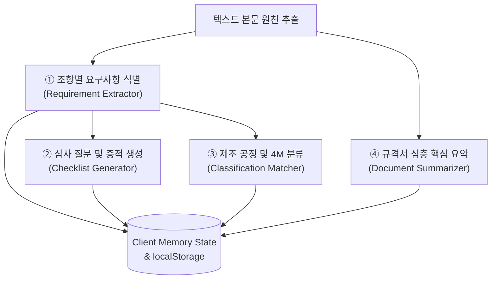

# 🧠 [Context 5] AI 기능별 컨텍스트 문서 (AI Features)

본 문서는 플랫폼 내에 내장된 핵심 AI 기능의 판단 기준, 입력과 출력 모델, 추출 규칙 및 추천 알고리즘을 상세히 기술한 AI 기능별 컨텍스트 문서입니다.

---

## 🌟 1. AI 적용 원칙 및 방향성

본 플랫폼의 AI는 독단적으로 의사결정을 내리는 '블랙박스형 AI'가 아닌, 인간 품질 전문가의 업무를 보조하고 속도를 개선하는 **Human-in-the-loop 지원 도구**로 정의됩니다. 

AI가 생성한 모든 결과는 클라이언트 메모리 상태(State) 및 브라우저 영속 보관함(`localStorage`)에 구조화되어 캐싱 및 저장되며, 품질 관리자는 언제든지 웹 대시보드를 바탕으로 항목을 수정, 보완, 삭제할 수 있는 무결한 제어권을 보유합니다.

---

## 🛠️ 2. 4대 핵심 AI 기능 명세

플랫폼은 규격서 파싱 및 데이터 적재 과정에서 다음과 같은 4가지 지능형 AI 가공 엔진을 순차적/병렬적으로 작동시킵니다.

---

### ① 조항별 요구사항 식별 및 구조화 (Requirement Extraction)
*   **목적**: 규격서 텍스트 중 단순 기술 배경이나 서술형 문장을 걸러내고, 협력업체가 반드시 준수해야 하는 **'강제성 실무 요구사항'**을 탐지 및 격리합니다.
*   **판단 기준**:
    - **의무/의무 조항 키워드 식별**: `shall`, `must`, `should`, `is required to`, `~해야 한다`, `~할 것`, `~이 요구된다`.
    - **참조 차단 규칙 (Anti-Reference Rule)**: "~를 참조하시오(see Clause X, refer to...)" 또는 "~에 따른다"와 같이 알맹이 없이 타 문항만 지시하는 참조 전용 문장은 추출 대상에서 즉각 탈피 및 배제하여 데이터 노이즈를 0%로 유지합니다.
    - **소제목 상속 매커니즘**: 구조화된 단락이 속해 있는 가장 인접하고 상위인 소제목(`Section X.Y`, `Chapter`, `Kapitel`, `조항`, `장` 등)을 소급 추적하여 해당 조항명(`section`) 필드에 자동으로 맵핑하여 상속시킵니다.
*   **입력 & 출력 데이터 모델**:
    - **Input**: 규격서 원본 텍스트 청크 (Plain Text Chunk).
    - **Output**: `section` (조항명), `requirement` (원문 요구사항).

---

### ② 심사 질문 및 증적 자동 생성 (Question & Evidence Generation)
*   **목적**: 딱딱하고 추상적인 원문 요구사항 및 과거 원천 실패/변경 텍스트를, 감사원(Auditor)이 현장에서 즉시 던질 수 있는 **실무형 심사 질문**과 이에 부합하는 **실물 증빙 리스트**로 번역 및 재창조합니다.
*   **품질 감사 질문 설계 기준**:
    - **오픈엔드 질문 (Open-ended Verification)**: 단순히 "네/아니오"로 때우는 닫힌 질문이 아닌, "어떤 절차를 통해 확인하고 있습니까?", "유무 확인 프로세스가 마련되어 있습니까?"와 같은 공정 심사 및 인터뷰 유도형 열린 문장으로 자동 가공합니다.
    - **8대 전문 품질 도메인 매퍼 (Domains)**: 완성차 타이어 신뢰성에 직결되는 8대 핵심 품질 영역(내구/고속주행, 공기기밀성, 제동/핸들링, 소음/진동, 마모, 이력추적, 4M변경/SOP, 원재료 배합 및 내오존성)에 특화된 키워드를 활용해 현장감 있는 감사 어휘를 사용합니다.
    - **대응 합치 증빙 명시**: 협력사가 제시해야 하는 막연한 서류가 아닌, `작업표준서(SOP)`, `일일 예방보전일지`, `계측기 검교정 성적서`, `원자재 COA`, `4M 변경승인서` 등 실제 자동차 산업에서 통용되는 **서류명칭**을 구체적으로 제공합니다.
*   **입력 & 출력 데이터 모델**:
    - **Input**: 구조화된 요구사항 텍스트 또는 실패 원인/대책 텍스트.
    - **Output**: `audit_question` (심사 질문), `evidence_compliance` (합치 증적 자료), `audit_method` (감사 검증 방법 - 실사/면담/문서검토).

---

### ③ 제조 공정 및 4M 요소 자동 분류 (Process & 4M Classification)
*   **목적**: 추출된 감사 질문을 여러 화면에서 유기적으로 필터링할 수 있도록 15대 표준 공정 카테고리와 4M 차원으로 정밀 자동 분류(Classification)합니다.
*   **분류 추천 로직 (Keywords Domain Matcher)**:
    - AI는 아래와 같이 수립된 형태소 및 의미 분석 사전을 활용해 대상 분류를 맵핑하며, 중복 맵핑이 필요할 시 다중 맵핑을 지원합니다.
    - **`Mixing`**: "배합", "원재료", "카본", "오일", "평량", "Rubber", "Compounding" 등 감지 시 추천.
    - **`Curing`**: "가류", "가열", "가압", "온도 프로파일", "벤트핀", "금형", "세정 주기" 등 감지 시 추천.
    - **`Building`**: "성형", "Air 배출", "그린타이어", "레이어 조립", "드럼" 등 감지 시 추천.
    - **`Machine` (4M)**: "설비", "금형", "롤러", "센서", "교정", "오차", "작동" 등 감지 시 맵핑.
    - **`Material` (4M)**: "고무", "원료", "재질", "재료 코드", "자재", "수입" 등 감지 시 맵핑.
*   **입력 & 출력 데이터 모델**:
    - **Input**: 가공된 요구사항 및 질문 텍스트.
    - **Output**: `process_category` (15대 공정 중 선택), `related_4m` (Man, Machine, Material, Method 중 선택).

---

### ④ 규격서 심층 핵심 검토 요약 (Review Summary Generator)
*   **목적**: 규격서 원본 파일을 전체적으로 다 읽지 않아도, 수석 품질 엔지니어가 반드시 알아야 할 **핵심 품질 의무와 변경 요약**을 한눈에 제공합니다.
*   **요약 정보 요건**:
    - 해당 규격의 핵심 적용 범위 및 목적.
    - 부품 공급업체 재자격 부여 주기 및 정기 시험 항목.
    - 완성차 제조사가 요구하는 특별 승인 프로세스 및 의무 보관 문서 기간.
    - 주요 이상 현상 발생 시 긴급 보고체계 의무조항 요약.
*   **입력 & 출력 데이터 모델**:
    - **Input**: 규격 문서 전체 원문 텍스트 (Full extracted text).
    - **Output**: `review_summary` (가독성이 극대화된 국문 요약문).

---

## 📝 3. AI 프롬프트 설계 규칙 및 안전 가이드라인

AI 기능의 지속적인 무결성과 고품질 작동을 보증하기 위해, 프롬프트 엔진 및 백그라운드 처리 모듈 개발 시 아래의 준수 조항을 강력히 권장합니다.

> [!IMPORTANT]
> **AI 프롬프트 무결성 3대 준수 규칙 (Core Prompt Rules)**
> 1.  **플레이스홀더 및 더미 텍스트 출력 금지**: "해당 조항 내용 없음", "N/A", "추후 입력"과 같은 기계적 무성의함을 원천 배제합니다. 내용이 누락될 가능성이 있을 시, 가장 가까운 상위 단락의 실제 핵심 문맥을 보정하여 출력하도록 예외 핸들링을 적용합니다.
> 2.  **프로페셔널 오디터 페르소나 주입**: 프롬프트의 최상단에는 반드시 "VDA 6.3 및 IATF 16949 인증을 담당하는 자동차 분야 최고 수준의 Lead Auditor"로서 행동할 것을 지시합니다.
> 3.  **JSON 형식 반환 및 무결성 파싱**: 모든 LLM 응답은 정해진 스키마의 완벽한 JSON 오브젝트 형태여야 하며, 특수 공백 부호나 인코딩으로 인한 파싱 에러를 미연에 방지하기 위한 문자열 정규화(`replace("\xa0", " ")` 등) 전처리 과정을 반드시 동반해야 합니다.
