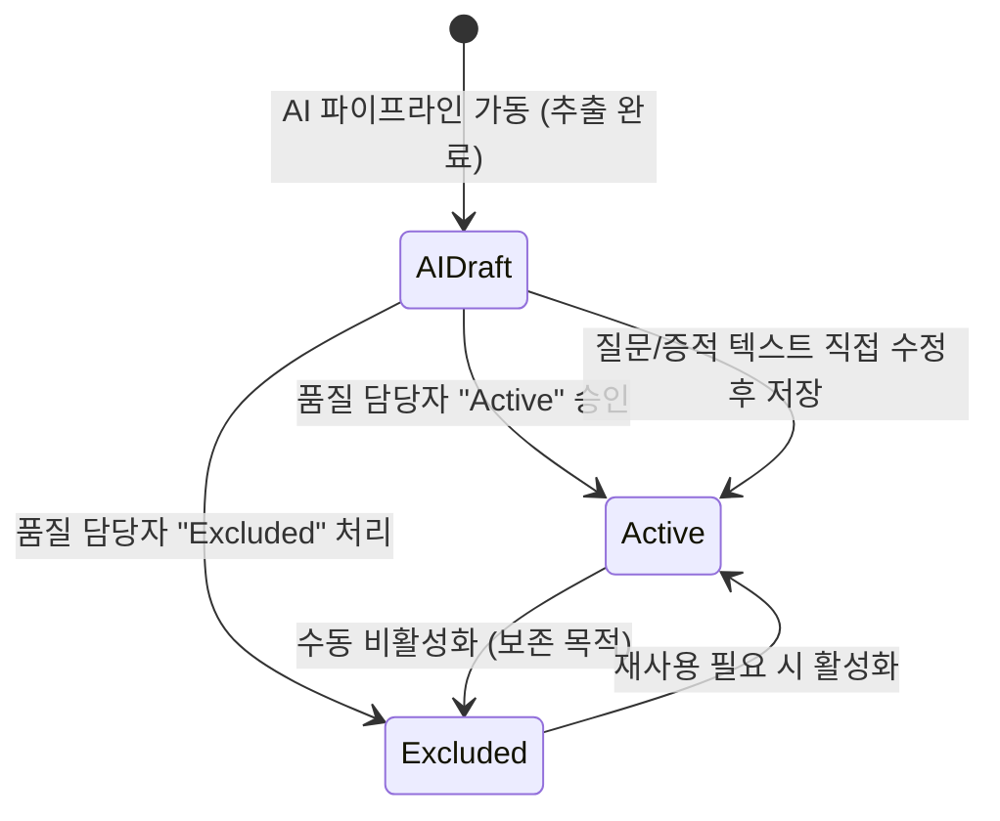

# 🔐 [Context 6] 공통 코드/권한/이력 정책 문서 (Policy & Permission)


본 문서는 플랫폼 전반에 적용되는 상태값 표준(Status Codes), 사용자 역할별 권한 구조(RBAC), 데이터 승인 및 리뷰 정책, 그리고 데이터 개정 및 변경 이력(Audit Trail) 관리 기준을 정의한 공통 정책 문서입니다.

---

## 🌟 1. 시스템 상태값 코드 정책 (Status Codes Policy)

다양한 이력 데이터 원천(QI, 4M, AUDIT) 및 가공된 체크리스트가 시스템 내에서 일관되게 정렬 및 관리될 수 있도록 상태값을 표준화합니다.

```
[4M 변경점 상태]  : 미결(Draft) ➔ 결재중(Under Review) ➔ 승인완료(Approved) ➔ 종결(Closed)
[품질 이슈 상태]  : 접수(Registered) ➔ 원인분석(Analyzing) ➔ 대책수립(Action Plan) ➔ 종결(Closed)
[체크리스트 상태] : AI제안(AI Draft) ➔ 검토완료(Active) ➔ 제외(Excluded)
```

### ① 4M 변경점 관리 상태 (`change_history_4m.STATUS / PROGRESS`)
*   **`STATUS` (결재 상태)**:
    - **`등록`**: 변경점이 발의되어 시스템에 최초 등록된 상태.
    - **`검토 중`**: 부서 간 영향도 분석 및 부서장 결재가 진행 중인 상태.
    - **`승인 완료`**: 모든 결재가 완료되어 변경 처리가 공식 승인된 상태.
    - **`반려`**: 보완이 필요하여 상신이 거부된 상태.
*   **`PROGRESS` (검증 단계)**:
    - **`초기 검증`**: 시제품 생산 및 연구소 평가 단계.
    - **`양산 적용 및 검증`**: 실제 공장에 변경 항목을 대입하여 모니터링하는 단계.
    - **`유효성 종결`**: 3개월 이상의 장기 신뢰성 확보 후 최종 검증 완료된 단계.

### ② 품질 실패 및 클레임 상태 (`quality_issues_qi.STATUS`)
*   **`Open`**: 이슈가 고객 또는 현장으로부터 접수되어 분석이 진행 중이거나 대책을 이행 중인 상태.
*   **`Closed`**: 원인 분석 및 재발방지 영구 대책(8D Report) 이행이 끝나고, 고객사의 최종 유효성 승인을 확보한 상태.

### ③ 통합 감사 체크리스트 검토 상태 (`unified_audit_checklists.status`)
*   **`AI Draft` (제안)**: AI 엔진에 의해 신규로 제안되었으며 실무자의 육안 검토를 대기 중인 상태.
*   **`Active` (사용)**: 실무자 검토 후 실제 감사에 활용하도록 승인된 정식 조항 상태 (기본값).
*   **`Excluded` (제외)**: 중복 조항이거나 대상 공정 환경에 불필요하여 감사 대상에서 수동으로 비활성화한 상태.

---

## 👥 2. 역할 기반 사용자 권한 정책 (RBAC - Role-Based Access Control)

초기 MVP 단계에서는 원활하고 신속한 피드백을 위해 **단일 권한 구조(모든 사용자가 전체 기능 사용 가능)**로 운영됩니다. 그러나 향후 실제 전사 배포 및 보안 통제를 대비해 아래와 같이 4단계로 확장 가능한 역할 기반 보안 아키텍처(RBAC)를 수립하여 설계에 반영해 둡니다.

```mermaid
gantt
    title 역할별 기능 접근 권한 범위
    dateFormat  X
    axisFormat %s
    section System Admin
    전체 시스템 제어 및 마스터/SQL 쓰기 권한   :active, 0, 100
    section Data Manager (품질담당)
    OE Library 관리, AI Action Plan 생성 및 수정 :active, 0, 75
    section Checklist User (현장오디터)
    Self-Audit Checklist 조건 조회 및 Export 가능  :active, 0, 50
    section Viewer (읽기전용)
    Risk Assessment 및 Checklist 열람/인쇄만 가능  :active, 0, 25
```



### 📋 역할별 세부 접근 권한 매핑 테이블

| 기능 구분 | 세부 기능 및 API 경로 | System Admin | Data Manager | Checklist User | Viewer |
| :---: | :--- | :---: | :---: | :---: | :---: |
| **시스템** | 글로벌 환경설정 및 마스터 코드 제어 | **O** | X | X | X |
| **SQL Console** | SELECT 및 특정 유용 쿼리 템플릿 실행 | **O** (All) | **O** (Select) | X | X |
| **OE Requirement Library** | 완제품 규격서 메타데이터 필터링, 요약 및 다운로드 | **O** | **O** | X | X |
| **AI Action Plan** | 감사 수검 후 AI 개선 방향 및 SOP 가이드 자동 제안 | **O** | **O** | X | X |
| **Self-Audit & Master Checklist** | 통합 체크리스트 마스터 조회, 조건 검색 및 편집 | **O** | **O** | **O** | X |
| **Risk Assessment** | 공장별 실시간 품질 실패/4M 리스크 시각화 및 모니터링 | **O** | **O** | **O** | **O** |
| **데이터 추출** | 필터링 결과 CSV 내보내기 (Export) | **O** | **O** | **O** | **O** |

---

## 📝 3. AI 제안 데이터 승인 및 리뷰 정책 (Approval & Review)

AI가 자동으로 정밀 도출한 감사 체크리스트의 신뢰성을 보장하고 데이터 오염을 예방하기 위한 프로세스 정책입니다.



1.  **AI 제안 항목의 표식**: AI에 의해 신규로 생성된 감사 질문 조항은 대시보드 및 결과 그리드 상에 **[AI Draft]** 배지와 함께 노출되어 사용자가 즉각 분별할 수 있도록 합니다.
2.  **검토 및 승인 이행**: 품질 담당자는 대시보드 상에서 해당 항목을 조회한 뒤, **"승인(Active)"** 버튼을 누르거나 텍스트를 일부 보정하여 저장하는 것으로 해당 조항의 정합성을 최종 확정합니다.
3.  **수동 보정 우선의 원칙**: 사용자가 임의로 직접 수정한 텍스트 및 가치 속성(공정 분류, 중요도 등)은 **AI의 재추출 및 동기화 루프가 가동되어도 절대 덮어써지지 않고 보존**되도록 예외 무결 처리를 구현합니다.
4.  **영구 삭제 대신 비활성화**: 사용자가 제외한 항목은 데이터베이스에서 물리적으로 지우지 않고 `Excluded` 상태값만 부여하여, 추후 감사 이력 추적 및 복원이 필요한 시점에 언제든 재활성화할 수 있도록 설계합니다.

---

## 📈 4. 규격 개정 및 데이터 변경 이력 관리 (Audit Trail)

자동차 품질 보증 분야에서 규격서의 제/개정 이력과 데이터의 정합성 추적은 매우 민감하고 중요한 정보입니다.

### ① 데이터 가공 및 적재 시점 타임스탬프 표준화
*   데이터베이스에 저장되는 모든 레코드는 데이터의 최종 갱신 및 가공 시점을 나타내는 **`processed_at`** 필드를 포함해야 합니다.
*   **포맷 표준**: `YYYY-MM-DD HH:MM:SS` (예: `2026-05-27 08:20:00`)

### ② 규격서 개정(Revision) 추적 및 영향도 분석 정책
*   **파일 중복 방지**: 완제품 규격서 마스터 테이블(`document_library`)은 실제 물리 파일명(`filename`)을 `Unique` 키로 선언하여 동일 파일의 중복 적재를 사전에 원천 차단합니다.
*   **동일 규격 개정판 탐지**: 파일명이나 텍스트 본문에서 기존과 동일한 규격코드(`doc_code`)를 가졌으나 개정일(`revision_date`)이 다른 신규 문서가 감지되면, 시스템은 이를 **"개정판 규격(Revision)"**으로 식별합니다.
*   **영향도 통보 프로세스**:
    1.  이전 버전의 규격서에 매핑되어 작동하던 기존 감사 체크리스트 조항들을 보존합니다.
    2.  신규 개정 규격서에 대하여 AI 파이프라인을 돌려 새로운 체크리스트 질문 후보를 도출합니다.
    3.  대시보드 상에 **"이전 규격(GS 90018-1 v2020) 대비 신규 개정판(GS 90018-1 v2024) 등록 완료 - 영향도 검토 필요"** 알림을 노출하여 품질 담당자가 신구 조항을 비교 대조하고 마이그레이션할 수 있는 작업 경로를 제공합니다.
