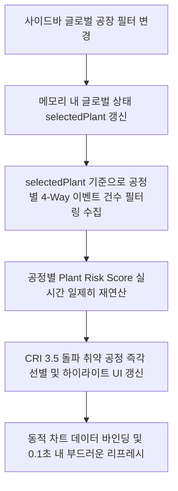

# ⚙️ [Context 07] Business Rules and Logic

본 문서는 **Risk-Based Audit Checklist System**의 핵심 두뇌 역할을 담당하는 비즈니스 가중치 연산 공식, 임계치 클램핑 규칙, 공정 키워드 매핑 우선순위 및 실시간 다차원 필터 연동 논리를 정교하게 규정하는 공식 비즈니스 룰 정의서입니다.

---

## 🧮 1. 공장별 리스크 스코어 (Plant Risk Score) 연산 공식

공장 및 공정별 위험도를 정량화하여 취약점을 판단하고, 자체 감사(Audit) 우선순위를 도출하기 위해 다음 4-Way 가중 수식을 엄격히 적용합니다.

### ① 리스크 지수 산출 수식 (4-Way Weighted Formula)
각 공장($P$)의 특정 공정($C$)에 대해 축적된 연간 품질 이벤트 건수를 바탕으로 위험 점수를 실시간 연산합니다.

$$R_{P,C} = \min \left( 5.0, \;\; w_{\text{QI}} \times N_{\text{QI}}(P, C) + w_{\text{4M}} \times N_{\text{4M}}(P, C) + w_{\text{Audit}} \times N_{\text{Audit}}(P, C) + w_{\text{Internal}} \times N_{\text{Internal}}(P, C) \right)$$

### ② 유형별 가중치 계수 ($w$) 정의
*   **$w_{\text{QI}}$ (과거 품질 실패 이력, QI)**: **0.3**
    *   고객 클레임 및 완성차 불만 직결 요인으로 가장 높은 가중치를 배정합니다. **Historical CQMS는 오직 등록일(`REG_DATE`) 기준 당해년도(2026년) 품질이슈 대상건** 중 **유효한 중대이슈 분류 코드인 `"HK_FAULT_YN": "Y"` 항목만을 추출**하여 분석 및 누적 감점 패널티에 반영합니다.
*   **$w_{\text{Audit}}$ (과거 감사 지적사항, Findings)**: **0.2**
    *   대외 오딧 지적 이력으로, 미조치 시 법적/계약적 패널티를 유발하는 고위험군입니다.
*   **$w_{\text{Internal}}$ (내부 상시 위배 지적, Internal Audit)**: **0.15**
    *   자체 진단 미흡 요소로, 상시 품질 저해 가능성을 나타냅니다.
*   **$w_{\text{4M}}$ (공정 변경 위험도, 4M Changes)**: **0.1**
    *   설비 교체, 작업자 변경 등 초기 공정 안정화 리스크 계수입니다.

### ③ 상한 클램핑 (Maximum Clamping Rule)
*   이벤트 건수 폭증으로 인해 점수가 무한대로 발산하여 레이아웃이 붕괴되는 것을 원천 차단합니다.
*   연산 결과의 최대 한계선은 **`5.0`** 점으로 클램프(Clamp) 처리하며, 최소값은 **`0.0`** 점입니다.
*   자바스크립트 구현 시 `Math.min(5.0, Math.max(0.0, calculatedScore))` 구조를 의무적으로 채택합니다.

---

## 🏷️ 2. 동적 위험도 등급 및 UI 뱃지 기준 (Risk Badge Rules)

연산된 리스크 스코어($R_{P,C}$)에 따라 3단계 위험 등급 및 시각적 HSL 테마 뱃지를 동적 매핑합니다.

| 위험 등급 (Level) | 스코어 임계값 ($R$) | HSL 배경색 (BG) | HSL 테두리 및 텍스트 | 시각적 강조 및 인터랙션 |
| :--- | :---: | :--- | :--- | :--- |
| 🔴 **CRITICAL** (고위험) | $R \ge 3.5$ | `hsl(0, 100%, 97%)` | `hsl(0, 72%, 51%)` | 적색 경고 테두리, 깜빡이는(Pulse) 미세 알럿 마커 트리거 |
| 🟡 **MODERATE** (중위험) | $2.0 \le R < 3.5$ | `hsl(38, 92%, 95%)` | `hsl(38, 92%, 35%)` | 황색 경보 스타일, 단정한 경고 테두리 유지 |
| 🟢 **LOW** (저위험) | $R < 2.0$ | `hsl(142, 70%, 95%)` | `hsl(142, 72%, 29%)` | 가독성이 차분한 녹색 테두리 및 마크 |

> [!IMPORTANT]
> **WCAG 2.1 AA 가이드라인 준수**: 
> 모던 슬레이트 다크 테마 및 화이트 배경 위에서 텍스트 시인성이 뭉개지는 현상을 방지하기 위해, 뱃지 내부의 텍스트 색상은 배경색보다 명도가 최소 4.5배 이상 어두운 짙은 HSL 톤으로 맵핑하여 극상의 가독성 대비율(Contrast Ratio)을 충족해야 합니다.

---

## 🔍 3. 공정 매핑 키워드 우선순위 규칙 (Keyword Priority Rules)

외부에서 신규 입력되거나 실시간 파싱해야 하는 가공되지 않은 텍스트 지적사항 발생 시, 단어의 핵심을 식별하여 15대 표준공정에 인텔리전트하게 자동 할당하는 키워드 매칭 규칙입니다.

### ① 다중 키워드 중복 시 처리 우선순위 (Fallback Priority)
하나의 부적합 상황 텍스트에 여러 공정 단어가 복합 출현할 경우, 제조 공정의 선후 위계 및 치명도를 반영하여 다음 순위로 가상 할당합니다.

1.  **압출 (Extruding) / 비드 (Beading)** (가장 높음) - 타이어 골격을 만드는 기초 공정으로 최상위 매핑.
2.  **가류 (Curing)** - 온도/압력 임계값이 핵심인 화학 반응 단계로, 미세 결함이 대형 사고로 직결됨.
3.  **성형 (Building)** - 반제품을 조립하는 조립 품질 보증 구간.
4.  **정밀 검사 (Final Inspection)** - 출하 전 최종 보루.
5.  **정련 (Mixing)** - 컴파운드 배합 구간.

### ② 표준 공정 매핑 딕셔너리 명세 (Mapping Dictionary)
*   **정련 (Mixing)**: `"정련"`, `"배합"`, `"컴파운드"`, `"Compound"`, `"Carbon"`, `"Rubber"`
*   **압출 (Extruding)**: `"압출"`, `"트레드"`, `"Tread"`, `"Extruding"`, `"Sidewall"`
*   **비드 (Beading)**: `"비드"`, `"에이프런"`, `"Bead"`, `"Wire"`, `"Apex"`
*   **가류 (Curing)**: `"가류"`, `"큐어링"`, `"Curing"`, `"Mold"`, `"스팀"`, `"Pressure"`
*   **성형 (Building)**: `"성형"`, `"그린타이어"`, `"Green Tire"`, `"Building"`, `"조립"`
*   **검사 (Inspection)**: `"검사"`, `"외관"`, `"유니포미티"`, `"Uniformity"`, `"X-Ray"`, `"인스펙션"`

---

## 🔄 4. 다차원 사이드바 필터 복차 연동 논리 (Multi-dimensional Filtering Cascade)

대시보드와 각 메뉴 화면이 실시간으로 조율된 데이터를 표시하기 위해, 전역 필터(Global Filter)가 사이드바에서 변경될 시 모든 메모리 데이터셋은 아래의 동적 단계적 폭포수(Cascade) 규칙을 따라 갱신됩니다.

*   **상태 보존(State Persistence)**: 
    *   공장 선택이 `'ALL'`인 경우 전사 8대 공장의 데이터 합산 결과를 노출하며, 특정 공장(예: `'KP'`) 선택 시 해당 공장의 단독 데이터만 발라내어 가중치를 집계합니다.
    *   사용자가 다른 메뉴 탭으로 마우스를 전환하더라도, 이전에 지정해 놓은 공장/고객사 글로벌 필터 상태는 전역 변수(`app.js` 내 `this.state`)에 완벽하게 박제 유지되어 탭을 왕복해도 정보의 연속성이 보존됩니다.
