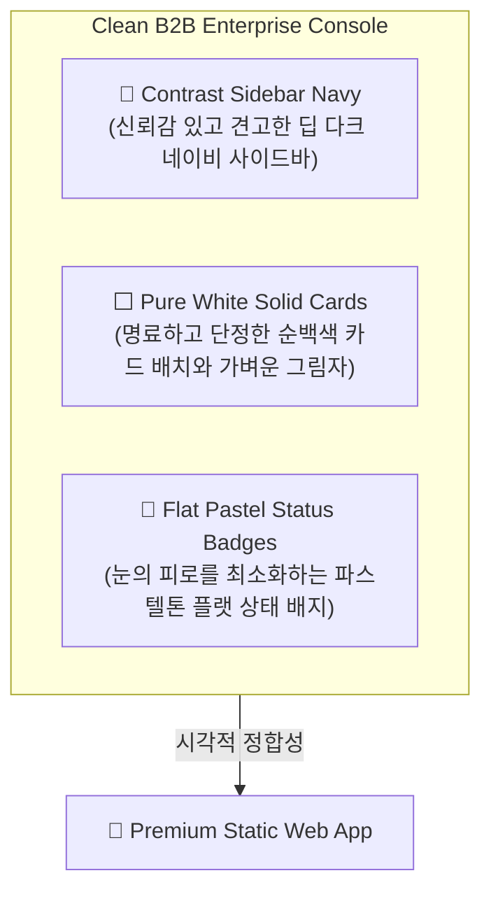

# 🎨 09 Design System and UI Guidelines

## 1. 문서 목적

본 문서는 **Risk-Based Audit Checklist System**의 고성능 정적(Static) 프론트엔드 아키텍처(HTML5, Vanilla CSS3, Vanilla JavaScript)를 개발할 때 일관되게 적용되어야 할 **초프리미엄 디자인 사양서 및 UI/UX 가이드라인**입니다.

사내 해커톤 MVP 제품이 완성차 고객사(OEM) 및 공장 감사 위원의 눈길을 즉시 사로잡는 시각적 수려함(Aesthetic WOW)과 뛰어난 비즈니스 신뢰성을 동시에 달성하도록 지휘하며, 개발자가 인라인 및 임의 코드를 양산하지 않고 정의된 토큰과 컴포넌트 클래스를 기반으로 고안정성·고해상도 인터페이스를 설계하도록 구체적인 가이드를 제공합니다.

기존의 어둡고 자극적인 네온 사인 스타일이나 해커톤용 스패닝 다크 무드를 완전히 걷어내고, 실제 글로벌 오디터 환경에서 찬사를 아끼지 않는 **"단정하고 신뢰성 넘치는 프리미엄 B2B 엔터프라이즈 콘솔 (Premium Clean B2B Enterprise Console)"** 시스템으로 정의하며, 핵심 화면인 **스마트 체크리스트(Smart Checklist)** 및 **감사 타임라인(Audit Timeline)** 화면 이미지의 정밀 수치 분석 명세를 일체화하여 완결합니다.

---

## 2. 디자인 컨셉 (Design Concept)

본 시스템은 공장의 복잡다단한 리스크 이력과 기술 규격을 한자리에서 실시간으로 지휘·모니터링하는 **"프리미엄 B2B 감사 콘솔 (Clean Enterprise Control Console)"** 콘셉트를 채택합니다.



*   **대비 극대화 사이드바 (Contrast Sidebar)**: 신뢰와 정갈함을 강조하는 **딥 슬레이트 다크 네이비(`#0f172a`)** 배경에 은은하고 고급스러운 회색-블루 텍스트(`#94a3b8`)를 조합합니다. 활성화된 탭은 로열 블루(`#2563eb`) 배경의 둥근 모서리 디자인을 적용하여 확실한 포커스 효과를 부여합니다.
*   **맑은 라이트 캔버스 (Clean Light Canvas)**: 메인 배경은 부드럽고 가독성 높은 **라이트 그레이/블루(`#f8fafc` 또는 `#f1f5f9`)**를 사용하여 장시간 데이터 정독에도 안구 피로가 최소화되도록 설계합니다.
*   **플랫 카드 & 솔리드 레이어 (Solid White Surfaces)**: 콘텐츠 카드는 투명하거나 빛나는 효과(Neon Glow) 대신, **순백색 솔리드 표면(`#ffffff`)**과 미세한 그레이 테두리(`#e2e8f0`), 그리고 매우 투명하고 가벼운 자연스러운 내추럴 섀도우를 조합하여 현대적이고 안정적인 공간감을 창출합니다.
*   **고대비 플랫 상태 신호 (Semantic Flat Badges)**: 연산 점수 3.5점을 상회하는 위험 공정, 긴급 지적 조항 등은 네온사인 같은 빛(Glow) 효과를 전면 차단하고, 파스텔 톤의 연한 배경에 선명한 고대비 컬러 폰트와 테두리를 매핑하여 높은 시인성과 완결성을 추구합니다.

---

## 3. 색상 토큰 (Color Tokens)

디자인 일관성 및 동적 스타일 튜닝을 위해 모든 핵심 색상은 커스텀 CSS 변수(`--variable`)로 선언되며, 명도 제어에 탁월한 **HSL 포맷**을 기준으로 구성됩니다.

```css
:root {
  /* --- 🎨 Core Brand Palette --- */
  --brand-navy: #0f172a;         /* HSL(222, 47%, 11%) - 사이드바 고정 다크 네이비 */
  --brand-blue: #2563eb;         /* HSL(221, 83%, 53%) - 포인트 로열 블루 */
  --brand-blue-hover: #1d4ed8;   /* HSL(221, 83%, 46%) - 로열 블루 호버 */

  /* --- 🌌 Base Backgrounds --- */
  --bg-app: #f8fafc;             /* HSL(210, 20%, 98%) - 메인 콘텐츠 기본 밝은 배경 */
  --bg-sidebar: #0f172a;         /* HSL(222, 47%, 11%) - 사이드바 어두운 배경 */
  --bg-card: #ffffff;            /* HSL(0, 0%, 100%) - 카드 및 패널 순백색 배경 */
  
  /* --- 🚦 Semantic Status Colors (Flat Pastel B2B Style) --- */
  /* High (Red) - 고위험 / 지연 */
  --color-status-high: #ef4444;           /* HSL(0, 84%, 60%) */
  --bg-status-high: #fef2f2;              /* HSL(0, 100%, 97%) */
  --border-status-high: #fca5a5;          /* HSL(0, 93%, 84%) */
  --text-status-high: #b91c1c;            /* HSL(0, 72%, 41%) */
  
  /* Medium (Orange/Amber) - 보통 / 주의 */
  --color-status-medium: #f59e0b;         /* HSL(38, 92%, 50%) */
  --bg-status-medium: #fffbeb;            /* HSL(48, 100%, 96%) */
  --border-status-medium: #fcd34d;        /* HSL(48, 96%, 77%) */
  --text-status-medium: #b45309;          /* HSL(35, 92%, 33%) */

  /* Low (Green/Mint) - 낮음 / 완료 */
  --color-status-low: #10b981;            /* HSL(150, 84%, 45%) */
  --bg-status-low: #f0fdf4;               /* HSL(143, 80%, 96%) */
  --border-status-low: #86efac;           /* HSL(142, 72%, 73%) */
  --text-status-low: #15803d;             /* HSL(142, 70%, 29%) */

  /* Info / In Progress (Blue) - 진행중 */
  --color-status-info: #3b82f6;           /* HSL(221, 83%, 53%) */
  --bg-status-info: #eff6ff;              /* HSL(214, 100%, 97%) */
  --border-status-info: #bfdbfe;          /* HSL(214, 95%, 87%) */
  --text-status-info: #1d4ed8;            /* HSL(221, 83%, 46%) */

  /* --- 📄 Premium Typography --- */
  --text-primary: #0f172a;        /* HSL(222, 47%, 11%) - 주조색 텍스트 (다크 네이비) */
  --text-secondary: #475569;      /* HSL(215, 16%, 47%) - 부조색 텍스트 (슬레이트 그레이) */
  --text-muted-dark: #94a3b8;     /* HSL(218, 11%, 65%) - 어두운 배경(사이드바)용 설명/비활성 텍스트 */
  --text-muted-light: #64748b;    /* HSL(215, 16%, 47%) - 밝은 배경(카드)용 설명/비활성 텍스트 */
  --text-light: #ffffff;          /* 어두운 컴포넌트/사이드바용 밝은 텍스트 */

  /* --- 🫧 Layout Borders --- */
  --border-card: #e2e8f0;         /* 표준 카드 연그레이 테두리 */
  --border-input: #cbd5e1;        /* 입력 폼 및 셀렉터 테두리 */
  --radius-panel: 16px;
  --radius-card: 12px;
  --radius-chip: 6px;

  /* --- 📦 Natural Box Shadows (No Glows) --- */
  --shadow-sm: 0 1px 2px 0 rgba(0, 0, 0, 0.05);
  --shadow-base: 0 4px 6px -1px rgba(0, 0, 0, 0.05), 0 2px 4px -2px rgba(0, 0, 0, 0.05);
  --shadow-md: 0 10px 15px -3px rgba(0, 0, 0, 0.05), 0 4px 6px -4px rgba(0, 0, 0, 0.05);
}
```

### 💡 WCAG 2.1 AA 명도 대비 무결성 표준 (Contrast Compliance)
*   **어두운 배경 (사이드바, 콘솔 등)**:
    *   배경색: `--bg-sidebar: #0f172a`
    *   기본 글자색: `--text-light: #ffffff` (대비율 15.9:1)
    *   설명/비활성 글자색: `--text-muted-dark: #94a3b8` (대비율 4.88:1)
    *   *결과: 모두 WCAG AA 기준(4.5:1)을 완벽하게 만족합니다.*
*   **밝은 배경 (메인 캔버스, 화이트 카드 등)**:
    *   배경색: `--bg-card: #ffffff`, `--bg-app: #f8fafc`
    *   주요 텍스트: `--text-primary: #0f172a` (대비율 15.9:1)
    *   부조색 텍스트: `--text-secondary: #475569` (대비율 5.39:1)
    *   설명/비활성 글자색: **`--text-muted-light: #64748b`** (대비율 4.58:1)
    *   *결과: 밝은 카드 영역에서 사용되는 보조 텍스트의 대비율을 4.5:1 이상으로 보장하여 시인성을 완벽히 확보합니다. 절대 밝은 배경 위에서 `--text-muted-dark`를 사용해서는 안 됩니다.*

> [!WARNING]
> ### 🚨 개발자 실수 다발 구간: `--text-light` & `--text-muted` 사용 규칙 오적용 방지
> 
> 1. **`--text-light`는 pure white (`#ffffff`) 입니다.** 
>    * "light"라는 명칭이 주는 뉘앙스(가볍다, 연하다) 때문에 밝은 카드 배경에서 보조용이나 연한 글자색으로 무심코 `var(--text-light)`를 적용하는 실수가 발생하기 쉽습니다.
>    * **결과**: 화이트 카드 배경 위에서 흰색 글씨(White-on-White)가 되어 "기능 구분" 컬럼의 글자처럼 아예 보이지 않게 되는 시각 소실이 일어납니다.
>    * **대책**: 밝은 배경 위에서 주요 타이틀/글자색이 필요할 때는 반드시 **`--text-primary`** (`#0f172a`), 보조 설명 글자색이 필요할 때는 **`--text-muted-light`** (`#64748b`)를 사용하십시오.
> 
> 2. **`--text-muted`는 어두운 배경용인 `#94a3b8` 입니다.**
>    * 밝은 배경(화이트 카드 등) 위에서 `var(--text-muted)`를 사용하면 명도 대비가 **2.43:1**에 불과하여 WCAG 기준(4.5:1)을 만족하지 못해 글자가 거의 보이지 않게 됩니다.
>    * **결과**: 가독성 불량 지적 유발.
>    * **대책**: 밝은 배경 위의 설명문에는 반드시 **`--text-muted-light`** (`#64748b`)를 지정하십시오.
> 
> 3. **복사-붙여넣기(Copy & Paste)의 함정**:
>    * 사이드바(Sidebar)나 어두운 콘솔(Terminal/SQL Console) 등 다크 테마가 적용된 UI의 코드를 복사해서 일반 화이트 카드 레이아웃에 붙여넣을 때, inline style에 하드코딩된 `color: var(--text-light)` 또는 `color: var(--text-muted)`가 그대로 잔존하여 글자가 소실되는 현상이 발생합니다. 복사 후에는 반드시 카드 배경에 맞춰 `var(--text-primary)` 등으로 텍스트 컬러를 재조정해야 합니다.
> 
> 4. **👥 역할 계정 변환 메뉴 및 다크 팝오버(Popover) 스타일 가이드**:
>    * 사이드바 하단 프로필 영역이나 팝오버 메뉴처럼 어두운 배경(`rgba(15, 24, 46, 0.95)`)을 사용하는 컴포넌트에서는 기본 글자색으로 `var(--text-light)` (`#ffffff`), 소속/직급/추가 역할 등의 보조 텍스트에는 반드시 **`var(--text-muted-dark)`** (`#94a3b8`)를 적용하여 4.5:1 이상의 명도 대비를 철저히 보장해야 합니다.
>    * 자바스크립트로 템플릿 리터럴을 동적 렌더링할 때 생성하는 하위 클래스(예: `.popover-dept`)가 CSS 스타일시트에서 누락되지 않도록 더블 체크하여 브라우저 기본 글자색(어두운 색)이 상속되는 대조 문제를 영구 차단하십시오.
>    * 팝오버 리스트나 Flexbox 컨테이너 내부의 아바타(`.popover-avatar`, `.profile-avatar`) 및 뱃지(`.popover-badge`)와 같은 원형/도형 요소들은 텍스트 신장이나 좁은 뷰포트 압축 환경에서도 크기가 보존되도록 **`flex-shrink: 0;`**을 의무 선언해야 합니다.
> 
> 5. **🤖 플로팅 AI 감사 비서 및 다크 컴포넌트 명도 대비 & 클래스 매핑 무결성**:
>    * 플로팅 AI 감사 비서 및 챗 위젯과 같이 어두운 슬레이트 계열(`rgba(15, 23, 42, 0.94)`)의 다크 컴포넌트를 구현할 때는, 동적으로 삽입되는 HTML 요소(`.message`, `.message-bot`, `.message-user`, `.message-content`)에 대한 클래스 명칭이 CSS 스타일시트와 완전히 일치하는지 무결성을 검증하십시오.
>    * 기본 `body` 글자색(`var(--text-primary)`: `#0f172a`, 어두운 다크 네이비)이 그대로 상속되어 어두운 슬레이트 배경 위에서 글씨가 검게 변하는 현상(Black-on-Dark Slate)을 영구 차단하십시오. 봇 메시지는 `#f8fafc` 이상의 고대비 밝은 텍스트를 할당해야 합니다.
>    * "추론 중" 로딩 텍스트나 인라인 가이드 등의 요소에 밝은 테마용 보조 색상인 `var(--text-secondary)` (`#475569`)를 명시적으로 인라인 하드코딩하지 마십시오. 반드시 어두운 배경에 부합하는 `#cbd5e1` 등 4.5:1 명도 대비를 확실히 보장하는 색상만을 지정해야 합니다.
>    * 상태 표시를 위한 원형 요소(`.status-dot`) 등은 크기와 테마별 배경색(`var(--color-status-low)` 등), 그리고 은은한 그림자 광원 효과(`box-shadow`)가 CSS로 명확하게 부여되었는지 매번 더블 체크해야 합니다.

---

## 4. 타이포그래피 (Typography)

품질 질문 및 이진 감사 통계 데이터의 밀도를 고려하여 시인성이 검증된 3대 서체 매커니즘을 적용합니다.

| 분류 | 추천 폰트 | 매핑 대상 및 효과 | 스타일 특징 |
| :---: | :--- | :--- | :--- |
| **Header & Metrics** | **`Outfit`** | 페이지 타이틀, KPI 핵심 수치, D-Day, 리스크 레벨 등 | 기하학적이고 현대적인 테크 감성, 대문자 및 숫자 가독성 우수 |
| **Body & Text** | **`Inter`** | 체크리스트 질문, 표 본문, AI 코멘트, 툴팁 등 | 장문의 기술 규격 조항 정독 시 눈의 피로를 최소화하는 글로벌 표준 서체 |
| **Code & Console** | **`JetBrains Mono`** | SQL 에디터, 쿼리 결과 프레임 데이터 등 | 등폭(Monospace) 서체로 행 정렬 및 데이터 정렬 무결성 확보 |

*   **기본 규칙**: 글꼴 미제공 환경을 대비한 폴백 구조를 유지하며, 자모음 자간(`letter-spacing: -0.01em`)을 섬세히 좁혀 고급스러운 프리미엄 인쇄 미학을 완성합니다.

### 📝 타이포그래피 폰트 패밀리 변수 (Typography Family Tokens)

```css
:root {
  --font-family-header: 'Outfit', sans-serif;
  --font-family-body: 'Inter', -apple-system, sans-serif;
  --font-family-mono: 'JetBrains Mono', monospace;
}
```

---

## 5. 레이아웃 구조 (Grid App Shell)

화면 공간의 왜곡이나 불필요한 스크롤 발생을 억제하기 위해 **좌측 고정 사이드바(Sidebar)**와 **우측 메인 콘텐츠 뷰포트(Main Content)**가 정렬된 **2컬럼 그리드 앱 셸(App Shell)** 구조를 사용합니다.

```
+---------------------------------------------------------------------------------+
|                               [ TOP HEADER BAR ]                                |
| 🛡️ OE Audit Copilot                                         [ 사용 가이드 | Action ] |
+------------------+--------------------------------------------------------------+
|                  |  (Top Dynamic Filter Panel)                                  |
|  [ SIDEBAR ]     |  [ Plant Select ]  [ Target OEM ]  [ Audit Date Selector ]   |
|                  +--------------------------------------------------------------+
|  - Workspace     |  (KPI Metrics Dashboard Rows)                                |
|  - Risk Audit    |  [ KPI Card 1 ]   [ KPI Card 2 ]   [ KPI Card 3 ]   [ KPI 4 ]|
|  - OE Library    +--------------------------------------------------------------+
|  - Checklist     |  (Main Core Panel Grid)                                      |
|  - AI Action     |  +---------------------------+  +--------------------------+ |
|  - SQL Console   |  |                           |  |                          | |
|                  |  |     [ Main Content ]      |  |    [ Right Sidebar/ ]    | |
|                  |  |     Data Table Grid       |  |    [ Detailed Panel ]    | |
|                  |  |                           |  |    AI Advisor Box        | |
|                  |  +---------------------------+  +--------------------------+ |
|                  |                                                              |
+------------------+--------------------------------------------------------------+
```

### Grid App Shell 골격 CSS

```css
.app-layout {
  display: grid;
  grid-template-columns: 260px 1fr;
  height: 100vh;
  width: 100vw;
  background-color: var(--bg-app);
  color: var(--text-primary);
  font-family: 'Inter', -apple-system, sans-serif;
  overflow: hidden;
}

.sidebar {
  background-color: var(--bg-sidebar);
  border-right: 1px solid rgba(255, 255, 255, 0.08);
  display: flex;
  flex-direction: column;
  justify-content: space-between;
  padding: 24px 16px;
  overflow-y: auto;
  z-index: 10;
}

.main-content {
  display: flex;
  flex-direction: column;
  overflow-y: auto;
  padding: 24px;
  gap: 20px;
  background-color: var(--bg-app); /* 차분하고 정갈한 라이트 모드 기본 배경 */
}
```

---

## 6. 주요 컴포넌트 기준 (Main Component Standards)

### ① Sidebar (메뉴 컨트롤 타워)
*   **구성**: 최상단 정갈한 로고 마크, 메인 탭 네비게이션 리스트, 하단 시스템 오디터 프로필 노드.
*   **스타일링**: `.sidebar-nav-item`은 기본적으로 투명 배경에 연회색 텍스트(`#94a3b8`)를 유지합니다. `:hover` 시점에 `rgba(255,255,255,0.05)` 배경을 부여하고, 활성화(`active`) 상태 돌입 시 **완벽한 로열 블루 배경(`var(--brand-blue)`)과 순백색 폰트**를 매핑하여 명확한 비주얼 계층을 구성합니다.

### ② Top Header / Page Header (콘솔 헤더)
*   **구성**: 좌측 현재 활성 메뉴 타이틀과 부드러운 회색 서브타이틀, 우측 가이드 텍스트 및 액션 버튼(예: `체크리스트 다운로드`).
*   **스타일링**: 대시보드 대형 타이틀은 `Outfit` 폰트, `600` 이상의 두께로 묵직하고 정밀하게 노출하며 색상은 오프블랙(`#0f172a`)으로 고정합니다. 액션 버튼은 신뢰감을 주는 블루 단색 단추 또는 정갈한 화이트 아웃라인 단추 스타일로 가독성을 극대화합니다.

### ③ Filter Bar (통합 파라미터 셀렉터)
*   **구성**: 공장, OEM, 분석 기준, 공정 등의 드롭다운 셀렉터를 가로로 슬림하게 배치한 패널.
*   **스타일링**: `.filter-bar` 클래스로 선언된 화이트 표면 바 구조를 띄며, 입력 폼 컴포넌트는 호버 시 테두리가 브랜드 로열 블루(`var(--brand-blue)`)로 부드럽게 변화하여 조작 가능함을 명시합니다.

### ④ KPI Card (통계 메트릭 위젯)
*   **구성**: 개별 통계 값 단위의 격자 배치 컴포넌트.
*   **스타일링**: 순백색 솔리드 표면 카드 클래스(`.card-solid`)를 주입합니다. 테두리는 `1px solid var(--border-card)`로 감싸고 자연스럽고 부드러운 내추럴 섀도우를 얹습니다. 네온 글로우 테두리는 전면 배제합니다. D-Day, 핵심 카운트 수치는 `Outfit` 서체를 이용해 시선을 끌고, 단위 및 타이틀은 차분한 그레이(`#64748b`)를 입힙니다.

### ⑤ Data Table (프리미엄 감사 그리드)
*   **구성**: 체크리스트 질문 및 기술 규격 정보를 고밀도로 가독성 있게 렌더링하는 핵심 표.
*   **스타일링**: `.premium-readiness-table` 클래스를 활용합니다. 테이블 헤더는 아주 연한 회색 배경(`background-color: #f1f5f9`)을 적용해 본문과 명확히 구분하고, 행 간에는 은은한 수평선(`border-bottom: 1px solid #e2e8f0`)으로 구획을 짓습니다. 마우스가 행에 위치 시 수려하게 미색 배경으로 하이라이팅 효과(`.table-row-hover`)가 적용되게 조율합니다.

### ⑥ Risk Badge (위험도 강조 뱃지)
*   **구성**: `High`, `Medium`, `Low` 리스크 정성 등급 및 점수 배지.
*   **스타일링**: 연하고 차분한 파스텔톤 배경에 짙고 명확한 고대비 컬러 텍스트와 보더를 매핑하여 시각 피로를 없애고 심플하게 완결합니다. (글로우 효과 전면 차단)
    *   **`High` (Red)**: `color: var(--text-status-high); background: var(--bg-status-high); border: 1px solid var(--border-status-high);`
    *   **`Medium` (Orange)**: `color: var(--text-status-medium); background: var(--bg-status-medium); border: 1px solid var(--border-status-medium);`
    *   **`Low` (Green)**: `color: var(--text-status-low); background: var(--bg-status-low); border: 1px solid var(--border-status-low);`

### ⑦ Alert Board (실시간 리스크 경고 보드)
*   **구성**: 치명적 4M 변경이나 품질 실패 포착 시 노출되는 경고 보드.
*   **스타일링**: 눈에 자극적인 글로우 애니메이션을 배제하고, 연한 주홍/적색 바탕의 플랫 보드(`--bg-status-high` 기반)에 적색 느낌표 아이콘과 짙은 안내문을 배치하여 엔터프라이즈 사양다운 위엄을 보존합니다.

### ⑧ Chart / Gauge (준비율 원형 게이지 및 도넛 차트)
*   **구성**: 준비 진척도를 표현하는 원형 아크(Gauge) 및 분석 비율 도넛 차트.
*   **스타일링**: 자체 SVG 드로잉을 기반으로 원형 진척 루프와 한가운데 검은색 정밀 수치 텍스트를 렌더링합니다. 게이지 아크의 바탕 트랙은 연한 그레이(`#e2e8f0`)로 가두고, 차오르는 게이지 라인에는 완료/지연 상태를 가상 응답 밸류에 부합하는 플랫 컬러로 마감하여 프리미엄 계기판 감성을 구현합니다.

```css
/* 도넛 차트 컨테이너 구조 */
.donut-chart-container {
  display: flex;
  align-items: center;
  gap: 16px;
}
.donut-svg-wrapper {
  position: relative;
  width: 90px;
  height: 90px;
}
.donut-legend-list {
  display: flex;
  flex-direction: column;
  gap: 4px;
  font-size: 11px;
}

/* 준비 상태 원형 인디케이터 (SVG 기준) */
.readiness-gauge {
  display: inline-flex;
  align-items: center;
  gap: 8px;
  font-size: 12px;
  font-weight: 600;
}
.gauge-svg {
  transform: rotate(-90deg);
}
.gauge-circle-bg {
  fill: none;
  stroke: #e2e8f0; /* 밝은 회색 트랙 */
}
.gauge-circle-val {
  fill: none;
  stroke-linecap: round;
  transition: stroke-dashoffset 0.3s ease;
}
.gauge-circle-val.high-risk { stroke: var(--color-status-high); }
.gauge-circle-val.medium-risk { stroke: var(--color-status-medium); }
.gauge-circle-val.low-risk { stroke: var(--color-status-low); }
.gauge-circle-val.info { stroke: var(--color-status-info); }
```

### ⑨ AI Insight Panel / Box (지능형 분석 피드)
*   **구성**: 화면 우측이나 일부분에 배치된 AI 어드바이저 코멘트 요약창.
*   **스타일링**: 차분하고 고급스러운 연보라빛 또는 연청색 단색 배경(`#f5f3ff` 또는 `#eff6ff`)을 사용하여 정보의 독립적 위계를 확보하고, 첫머리에 실시간 분석을 의미하는 진한 퍼플/블루 번개 아이콘(`⚡`)을 배치하여 지능형 레이아웃의 깊이를 부각합니다.

### ⑩ Detail Drawer (우측 슬라이드 상세 패널)
*   **구성**: 특정 행이나 지적사항 터치 시 우측에서 출현하는 수검 증빙 및 대책 명세 패널.
*   **스타일링**: `.detail-drawer` 컴포넌트는 평소에 우측 영역 바깥에 은닉해 두었다가, 활성화 시 매끄러운 2D 가속 트랜지션(`transform: translateX(0)`)을 가동하여 부드럽고 가볍게 밀려 들어오도록 구축하며, 순백색의 솔리드한 질감과 미세한 경계 보더로 설계합니다.

### ⑪ White Modal (고대비 규칙 준수 - Phase 3)
*   **구성**: 신규 감사 일정 등록 모달, 메뉴 접근 제한 모달(Permission Modal), 신규 사용자 등록 모달(User Registration Modal) 등 입력 및 안내 폼이 결합된 핵심 팝업 패널 전체.
*   **스타일링**: 복잡한 반투명 다크 글래스 뒤에 텍스트나 입력란이 묻혀 일관성을 해치는 것을 원천 차단하기 위해, 전체 모달창에 완전한 불투명 솔리드 화이트 백그라운드(`#ffffff`)와 명확한 그레이 보더(`#cbd5e1`), 그리고 차콜 네이비 폰트(`#0f172a`)가 포함된 `.white-modal` 테마를 의무 일괄 적용합니다. 이를 통해 라이트 테마 콘솔 전체에 완벽한 시각적 일관성과 함께 WCAG 2.1 AA 규격(4.5:1 이상 대비율)을 완벽히 충족합니다.

---

## 7. 메뉴별 UI 적용 방향 (Menu-Specific UI Directions)

### ① Risk Assessment (실시간 리스크 대시보드)
*   **핵심 비주얼**: 대형 KPI 카드 4장 + `Chart.js` 기반의 플랫하고 시인성 높은 리스크 도넛 차트 및 공정별 위험도 비교 가로 바 차트.
*   **레이아웃 구성**: 백그라운드는 맑은 라이트 그레이 바탕이며, 차트 컨테이너는 pure white 카드 안에 정갈하게 단추 형태로 수납합니다. 차트가 리렌더링될 때 화면이 튕기는 레이아웃 흔들림(Layout Shift) 현상을 미연에 방지하기 위해 정적 높이와 패딩을 준수하여 가둡니다.
*   **💎 프리미엄 대시보드 전용 컴포넌트 클래스 명세 (Premium Dashboard Components)**:
    1.  **`.premium-section-card`**: 대시보드의 대형 섹션을 감싸는 고품격 순백색 솔리드 카드입니다. 은은한 외곽 테두리(`border: 1px solid rgba(15, 23, 42, 0.06)`), 둥근 모서리(`border-radius: var(--radius-panel)`), 그리고 극도의 투명도를 갖춘 내추럴 섀도우를 조합하여 프리미엄 테크니컬 디자인의 절제된 깊이감을 선사합니다.
    2.  **`.premium-section-card-header`**: 섹션 카드의 상단 헤더 영역으로, 타이틀과 숏컷/CTA 버튼의 정밀 수평 배치 및 모바일 뷰포트에서 최적의 수직 정렬로 전환되는 반응형 레이아웃 가드를 가집니다.
    3.  **`.premium-card-title` / `.premium-card-subtitle`**: 기하학적 프리미엄 폰트인 `Outfit` 서체를 헤더 및 메트릭에 일관되게 활용하고, 밝은 배경(WCAG 2.1 AA 4.5:1 이상 명도 만족)에 완벽히 정합되는 타이포그래피 스케일을 부여하여 정보 가독성을 극대화합니다.
    4.  **`.premium-shortcut-btn` / `.premium-shortcut-btn:hover`**: 타 탭 메뉴로의 빠른 이동을 지능적으로 지휘하는 고대비 CTA 숏컷 버튼으로, lucide `arrow-right` 또는 `arrow` 아이콘과의 우아한 수평 이동 마이크로 트랜지션 및 배경색 호버 트랜지션을 내포합니다.
    5.  **`.premium-upcoming-card` / `.premium-cri-card`**: 향후 예정된 Audit 위젯 및 글로벌 공장별 종합 리스크 지수(CRI) 리더보드 카드에 일관되게 지정되는 프리미엄 카드입니다. 조잡하고 화려한 네온 글로우를 배제하고 자연스러운 미학적 섀도우와 절제된 4px 호버 트랜스레이트 기법을 결합하여 완결합니다.
    6.  **`.premium-progress-track` / `.premium-progress-bar`**: 준비 진척도를 표현하기 위해 디자인된 수평 막대 그래프의 트랙과 멀티-컬러 파스텔 진행 궤적입니다.


### ② OE Requirement Library (기술 규격서 보관소)
*   **핵심 비주얼**: 완성차 고객사 필터 바 + 고가독성 데이터 테이블 그리드 + 하단 AI 요약 카드.
*   **레이아웃 구성**: 복잡한 텍스트 규격이 많으므로 테이블의 행 간격과 텍스트 정렬을 칼같이 다듬고, 특정 항목을 선택하면 하단의 AI 핵심 검토 요약 패널이 연청색 배경의 정갈한 카드로 부드럽게 고도화되어 확장되도록 배치합니다.

### ③ Self-Audit Checklist (현장 맞춤형 체크리스트 / 스마트 체크리스트)
*   **핵심 비주얼**: 상단 4열 통합 AI 분석 요약 보드, 퀵 공정 전환 탭바, 라이브 검색어 인풋 창, 준비 인디케이터 배지와 AI Risk 등급 뱃지가 박힌 프리미엄 테이블, 우측 상세 수검 증빙 패널(Detail Drawer).
*   **상단 AI 분석 요약 보드 (Plant Smart Summary Board)**:
    1.  **1열: 대상 OEM 프로필 카드**: 정방형 박스 안에 깔끔한 연그레이 아웃라인 테두리 안에 GM 등 OEM 로고 및 타이틀/서브타이틀(`GM Audit`, `Global Quality Audit`) 배치.
    2.  **2열: 주요 감사 Focus Area (AI 분석)**: AI가 도출한 핵심 검토 집중 영역 5단계 리스트를 정갈한 붉은색 원 번호 마커(`➊` ~ `➎`)와 함께 제공. (Change Management, Layered Process Audit, Traceability & Identification, SPC & Process Control, Corrective Action Effectiveness)
    3.  **3열: 공장 Risk 요약 (AI 분석)**: 실시간 리스크 동향 지표 제공 (OE Claim Trend 상승 배지, PPM Trend 상승 배지, RR Trend 주의 배지, 4M 변경 건수 8건, 미완료 조치 건수 5건).
    4.  **4열: 추천 준비 우선순위 (Circular Donut Chart)**: 가운데가 뚫린 원형 도넛 차트로, High(Red, 38%), Medium(Orange, 40%), Low(Green, 22%) 등 사전 계산된 정적 비율을 플랫하고 미려하게 시각화.
*   **탭 메뉴 (Tabbed Process Navigator)**:
    *   전체, 1. Mixing, 2. Extruding, 3. Calendering, 4. Building, 5. Curing, 6. Final Inspection, 7. Warehouse/Traceability 구성.
    *   활성화된 탭은 강한 오프화이트/다크블루 타이틀 폰트와 슬림한 로열 블루 테두리 밑선으로 가시성을 부각합니다. 비활성 탭은 가벼운 회색 폰트로 정렬합니다.
*   **레이아웃 구성**: 공정별(Mixing, Curing 등) 탭 전환 시 화면이 통째로 깜빡이지 않고 바닐라 자바스크립트 DOM 제어로 즉각 교체되도록 속도를 튜닝합니다. 엑셀 연동용 CSV 다운로드 및 체크리스트 다운로드 단추는 로열 블루 단색 단추로 시각 위계를 확보합니다.
*   **상세 수검 증빙 패널 (Detail Drawer)**: 체크리스트 행을 클릭하면 우측에서 매끄럽게 슬라이드인(Slide-In)되어 기한, 담당자(유저 아바타 동반), 상세 요구사항 칩 뱃지, 증빙 체크리스트(Interactive Checklist), AI 코멘트, 증빙 등록 및 담당자 알림 버튼을 수려하고 깔끔한 화이트 바탕에 노출합니다.

### ④ AI Action Plan (AI 대책 수립 보드)
*   **핵심 비주얼**: 좌측 오디트 지적 사항 대화창/직접 입력 카드 + 우측 화이트 카드 대응 조치 피드백 카드.
*   **레이아웃 구성**: 생성 버튼 클릭 시 AI가 숙고하는 것을 우아하게 전달하기 위해 감박이는 슬림 진행 스피너를 카드 중앙에 노출하며, 최종 결과는 `Risk Summary`, `Root Cause Hypothesis`, `Corrective Action`, `Required Evidence`, `SOP Revision Guide` 항목으로 확연하게 명료히 분할 제안하여 정갈한 회색 수평선 구획과 함께 가독성 높게 출력합니다.

### ⑤ SQL-like Data Explorer (정적 안전 SQL 콘솔)
*   **핵심 비주얼**: SELECT 단축키 템플릿 모음 패널 + 흑색/다크 그레이 터미널 스타일 텍스트 에디터 + 데이터프레임 하단 출력창.
*   **레이아웃 구성**: 오디팅 데이터 분석에 몰입하는 수석 엔지니어 페르소나의 코딩 감흥을 살리기 위해, 쿼리 입력 에디터 패널에 한해 고정 다크 콘솔 테마(`#1e293b` 또는 `#0f172a`)를 제한적으로 채택하되 전체적인 대시보드 레이아웃의 라이트 모드 기조와 우아하게 결합합니다. 쓰기 금지 명령어 기입 포착 시, 네온이 번뜩이는 팝업 대신 미려한 연한 붉은색 테두리의 화이트 안전 경고 팝업이 중앙에 차분히 페이드인되어 보안성을 직관적이고 완성도 있게 전달합니다.

### ⑥ Audit Timeline (감사 일정 관리 타임라인 - 신규 병합)
*   **핵심 비주얼**: D-Day가 포함된 D-30 카운터, 상단 요약 배너 및 전체 준비율 프로그레스 카드, D-Day 기반 5단계 요약 KPI 카드, 좌측 마일스톤 타임라인 트랙 및 상세 트리-뷰 태스크 리스트, 우측 세부 태스크 증빙 가이드 패널(Detail Drawer).
*   **상단 요약 배너 & 전체 준비율 메트릭**:
    *   전체 준비율: 68%와 함께 오른쪽 끝에 수치`(29 / 42)` 및 로열 블루 컬러로 차오르는 슬림 프로그레스 바 배치.
*   **5단계 요약 KPI 카드 (Metric Indicator Array)**:
    *   순백색 사각형 카드 구성: D-DAY `-30일` (Outfit 폰트 로열 블루), 전체 항목 `42개`, 완료 `29개` (초록색), 진행중 `7개` (파란색), 미시작 `6개` (회색), 지연 항목 `3개` (빨간색 `#ef4444`).
*   **마일스톤 타임라인 & 태스크 그리드 (Milestone & Grouped Tasks Panel)**:
    *   **좌측 수직 타임라인**: 수직 실선과 둥근 로케이션 노드 제공. `D-30 ~ D-21` (준비 계획 수립), `D-20 ~ D-8` (실행 및 증빙 확보 - 포커스 음영/테두리), `D-7 ~ D-1` (최종 점검 및 시뮬레이션), `D-Day (감사)` (레드 노드).
    *   **중앙 태스크 상세 리스트**: 수검 업무들을 트리형 구조로 배치. 담당자명(예: 박정호, 이수진, 최민수, 김지훈), 기한, 완료 상태 및 60%, 70% 등 완성도에 상응하는 플랫 가로 진척률 바 연동.
*   **우측 선택 태스크 상세 패널 (Task Action Detail Drawer)**:
    *   중앙 태스크 행을 클릭 시 슬라이드인되는 패널. 기한 `2025-02-04 (D-14)` 레드 표시, 유저 아바타가 있는 담당자 표시, GM CSR 메타 칩 뱃지, 증빙 체크리스트(Change Approval, Validation Report 등 완료 체크), 연보라 배경의 AI 경고 코멘트 박스 및 아웃라인 버튼(`증빙 등록`, `담당자에게 알림`) 배치.

### ⑦ Plant Risk & Action / AI Custom Audit (공장별 리스크 대응 및 맞춤형 자체 감사)
*   **핵심 비주얼**: 서브탭 3 전용 필터 컨트롤러 바, 11대 공정 리본 단추 바, 다크 슬레이트 고대비 분석 노티스 배너, 10열 정밀 연계 테이블 그리드, 종단 확장형 어드바이스 패널, 서브탭 2 전용 공장 선택 드롭다운 및 이중 연계 차트 캔버스.
*   **서브탭 2 품질 시스템 드롭다운 다차원 동기화 (Multi-tab Dropdown Connection)**:
    *   2번 서브탭("OE Quality System Level")의 공장 선택 드롭다운(`#system-factory-select`) 변경 시, 1번 서브탭의 리스크 리더보드 하이라이트 상태 및 타 공장 선택 셀렉터들과 실시간 무지연 연계됩니다.
    *   어떤 탭에서든지 공장을 스위칭하면 전체 3번 화면의 전역 상태가 안전하게 갱신되며, 해당 공장의 2D 산점도 차트 및 Process Compliance 막대 차트가 즉각적으로 재생성되어 데이터의 왜곡 없는 멀티뷰 조회를 완성합니다.
*   **전용 필터 컨트롤 및 리셋 인터랙션**:
    *   시작일 및 종료일 입력필드는 디폴트 `''` (빈 스트링)으로 세팅하여 날짜 선택기 플레이스홀더를 노출합니다.
    *   고객사 드롭다운 디폴트를 `'ALL'` (전체 고객사), 실사 목적 드롭다운 디폴트를 `'ALL'` (전체 목적)으로 지정합니다.
    *   리셋 버튼 클릭 시 모든 필터값이 이 기본값으로 부드럽게 무지연 초기화 환원됩니다.
*   **고대비 분석 알림 배너 (Notice Banner)**:
    *   배경은 럭셔리 다크 슬레이트 분위기(`background: rgba(15, 23, 42, 0.94)`), 테두리는 왼쪽만 포인트 색상(`border-left: 4px solid #0ea5e9`), 글자색은 고대비 화이트(`#ffffff`)로 매핑하여 WCAG 2.1 AA 명도 대비(10:1 이상) 요건을 완벽하게 만족합니다.
    *   본공장 실적(`localCount`), 타공장 벤치마킹(`otherCount`), 전체 분석 건수(`totalCount`)의 실시간 통계 숫자가 배너 내에 동적으로 명확하게 표출됩니다.
*   **테이블 그리드 10열 연계 명세 및 상태 변경**:
    *   컬럼은 반드시 `구분 (TYPE)`, `공장 (PLANT)`, `고객사 (OEM)`, `차종 (VEHICLE)`, `발생일 (OCC DATE)`, `조치예정일 (TARGET DATE)`, `지적 사항 (POINT OUT)`, `원인 분석 및 대책 (ROOT CAUSE & COUNTERMEASURE)`, `상태 (STATUS)`, `E-QMS LINK` 10개 열 순서로 결합합니다.
    *   `상태 (STATUS)` 열 내의 뱃지 클릭 시 즉시 종결 및 재개 처리되는 클릭 핸들러가 탑재되며, 상태 뱃지 글자색은 WCAG AA AA 기준에 부합하게끔 HSL 레드(`#b91c1c`, On-going) 및 그린(`#15803d`, Closed)의 충분한 고대비 명도를 유지합니다.
*   **공장별 종합 리스크 랭킹 (Leaderboard) 동적 균등 배포**:
    *   좌측 리더보드 영역은 우측에 렌더링되는 다중 대형 차트 및 디테일 드로어들의 세로 신축(Stretch)에 맞춰 `flex: 1;` 기반의 동적 팽창형 레이아웃을 투사합니다.
    *   이를 통해 하단에 잔존하는 공백 여백(Empty Gap)을 한치의 오차도 없이 일제히 소멸시킵니다.
    *   각 행의 카드는 가로/세로 비율 뭉개짐 방지를 위해 `min-height: 52px;` 및 `padding: 12px 14px;` 과 `justify-content: center;`를 병합해 8대 공장 카드가 수직 균등 분할로 카드를 꽉 채우도록 지원합니다.
*   **💎 프리미엄 벤치마킹 및 글로벌 참조 컴포넌트 클래스 명세**:
    1.  **`.premium-peer-card`**: 타 우수 공장(10점 만점)의 모범 사례(Best Practice)를 시각적으로 차별화하여 부각하기 위한 전용 카드 클래스입니다. 브랜드 블루를 베이스로 삼고, 은은한 배경(`rgba(37, 99, 235, 0.04)`)과 테두리(`rgba(37, 99, 235, 0.12)`), 자연스러운 호버 변색을 연계해 시인성을 보장합니다.
    2.  **`.premium-global-card`**: 데이터 대안 부재 시 글로벌 대표 3대사 표준 지침을 차분하게 교사하기 위한 카드 클래스입니다. 중간 톤의 슬레이트 그레이(`rgba(148, 163, 184, 0.04)`) 배경과 연한 그레이 테두리로 위계를 정립해, 벤치마킹 카드와 시각적으로 명확하게 구분됩니다.
    3.  **`.premium-matrix-empty`**: 데이터가 부재한 상황에서의 미려한 폴백 안내 컴포넌트입니다.
        *   **`.height-lg`**: 200px 이상의 큰 세로 영역을 안전하게 확보하는 보조 클래스입니다.
        *   **`.height-md`**: 140px 내외의 컴팩트한 세로 위계를 제공하는 보조 클래스입니다.
        *   **`.icon-status-low`** & **`.icon-status-medium`**: 내장된 Lucide 아이콘의 색상을 HSL 테마에 연동하여 정밀 반사하는 보조 클래스입니다.

---

## 8. Micro Interaction 기준 (Micro Interaction Standards)

시연 당일 브라우저의 오동작을 배제하고 프리미엄 소프트웨어의 조작 완성도를 비약적으로 격상시키기 위해, 브라우저 스레드를 독점하지 않는 **CSS 하드웨어 가속 위주의 경량 트랜지션**만 채택합니다.

*   **호버 이징 효과 (Hover Ease)**:
    메뉴 항목, 카드, 필터 및 버튼에 적용되는 마우스 오버 시의 변색이나 미세 테두리 점등 속도는 `0.2s ~ 0.3s` 선에서 차분하게 처리합니다.
    ```css
    .premium-transition {
      transition: all 0.25s cubic-bezier(0.16, 1, 0.3, 1);
    }
    ```
*   **우측 슬라이더 출현 효과 (Drawer Slide-In)**:
    우측 상세 증빙 가이드 패널 열기 동작 시 `translateX`를 이용해 끊김 없이 매끄럽게 흐르도록 설정합니다.
    ```css
    .detail-drawer {
      transform: translateX(100%);
      opacity: 0;
      transition: transform 0.35s cubic-bezier(0.16, 1, 0.3, 1), opacity 0.35s ease;
    }
    .detail-drawer.active {
      transform: translateX(0);
      opacity: 1;
    }
    ```
*   **진척도 차오름 트랜지션 (Progress Fills)**:
    화면 진입 시 원형 준비율 게이지와 가로형 프로그레스 바가 부드럽게 채워지는 시각적 효과를 부여합니다. (글로우, 네온 효과는 전면 차단합니다)
    ```css
    .gauge-circle-val {
      stroke-dasharray: 283; /* 2 * PI * r (r=45 기준) */
      stroke-dashoffset: 283;
      animation: fillGauge 1.2s cubic-bezier(0.16, 1, 0.3, 1) forwards;
    }
    @keyframes fillGauge {
      to {
        stroke-dashoffset: var(--target-offset);
      }
    }
    ```
*   **과도한 네온/글로우 애니메이션 금지**: 시연 환경에서의 프레임 드롭이나 난잡함을 막기 위해 현란하고 큰 물리 3D 효과나 거대한 스케일 팝업, 네온 펄스 애니메이션은 전면 배제합니다.

---

## 9. MVP에서 단순화할 항목 (MVP Simplifications)

해커톤 단기 시연의 극단적 구동 안전성을 위해 다음 항목은 고도화된 기능 대신 시각적으로 기만하여 미학적 보존을 달성합니다.

1.  **실시간 차트 드로잉의 제한**: 마우스 드래그를 통해 실시간 데이터 영역을 쪼개거나 3D로 회전하는 고급 차트 액션은 배제하고, `Chart.js`를 이용한 2D 정적 고해상도 리드로잉(Redraw) 범위로 제한합니다.
2.  **무거운 JS 애니메이션 라이브러리 차단**: GreenSock(GSAP)이나 Anime.js 등의 외부 모듈은 들여오지 않으며, 오직 Vanilla CSS의 `@keyframes`와 `transition`만으로 모든 인터랙션을 소화합니다.
3.  **체크리스트 드래그 정렬 제외**: 질문 카드를 위아래로 끌어당겨 정렬을 바꾸는 드래그 앤 드롭(Drag and Drop) 로직은 에러 유발 1순위이므로 제외하고, 클릭형 정렬 필터(우선순위순, 공정순)로 온전히 갈음합니다.

---

## 10. Do / Do Not

| 분류 | 👍 Do (권장 표준) | 👎 Do Not (금지 사항) |
| :---: | :--- | :--- |
| **테마 & 모드** | 사이드바 고정 다크 네이비와 메인 캔버스 라이트 그레이의 조화롭고 깔끔한 대비 설계 | 전체 화면을 검게 만들고 번쩍이는 불빛을 뿌리는 "네온 암흑" 무드 코딩 금지 |
| **색상 및 배경** | 디자인 시스템에 선언된 `--brand-` 및 `--color-status-` HSL 변수만 연계 사용 | `#ff0000`, `red`, `cyan` 등 임의의 강렬한 네온 원색 CSS 기입 금지 |
| **CSS 및 스타일** | 전역 `styles.css`에 구조적 레이아웃과 플랫한 섀도우, 정갈한 보더를 모아 통제 | 개별 HTML 인라인 태그 내부에 `style="box-shadow: 0 0 20px cyan;"` 글로우 남발 금지 |
| **컴포넌트** | 순백색 솔리드 표면 카드(`#ffffff`) 및 연그레이 경계 보더(`#e2e8f0`)의 단정한 컴포넌트 마감 | 빛나거나 블러가 과도하게 적용된 번잡한 아크릴 유리 카드 남발 금지 |
| **라이브러리** | 신뢰성이 검증된 단 한 장의 대시보드 차트 솔루션(`Chart.js` CDN) 로드 | 무겁고 빌드가 수반되는 React, Vue 컴포넌트 라이브러리 및 Tailwind CSS 강제 주입 금지 |

---

## 11. 관련 문서

*   [01_product_system_overview.md](file:///home/jumasi/risk_hunter/context/01_product_system_overview.md) (전체 제품 개요 및 업무 시나리오 흐름)
*   [04_menu_workspace_overview.md](file:///home/jumasi/risk_hunter/context/04_menu_workspace_overview.md) (대시보드 5대 화면의 기획 레이아웃 및 컨트롤 사양)
*   [10_mvp_scope_and_non_goals.md](file:///home/jumasi/risk_hunter/context/10_mvp_scope_and_non_goals.md) (해커톤 정적 데모의 타겟 영역 경계선 정의)
*   [12_project_structure_and_coding_rules.md](file:///home/jumasi/risk_hunter/context/12_project_structure_and_coding_rules.md) (물리 파일 위치 표준 및 바닐라 JS 코딩 규칙)
*   [15_acceptance_criteria.md](file:///home/jumasi/risk_hunter/context/15_acceptance_criteria.md) (디자인 정합성 및 정상 동작 확인 인수 조건 리스트)

---

## 12. Definition of Done

본 디자인 가이드라인 및 시스템 명세서가 명확하게 완결되었음을 판단하는 기준입니다.

*   **B2B 플랫 HSL 토큰화**: HSL 포맷을 준수한 글로벌 라이트 모드 컬러 변수, 폰트 명세, 내추럴 섀도우 가이드라인이 명료하게 선언되어 개발자가 바로 적용 가능해야 합니다.
*   **5대 화면 디자인 표준의 일치**: 대시보드의 각 메뉴(대시보드, 규격서, 체크리스트, AI 액션, SQL 콘솔)가 어떠한 시각 요소를 주축으로 구성되어야 하는지 개별 방향성이 엔터프라이즈 사양에 맞춰 한글로 선언적 기재되어 있어야 합니다.
*   **네온사인 스타일 전면 퇴출**: 기존에 수립되어 있던 다크 네온, 빛나는 글로우, 과도한 backdrop-blur 관련 설명이 말끔하게 소거되고 단정하고 고급스러운 라이트 모드 명세로 대치되어야 합니다.

---

## 13. 레이아웃 안정성 및 반응형 가이드라인 (Layout Safety & Responsive Guidelines)

사내 해커톤 당일 다양한 해상도(태블릿, 노트북, 빔프로젝터 등)에서 Broken UI 및 가로폭 오버플로우로 인한 시각적 불완전성을 전면 배제하기 위해, 모든 개발자는 다음의 **2대 레이아웃 절대 사양**을 반드시 준수하여 설계 및 집필해야 합니다.

### ① 왼쪽 제목 공간 보호 규칙 (Left Title Protection Rule)
*   **배경**: 상단 페이지 헤더(`.page-header`) 내부에서 우측 액션 버튼들의 부피가 커지거나 브라우저 가로 해상도가 좁아질 때, 좌측 제목 공간(`.header-left`) 및 텍스트들이 우측 영역의 압박을 받아 세로로 과하게 찌그러지거나 글자가 생략/잘리는 심각한 시각적 붕괴가 발생할 수 있습니다.
*   **디자인 계약**:
    *   `.header-left` 래퍼에 반드시 `flex: 1; min-width: 0;` 속성을 부여하여 가로 해상도가 부족할 때 자식 공간의 찌그러짐을 격리하고 텍스트가 적절히 유연하게 적응하도록 보장해야 합니다.
    *   `.header-right` 래퍼에는 `flex-shrink: 0;`를 명시하여 내부의 오디팅 조작 단추들이 찌그러지지 않는 정적 폭을 갖도록 설정합니다.
    *   **미디어 쿼리 대응**: 모바일 및 좁은 뷰포트(폭 `768px` 이하)에서는 `.page-header`가 `flex-direction: column; align-items: flex-start; gap: 12px;`로 자동 변경되어, 제목과 동작 버튼이 수직으로 유려하게 배열되며 충돌이 원천 방지되게 설계합니다.

### ② 반응형 오버플로우 격리 샌드박스 (Responsive Overflow Sandbox)
*   **배경**: CSS Flexbox/Grid 구조 안에서 가로 너비가 넓은 스크롤 보드(예: `#checklist-horizontal-scroll-board`)나 대형 데이터 테이블(`.data-table`)이 삽입될 때, 직계 부모 및 조상 노드에 `min-width: 0;` 등의 유연성 한계 처리가 생략되면 자식 요소의 크기가 부모를 강제로 팽창시켜 전체 화면에 가로스크롤바가 발생하고 레이아웃이 붕괴합니다.
*   **디자인 계약**:
    *   **메인 캔버스**: 전체 콘텐츠 영역(`.main-content`)과 활성화된 탭 패널(`.tab-pane.active`)에 반드시 `min-width: 0; width: 100%; overflow-x: hidden;` 사양을 부과하여, 내부 가로 팽창으로 인한 브라우저 전역 가로스크롤 생성을 원천 방어합니다.
    *   **공정 요약 및 필터 카드**: 동적으로 수많은 공정이 가로로 나열되는 요약 카드 컨테이너(예: `#checklist-process-summary-container`)는 반드시 `min-width: 0; overflow: hidden;`을 보장하고, 실제 스크롤 트랙(`#checklist-horizontal-scroll-board`)에만 `overflow-x: auto; flex-shrink: 0;`를 적용해 우아한 컴포넌트 내부 수평 스크롤바가 작동하도록 가둡니다.
    *   **테이블 반응형 샌드박스**: 모든 대형 그리드 및 데이터 테이블은 반드시 `class="table-responsive"` 래퍼 안에 감싸고, 해당 래퍼에 `overflow-x: auto; overflow-y: auto; min-width: 0; width: 100%;` 규칙을 기입해 카드를 뚫고 나가지 않고 내부 스크롤로 매끄럽게 흡수되게 완결합니다. 또한, Library 메뉴 of Checklist와 같이 상단 요약 배너 및 필터 바가 공존하여 하단부가 생략될 위험이 있는 체크리스트 컨테이너(`.checklist-container`)의 경우, 높이 계산을 `height: calc(100vh - 460px); min-height: 350px;`로 고도화하고 `overflow-y: auto; overflow-x: hidden;`을 보장하여 브라우저 가상 뷰포트 압축 환경에서도 하단부 페이지네이션 및 풋터 조작 영역이 절대 은폐되지 않고 내부 수직 스크롤을 통해 완벽히 노출되도록 제어해야 합니다.

### ③ 프리미엄 컴포넌트 세부 디자인 가이드라인 (버튼, 구분 필터, 테이블 전용 스크롤)
*   **프리미엄 컬러 버튼 클래스 정의**:
    *   **`.btn-brand`**: 브랜드 로열 블루 그라디언트 배경(`linear-gradient(135deg, var(--brand-blue), #1d4ed8)`)과 미세한 그림자 효과를 부여하여 클릭 충동을 높이고, 마우스 오버 시 한 단계 어두운 블루 톤으로 부드럽게 트랜지션되며 아주 약간 떠오르는(`translateY(-1px)`) 입체감을 제공합니다.
    *   **`.btn-outline-brand`**: 배경이 투명하며 은은한 블루 테두리(`border: 1px solid rgba(37, 99, 235, 0.4)`)를 적용하고, 호버 시 옅은 블루 배경(`rgba(37, 99, 235, 0.04)`)과 선명한 블루 텍스트로 보정되어 깔끔한 외관을 유지합니다.
    *   **`.btn-success`**: 안전 상태를 나타내는 그린 그라디언트 배경(`linear-gradient(135deg, var(--color-status-low), #059669)`)과 그림자를 부여하고, 호버 시 어두운 그린 계열로 변경 및 부유 인터랙션을 지닙니다.
    *   **`.btn-danger`**: 취약 상태를 타겟하는 레드 그라디언트 배경(`linear-gradient(135deg, var(--color-status-high), #dc2626)`)과 섀도우를 설정하고, 호버 시 짙은 레드 계열로 변경되어 시각적 경각심을 고취합니다.
    *   **`.btn-filter-reset`**: 다른 검색 필터 요소들(Select 높이 34px)과의 상하 가로세로 정합성을 맞추기 위해 정밀하게 `height: 34px !important` 높이 보정 가이드라인을 부여하고 우측 하단에 정갈하게 정렬합니다.
*   **구분 (Infra / Process) 필터 버튼 디자인**:
    *   **`.premium-system-category-filter`**: 부모 컨테이너는 연한 회색(`#f1f5f9`) 배경으로 둘러싸여 버튼의 음양각 대비를 강조합니다.
    *   **`.system-cat-btn`**: 마우스 오버 시 비활성 버튼 영역에 미세한 블루 레이어(`rgba(37, 99, 235, 0.06)`)를 점등시켜 반응성을 극대화합니다.
    *   **`.system-cat-btn.active`**: 활성화 시 단순 단색 배경이 아닌, 프리미엄 블루 그라디언트와 미세 그림자(`box-shadow: 0 2px 4px rgba(37, 99, 235, 0.2)`)를 적용하여 깊이 있고 하이엔드 테크적인 계기판의 질감을 완성합니다.
*   **데이터 테이블 스티키 헤더 고정 (Sticky Table Header)**:
    *   **테이블 내부 스크롤 보호**: 260개 이상의 대용량 품질 매트릭스 목록(Tab 2) 탐색 시, 테이블 카드의 외곽 래퍼(`.premium-table-box-max-height-550`)에 `max-height: 550px` 고정 제약 폭과 내부 전용 스크롤(`overflow-y: auto`)을 탑재합니다.
    *   **`.premium-matrix-table th`**: 스크롤 시 테이블의 헤더가 상단에 유려하게 점착되도록 `position: sticky; top: 0; z-index: 10;`을 선언하고, 브라우저가 보더 붕괴 현상을 일으켜 그리드가 깨지는 것을 보완하기 위해 안쪽 인셋 섀도우 보더(`box-shadow: inset 0 -1px 0 var(--border-card)`)를 보충하여 명료한 구획선 가독성을 100% 영구 보장합니다.

### ④ 노트북 전용 고화질 콤팩트 레이아웃 규칙 (Standard Notebook Compact Layout Rule)
*   **배경**: 사내 해커톤 및 현장 오디팅 시 주 시연 도구인 노트북 해상도(주로 가로 1366px ~ 1536px 및 세로 700px ~ 850px)에서, 데스크톱용 풀 스케일의 간격과 크기가 100% 줌 상태로 유지될 경우 과도한 레이아웃 팽창으로 화면 전체에 수직 스크롤바가 발생하고, 정보를 한눈에 볼 수 있는 대시보드 본연의 계기판 감성이 희석되는 문제가 발생합니다.
*   **디자인 계약**:
    *   **대상 브레이크포인트**: `(min-width: 769px) and (max-width: 1536px)` 범위를 노트북 기본 해상도 구역으로 정의합니다.
    *   **화면 여백 및 간격**: 메인 컨텐츠 영역의 패딩은 기존 `32px`에서 `16px 20px`로 축소하고, 카드 간 그리드 갭은 `24px`에서 `14px`로 긴밀화하여 가용 뷰포트를 확보합니다.
    *   **폰트 및 타이포그래피**: 전체 대제목은 `21px`, 소제목은 `11.5px`로 하향 평준화하며, 카드의 헤더 타이틀 및 세부 설명 폰트 크기 또한 한 단계씩 슬림화합니다.
    *   **데이터 테이블(`class="data-table"`)**: 테이블의 셀 패딩을 `8px 10px`로 밀착 조절하고 글자 크기를 `11.5px`로 맞춤화하여 세로 오버플로우와 찌그러짐을 제거합니다.
    *   **스크롤 높이 및 카드 고정폭**: 일정 준비 수검 달력의 추진 트랙 카드(`.planning-timeline-track-card`) 등의 최소 높이를 `420px` 수준으로 축소하여 아래쪽 컨트롤 요소나 풋터가 노출을 방해하지 않고 카드 내부 스크롤로 매끄럽게 흐르도록 제한합니다.

