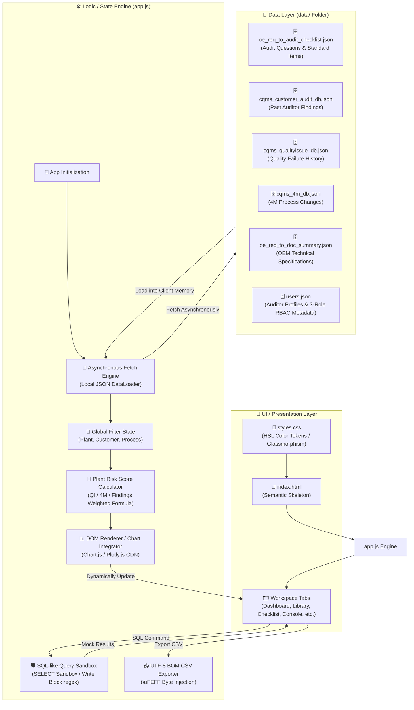

# 🛠️ 12_project_structure_and_coding_rules

본 문서는 **Risk-Based Audit Checklist System**의 기술적 소프트웨어 아키텍처, 물리적 디렉토리 구조 및 세부 코딩 컨벤션을 정의하는 통합 지침서입니다. 본 설계는 해커톤 MVP 규격 및 브라우저 온디맨드 무지연 구동 목적에 부합하도록 **HTML5 + CSS3 + Vanilla JavaScript 기반 고성능 정적 프론트엔드 단일 페이지 애플리케이션(SPA) 아키텍처**를 표준 모델로 선언합니다.

---

## 🏛️ 1. 소프트웨어 아키텍처 및 데이터 흐름

본 시스템은 별도의 서버 사이드 엔진이나 물리적인 DB 연결 없이, 브라우저가 정적 마스터 리소스를 비동기 로딩하여 클라이언트 메모리 내에서 모든 리스크 연산 및 필터링 처리를 완벽하게 구동하는 **클라이언트 사이드 버추얼 DB 아키텍처(Client-Side Virtual DB Architecture)**를 채택합니다.



### ① 초기화 및 데이터 Fetch 흐름
1.  **시작점**: 사용자가 `index.html`을 기동하면 HTML 파서가 뼈대를 로드하고 외부 CDN 라이브러리(Fira Code, Plotly.js 등) 및 내부 자원(`styles.css`, `app.js`)을 연동합니다.
2.  **데이터 바인딩**: `app.js` 내의 `init()` 핸들러가 가동되며 `data/` 폴더 하위의 5대 정적 마스터 데이터 JSON 파일들을 비동기 `fetch`합니다.
3.  **메모리 캐싱**: 수동 DB 소켓 생성 없이 로드된 데이터셋을 전역 변수(e.g., `app.state.masterChecklists`, `app.state.qualityIssues` 등)에 영속 캐싱하여 무지연 고속 데이터 액세스 환경을 확보합니다.
4.  **UI 렌더링**: 초기 캐싱이 종료되는 즉시 사이드바 글로벌 필터의 드롭다운 리스트를 동적 바인딩하고 대시보드 종합 통계 및 차트를 첫 화면에 드로잉합니다.

### ② 클라이언트 사이드 상태 관리 및 렌더링 파이프라인
*   **글로벌 상태 보존**: 수검 대상 공장(`plant`), 완성차 고객사(`customer`), 제조 공정 카테고리(`process`) 변경이 감지되면 전역 필터 객체(`app.state.filters`)를 즉각 동기화합니다.
*   **다중 AND 연산 파이프라인**: 
    1. 필터 변경점 발생 ➔ 2. 리스크 스코어 재생성 ➔ 3. 차트 컴포넌트 데이터 갱신 ➔ 4. 활성화된 탭 워크스페이스 그리드 리렌더링 순서로 물 흐르듯 순차 실행됩니다.
*   **SPA 탭 제어**: `app.switchTab(tabId)` 호출 시 브라우저 주소창 변경이나 페이지 새로고침(Reload) 없이, 모든 워크스페이스 세션을 글래스모피즘 스켈레톤 상태로 전환하고 타겟 섹션만 부드러운 이징 효과(`opacity / scale`)와 함께 드러내는 고성능 전환 인터랙션을 사용합니다.

---

## 📂 2. 물리적 프로젝트 폴더 구조

시스템의 폴더 설계 구조는 아래 명세를 엄격히 준수하며 비상식적인 폴더 신설이나 실행 파일 침투는 엄격히 금단됩니다.

```
/home/jumasi/risk_hunter/
├── index.html                  # 메인 프레임워크 (시멘틱 HTML 및 SPA 탭 뼈대 선언)
├── styles.css                  # 프리미엄 다크 글래스모피즘 디자인 시스템 CSS 정의
├── app.js                      # 핵심 비동기 Fetch, 가중치 연산 및 DOM 렌더링 엔진
│
├── data/                       # 물리 디비(DB)를 완전 대체하는 정적 JSON 원천 파일 폴더
│   ├── oe_req_to_audit_checklist.json   # 기술 표준 조항 및 감사 체크리스트 질문 마스터
│   ├── cqms_customer_audit_db.json     # 과거 공장별 오디트 지적 사항 이력 데이터
│   ├── cqms_qualityissue_db.json  # 과거 공장별 생산 현장 품질 실패(QI) 이력 데이터
│   ├── cqms_4m_db.json         # 과거 공장별 4M(Man, Machine, Material, Method) 변경점 이력
│   ├── oe_req_to_doc_summary.json   # 글로벌 완성차 고객사(OEM) 규격 문서 목록 데이터
│   └── users.json              # 가상 오디터 프로필 및 3대 RBAC 권한 메타데이터
│
├── context/                    # 바이브코딩 인공지능 지휘 통제용 개발 명세 및 규칙 마크다운 폴더
│   ├── 00_context_index_and_build_order.md
│   ├── 01_product_system_overview.md
│   ├── 09_design_system_and_ui_guidelines.md
│   ├── 12_project_structure_and_coding_rules.md  # [본 문서]
│   └── ... (기타 13개 세부 명세 문서군)
│
├── documents/                  # [다운로드용] OEM 오리지널 규격서 파일 저장 물리 폴더 (PDF, DOCX 등)
└── scratch/                    # 개발자 일시 디버깅 및 실험용 스크래치 파일 보관 폴더
```

---

## ✒️ 3. 핵심 코딩 약속 (Coding Conventions & Rules)

### ① Vanilla HTML/CSS 구조적 격리
*   **Spaghetti CSS 금지**: 모든 레이아웃 스타일, HSL 팔레트 토큰, 스크롤바 세밀 디자인은 반드시 전적으로 `styles.css`에 전담 기재하며, `index.html` 태그 내부에 인라인 스타일(`style="..."`)을 복잡하게 인서트하는 스파게티 형태의 구현을 철저하게 배제합니다.
*   **ID/Class 네이밍 규칙**: UI 요소 제어와 브라우저 호버 검증의 용이성을 극대화하기 위해, 주요 제어 블록은 고유하고 명확한 카멜케이스(CamelCase) 혹은 케밥케이스(kebab-case)의 ID 속성(e.g., `id="global-filter-plant"`, `id="dashboard-kpi-score"`)을 정밀하게 장착합니다.

### ② 안전한 SQL-like 모의 에뮬레이터 구현 정책
*   **실제 파서 작성 불허**: 브라우저 샌드박스의 안전성 유지 및 시연 속도 지연 예방을 위해 실제 SQLite AST SQL Parser 구문을 브라우저에 임베딩하지 않습니다.
*   **템플릿 매핑 기법**: 자주 사용되는 핵심 SELECT 통계 쿼리를 템플릿 목록으로 제공하고, 실행(Execute) 버튼 선택 시, SQL 구문을 분석하지 않고 미리 일치화된 JSON 뷰 데이터셋을 메모리에서 직접 바인딩하여 하단 데이터프레임 테이블에 즉각 노출합니다.
*   **Write-Block 보안 필터**: 비정상 수동 입력에 대응해 쿼리 텍스트 내에 쓰기 유발 파괴 단어(`INSERT`, `UPDATE`, `DELETE`, `DROP`, `ALTER`, `CREATE` 등)가 대소문자 무관하게 탐지되면 정규식 스캔으로 가로채어 즉시 시각 경고 모달을 인서트하고 연산을 전면 무효화시킵니다.

### ③ 한글 캐릭터 깨짐(Excel 깨짐) 해결 약속
*   브라우저의 standard CSV 내보내기 모듈 가동 시, 완성차 품질 현장에서는 주로 MS Excel을 사용하여 CSV 파일을 더블클릭 기동합니다.
*   Excel은 기본 인코딩이 ANSI로 인식되므로 UTF-8 문자열이 무참히 깨지는 현상이 빈번하게 발생합니다.
*   이를 원천 해결하기 위해, CSV 내보내기 구현 시 생성된 문자열 버퍼를 즉시 파일 객체로 빌드하지 않고, 바이트 배열의 가장 맨 앞머리에 **UTF-8 BOM 마커인 `\uFEFF`**를 반드시 삽입한 후 파일 저장 처리(Blob build)를 완료하도록 통일 규율합니다.
    ```javascript
    // UTF-8 BOM 바이트 인젝션 표준 템플릿
    const csvContent = "\uFEFF" + compiledCsvString;
    const blob = new Blob([csvContent], { type: "text/csv;charset=utf-8;" });
    const link = document.createElement("a");
    // ... 다운로드 링크 가동 로직
    ```

### ④ 무장애 에러 바운더리 폴백 (Fallback Boundary UI)
*   로컬 데이터 fetch 중 파일 미탐지, 잘못된 JSON 문법 에러, 혹은 네트워크 CDN 장애 등으로 인해 화면 전체가 멈추거나 스켈레톤 상태에 영구히 갇히는 **White-out 및 무한 로딩 침묵 상태를 철저하게 방지**합니다.
*   `try-catch` 블록으로 데이터 로딩 및 파싱 세션을 밀착 감싸고, 실패 유발 시 빈 화면에 자바스크립트 uncaught exception 에러 콘솔만 남기는 무책임한 처리를 피합니다.
*   에러 포착 즉시 화면 레이아웃 중앙에 **"⚠️ 데이터 리소스를 비동기 로드할 수 없습니다. /data 폴더 내부 파일 또는 파일 구조를 확인하십시오."**라는 미려한 글래스모피즘 알럿 경고창(`#error-boundary`)을 표시함과 동시에, 백그라운드에서는 **인메모리 모의 데이터셋 로더(`loadMockFallbacks()`)를 즉각 가동하여 대시보드와 컴포넌트들을 100% 사전 렌더링**해 둡니다. 이로써 사용자가 스켈레톤 화면에 방치되는 일을 원천적으로 차단합니다.
*   에러 오버레이에 사용되는 텍스트 및 조작 버튼은 어두운 슬레이트 배경(`rgba(16, 21, 38, 0.98)`) 위에서 **WCAG 2.1 AA 명도 대비 규격인 4.5:1 이상(기본 7:1~10:1 이상의 고대비 흰색 및 네온 시안)을 만족**하도록 코딩하여 장시간 가독성과 시각 보증 신뢰도를 충족합니다.

### ⑤ UI 레이아웃 고정 및 내부 스크롤바 바운더리 정책 (UI Height Containment & Inner Scrollbar Policy)
*   **화면 뷰포트 고정**: 대시보드나 라이브러리 목록 등 데이터 집약형 화면은 스크롤바가 전체 브라우저 창에 걸쳐 듀얼로 발생하지 않도록 뷰포트 내에 세부 레이아웃을 한눈에(Within 1 Viewport) 가둡니다.
*   **Flex/Grid 자식 붕괴 방지**: 가로 분할 레이아웃 적용 시, 각 컴포넌트 컬럼에 `height: 100%; min-height: 0; overflow: hidden;`을 엄격히 부여하여 자식 요소들의 데이터 부피에 의해 그리드가 무제한 늘어나는 Flexbox/Grid 팽창 버그를 원천 봉쇄합니다.
*   **내부 스크롤 메커니즘**: 긴 데이터 카드가 렌더링되는 자식 데이터 그리드 영역은 전체가 아니라 `.card-body` 등의 내부 엘리먼트에 `flex: 1; min-height: 0; overflow-y: auto;`를 부여하여 화면 내에서 깔끔하게 독립적인 미세 스크롤이 작동하도록 제어합니다.
*   **🚨 개발자 실수 다발: Flex 자식 레이아웃 내 `display: flex;` 속성 선언 필수 규칙 (Flex Wrapper Safety Rule)**:
    *   **장애 원인**: 자식 요소가 `flex: 1;` 또는 `flex-direction: column;` 등을 사용하여 유동적인 높이 비중 분배와 독립적인 내부 스크롤을 형성하려 할 때, 해당 부모 노드에 **`display: flex;`**가 누락되어 일반 블록(`block`) 상태로 방치될 경우, 자식의 모든 플렉스 기반 크기 산출 메커니즘이 무력화됩니다.
    *   **장애 현상**: 이로 인해 내부 데이터 테이블이 물리적인 전체 부피만큼 아래로 한계 없이 팽창하는 누수 현상(Height Leak)이 발생하며, 화면 레이아웃 최하단에 배치되어야 할 페이지네이션 컴포넌트(예: `#checklist-table-pagination`)가 브라우저 하단 영역 밖으로 완전히 밀려납니다. 동시에 상위 노드의 `overflow: hidden;`에 가로막혀 결국 **페이지네이션 및 이전/다음 버튼들이 시각적으로 잘린 채 숨겨져 사용자가 탐색할 수 없는 심각한 레이아웃 버그**를 초래하게 됩니다.
    *   **해결 대책**: 플렉스 컬럼 분할을 유도하는 모든 레이아웃 판넬 구조(예: `.checklist-main-panel`)의 CSS 클래스 선언부에는 반드시 **`display: flex;`** 가 함께 단단히 바인딩되어 있는지 최우선적으로 교차 확인하십시오. 뷰포트 높이 가둠 정책(Height Containment)을 만족하기 위해, 임의의 자식이 비대하게 늘어나 하단 액션 컴포넌트를 영역 밖으로 밀어내지 않도록 구조적 안전 설계를 의무화합니다.

### ⑥ 단어 시작 경계형 검색 필터링 매칭 규칙 (Word-Boundary Aware Search Filtering Rule)
*   **단락/접미사 충돌 방지**: 단순 `String.prototype.includes`를 통한 부분 검색은 "Ford" 검색 시 독일어 OEM 기술 요구 조건 파일에 다수 포함된 "Anforderungen"(요구사항) 내의 `ford` 문자열까지 무분별하게 매칭해내는 치명적인 의미론적 오류를 유발합니다.
*   **경계 체크 로직 채용**: OEM 검색 필터 등 단어 단위 구분이 필수적인 탐색에는 검색어 매칭 시 해당 검색어가 문자열의 맨 앞이거나, 매칭 지점의 바로 직전 글자가 알파벳이나 숫자 등 영문숫자(`[a-zA-Z0-9]`)가 아닌 특수문자나 띄어쓰기(`-, _, space, (, [`) 등 단어 경계(Word Boundary)에서 출발했는지 정밀하게 검증하여 다른 단어 내부의 일부로 매칭되는 것을 차단합니다.


### ⑦ 명도 대비 무결성 및 테마 가독성 코딩 규칙 (Text Contrast & Accessibility Compliance Policy)
*   **배경색 매칭용 텍스트 변수 강제 연계**:
    *   모든 CSS 스타일 및 JavaScript 동적 마크업 작성 시, 텍스트 색상에 `#aaa`, `#999`, `#94a3b8` 등의 색상을 임의로 하드코딩하는 것을 전면 금지합니다.
    *   반드시 시스템 전반의 테마 변수(`--text-muted-light`, `--text-muted-dark`, `--text-secondary`, `--text-primary`)를 연계하여 사용해야 합니다.
*   **JS 동적 템플릿의 가독성 무결성 확보**:
    *   `app.js` 내에서 동적으로 생성하는 요약 노드, 정보 텍스트, KPI 서브 정보 템플릿 영역에 `style="color: var(--text-muted);"`처럼 모호하게 지정되어 밝은 배경 위에서 글씨가 보이지 않게 되는 구조적 모순을 전면 배제합니다.
    *   밝은 배경 카드 및 앱 캔버스(예: 예정일, 달성율, 진행 건 수치 등) 상의 보조 안내문에는 반드시 **`--text-muted-light`** 또는 **`--text-secondary`**를 장착하여 명도 대비율을 **4.5:1 이상**으로 엄격하게 보장합니다.
    *   **🚨 절대 금지 (White-on-White 및 명도 대비 저하 방지)**:
        *   밝은 배경(화이트 카드, 메인 캔버스 등) 위에서 **`--text-light`** (`#ffffff`, 순백색)를 사용하는 것을 엄격하게 금지합니다. (White-on-White 현상으로 글자가 완전히 투명해져 시각적으로 소실됩니다.)
        *   밝은 배경 위에서 **`--text-muted`** 또는 **`--text-muted-dark`** (`#94a3b8`)를 사용하는 것을 금지합니다. (대비율이 2.43:1에 불과하여 식별이 불가능해집니다.)
    *   사이드바 및 다크 콘솔 같은 어두운 배경 영역에는 **`--text-muted-dark`** 또는 **`--text-light`**를 할당하여 시인성을 확보합니다.
    *   **다크 팝오버 및 동적 렌더링 템플릿의 명시적 스타일 선언**:
        *   사용자 역할 전환 팝오버 리스트처럼 자바스크립트로 동적 렌더링을 사용하는 어두운 글래스모피즘 팝오버 내의 모든 소속 및 상세 텍스트(예: `.popover-dept`)는 누락 없이 CSS에서 **`color: var(--text-muted-dark);`** 등으로 명확히 지정해 주어야 합니다. 스타일 정의가 누락될 경우, 브라우저 기본 글자색(검정)이 적용되어 어두운 배경 위에서 시각적 소실이 발생합니다.
*   **버튼 내 텍스트 줄바꿈 및 레이아웃 압착 방지 규칙 (Button Text Wrap & Flex-Shrink Prevention Policy)**:
    *   화면 너비가 압착되거나 반응형 그리드 내에서 공간이 좁아질 때, 특정 액션 버튼(예: 글로벌 필터 초기화 버튼 `.btn-reset-filters`, 로그 초기화 버튼 `#btn-clear-audit-logs` 등) 내부의 텍스트가 아래 줄로 강제 개행(Wrapping)되거나 영역 바깥으로 튀어나와 겹쳐 보이는 오동작을 원천 방지합니다.
    *   **CSS 표준 방어 가이드**:
        1. 모든 버튼 요소의 기반 클래스인 `.btn`에는 **`white-space: nowrap;`**을 상시 선언하여, 어떠한 화면 축소 상태에서도 버튼 라벨 글씨가 단정하게 일열로 유지되도록 보장합니다.
        2. 플렉스박스(Flexbox) 레이아웃 하위에서 버튼이 찌그러지거나 픽셀 너비가 무너지는 것을 막기 위해, 버튼 및 버튼의 직계 부모 래퍼 클래스(`.filter-btn-item`, `.btn-reset-filters` 등)에는 **`flex-shrink: 0;`** 및 **`flex: 0 0 auto;`**를 사용하여 물리적인 레이아웃 최소 너비를 철저하게 보존합니다.
    *   **아바타, 아이콘 및 배지 등 그래픽 요소의 찌그러짐 방지**:
        *   Flexbox 구조를 채택하는 리스트 아이템 및 프로필 영역(`.sidebar-profile`, `.popover-item`) 내부에서 아바타 아이콘 및 배지(`.popover-avatar`, `.profile-avatar`, `.popover-badge`) 등이 텍스트나 공간 축소에 의해 눌려 찌그러지는(Geometric Distortion) 현상을 방지하기 위해, 해당 도형/그래픽 요소에 반드시 **`flex-shrink: 0;`**을 선언해 크기를 물리적으로 보존하십시오.


---

## 🤝 4. Git 협업 및 자동 커밋/푸쉬 규칙 (Git Commit & Push Rules)

본 프로젝트는 AI 에이전트와 인간 개발자 간의 긴밀하고 투명한 협업을 보장하기 위해, 작업 완료 시의 Git 형상 관리와 이력 기록에 대한 엄격한 규칙을 준수합니다.

### ① 자동 커밋 및 푸쉬 수행 원칙
*   **최종 피드백 전 필수 실행**: 모든 코드 개발, 버그 수정, 스타일 보정 및 컨텍스트 문서의 양방향 역동기화(Reverse-Sync) 작업이 완료되면 에이전트는 사용자의 최종 검토 전에 변경된 모든 문서와 소스 코드를 자동으로 `git commit` 및 `git push` 해야 합니다.
*   **안전한 예외 처리**: git push 실패 상황(원격 저장소 충돌 등)에 직면할 경우 작업 전체를 롤백하지 않고 오류 상황을 로그에 상세히 출력한 뒤 사용자에게 수동 해결 조치를 안내합니다.

### ② 한국어 Git 커밋 메시지 표준 형식 (Commit Message Schema)
모든 커밋 메시지는 반드시 **한국어**로 작성하며, 아래의 명확한 구조화 양식을 100% 준수합니다.

```
[태그] <제목> (50자 이내의 명확한 한글 기술)

- 수정/추가 파일 목록: (예: app.js, styles.css 등)
- 변경 및 구현 핵심 요약: (기획 스펙 수용 및 비즈니스 연산 로직 변경 내용)
- 검증 결과: (크롬 개발자 도구 콘솔의 예외 에러 유무 및 정상 동작 확인 내역)
- 컨텍스트 역동기화(Reverse-Sync) 결과: (역반영된 context/*.md 문서명 기술)
```

#### 📌 사용 가능한 태그 목록 (Standard Tags)
*   **`[Feat]`**: 새로운 기능 개발, 화면 탭 추가 및 컴포넌트 신규 구현
*   **`[Fix]`**: 화면 깨짐, 데이터 계산 버그, 예외 처리 미비점 및 크롬 콘솔 에러 조치
*   **`[Docs]`**: `context/` 폴더 내 마크다운 사양 문서 업데이트 및 `GEMINI.md` 등의 규칙 변경
*   **`[Style]`**: CSS 파일 수정, HSL 컬러 토큰 조정, 호버 트랜지션 디테일 폴리싱 (로직 변경 없음)
*   **`[Refactor]`**: 성능 향상을 위한 클라이언트 메모리 정렬, 중복 DOM 렌더러 함수 단일화 (기능 변경 없음)
*   **`[Chore]`**: 사소한 디렉토리 구조 정리, 패키지 구성 변경 및 빌드 설정 조정


