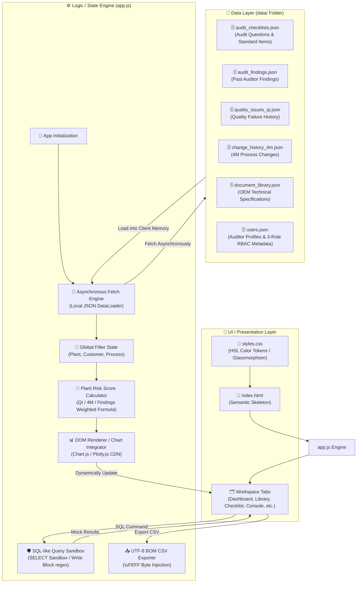

# 🛠️ 12_project_structure_and_coding_rules

본 문서는 **Risk-Based Audit Checklist System**의 기술적 소프트웨어 아키텍처, 물리적 디렉토리 구조 및 세부 코딩 컨벤션을 정의하는 통합 지침서입니다. 본 설계는 해커톤 MVP 규격 및 브라우저 온디맨드 무지연 구동 목적에 부합하도록 **HTML5 + CSS3 + Vanilla JavaScript 기반 고성능 정적 프론트엔드 단일 페이지 애플리케이션(SPA) 아키텍처**를 표준 모델로 선언합니다.

---

## 🏛️ 1. 소프트웨어 아키텍처 및 데이터 흐름

본 시스템은 별도의 서버 사이드 엔진이나 물리적인 DB 연결 없이, 브라우저가 정적 마스터 리소스를 비동기 로딩하여 클라이언트 메모리 내에서 모든 리스크 연산 및 필터링 처리를 완벽하게 구동하는 **클라이언트 사이드 버추얼 DB 아키텍처(Client-Side Virtual DB Architecture)**를 채택합니다.



### ① 초기화 및 데이터 Fetch 흐름
1.  **시작점**: 사용자가 `index.html`을 기동하면 HTML 파서가 뼈대를 로드하고 외부 CDN 라이브러리(Fira Code, Plotly.js 등) 및 내부 자원(`styles.css`, `app.js`)을 연동합니다.
2.  **데이터 바인딩**: `app.js` 내의 `init()` 핸들러가 가동되며 `data/` 폴더 하위의 5대 정적 마스터 데이터 JSON 파일들을 비동기 `fetch`합니다.
3.  **메모리 캐싱**: 수동 DB 소켓 생성 없이 로드된 데이터셋을 전역 변수(e.g., `app.state.masterChecklists`, `app.state.qualityIssues` 등)에 영속 캐싱하여 무지연 고속 데이터 액세스 환경을 확보합니다.
4.  **UI 렌더링**: 초기 캐싱이 종료되는 즉시 사이드바 글로벌 필터의 드롭다운 리스트를 동적 바인딩하고 대시보드 종합 통계 및 차트를 첫 화면에 드로잉합니다.

### ② 클라이언트 사이드 상태 관리 및 렌더링 파이프라인
*   **글로벌 상태 보존**: 수검 대상 공장(`plant`), 완성차 고객사(`customer`), 제조 공정 카테고리(`process`) 변경이 감지되면 전역 필터 객체(`app.state.filters`)를 즉각 동기화합니다.
*   **다중 AND 연산 파이프라인**: 
    1. 필터 변경점 발생 ➔ 2. 리스크 스코어 재생성 ➔ 3. 차트 컴포넌트 데이터 갱신 ➔ 4. 활성화된 탭 워크스페이스 그리드 리렌더링 순서로 물 흐르듯 순차 실행됩니다.
*   **SPA 탭 제어**: `app.switchTab(tabId)` 호출 시 브라우저 주소창 변경이나 페이지 새로고침(Reload) 없이, 모든 워크스페이스 세션을 글래스모피즘 스켈레톤 상태로 전환하고 타겟 섹션만 부드러운 이징 효과(`opacity / scale`)와 함께 드러내는 고성능 전환 인터랙션을 사용합니다.

---

## 📂 2. 물리적 프로젝트 폴더 구조

시스템의 폴더 설계 구조는 아래 명세를 엄격히 준수하며 비상식적인 폴더 신설이나 실행 파일 침투는 엄격히 금단됩니다.

```
/home/jumasi/risk_hunter/
├── index.html                  # 메인 프레임워크 (시멘틱 HTML 및 SPA 탭 뼈대 선언)
├── styles.css                  # 프리미엄 다크 글래스모피즘 디자인 시스템 CSS 정의
├── app.js                      # 핵심 비동기 Fetch, 가중치 연산 및 DOM 렌더링 엔진
│
├── data/                       # 물리 디비(DB)를 완전 대체하는 정적 JSON 원천 파일 폴더
│   ├── audit_checklists.json   # 기술 표준 조항 및 감사 체크리스트 질문 마스터
│   ├── audit_findings.json     # 과거 공장별 오디트 지적 사항 이력 데이터
│   ├── quality_issues_qi.json  # 과거 공장별 생산 현장 품질 실패(QI) 이력 데이터
│   ├── change_history_4m.json  # 과거 공장별 4M(Man, Machine, Material, Method) 변경점 이력
│   ├── document_library.json   # 글로벌 완성차 고객사(OEM) 규격 문서 목록 데이터
│   └── users.json              # 가상 오디터 프로필 및 3대 RBAC 권한 메타데이터
│
├── context/                    # 바이브코딩 인공지능 지휘 통제용 개발 명세 및 규칙 마크다운 폴더
│   ├── 00_context_index_and_build_order.md
│   ├── 01_product_system_overview.md
│   ├── 09_design_system_and_ui_guidelines.md
│   ├── 12_project_structure_and_coding_rules.md  # [본 문서]
│   └── ... (기타 13개 세부 명세 문서군)
│
├── documents/                  # [다운로드용] OEM 오리지널 규격서 파일 저장 물리 폴더 (PDF, DOCX 등)
└── scratch/                    # 개발자 일시 디버깅 및 실험용 스크래치 파일 보관 폴더
```

---

## ✒️ 3. 핵심 코딩 약속 (Coding Conventions & Rules)

### ① Vanilla HTML/CSS 구조적 격리
*   **Spaghetti CSS 금지**: 모든 레이아웃 스타일, HSL 팔레트 토큰, 스크롤바 세밀 디자인은 반드시 전적으로 `styles.css`에 전담 기재하며, `index.html` 태그 내부에 인라인 스타일(`style="..."`)을 복잡하게 인서트하는 스파게티 형태의 구현을 철저하게 배제합니다.
*   **ID/Class 네이밍 규칙**: UI 요소 제어와 브라우저 호버 검증의 용이성을 극대화하기 위해, 주요 제어 블록은 고유하고 명확한 카멜케이스(CamelCase) 혹은 케밥케이스(kebab-case)의 ID 속성(e.g., `id="global-filter-plant"`, `id="dashboard-kpi-score"`)을 정밀하게 장착합니다.

### ② 안전한 SQL-like 모의 에뮬레이터 구현 정책
*   **실제 파서 작성 불허**: 브라우저 샌드박스의 안전성 유지 및 시연 속도 지연 예방을 위해 실제 SQLite AST SQL Parser 구문을 브라우저에 임베딩하지 않습니다.
*   **템플릿 매핑 기법**: 자주 사용되는 핵심 SELECT 통계 쿼리를 템플릿 목록으로 제공하고, 실행(Execute) 버튼 선택 시, SQL 구문을 분석하지 않고 미리 일치화된 JSON 뷰 데이터셋을 메모리에서 직접 바인딩하여 하단 데이터프레임 테이블에 즉각 노출합니다.
*   **Write-Block 보안 필터**: 비정상 수동 입력에 대응해 쿼리 텍스트 내에 쓰기 유발 파괴 단어(`INSERT`, `UPDATE`, `DELETE`, `DROP`, `ALTER`, `CREATE` 등)가 대소문자 무관하게 탐지되면 정규식 스캔으로 가로채어 즉시 시각 경고 모달을 인서트하고 연산을 전면 무효화시킵니다.

### ③ 한글 캐릭터 깨짐(Excel 깨짐) 해결 약속
*   브라우저의 standard CSV 내보내기 모듈 가동 시, 완성차 품질 현장에서는 주로 MS Excel을 사용하여 CSV 파일을 더블클릭 기동합니다.
*   Excel은 기본 인코딩이 ANSI로 인식되므로 UTF-8 문자열이 무참히 깨지는 현상이 빈번하게 발생합니다.
*   이를 원천 해결하기 위해, CSV 내보내기 구현 시 생성된 문자열 버퍼를 즉시 파일 객체로 빌드하지 않고, 바이트 배열의 가장 맨 앞머리에 **UTF-8 BOM 마커인 `\uFEFF`**를 반드시 삽입한 후 파일 저장 처리(Blob build)를 완료하도록 통일 규율합니다.
    ```javascript
    // UTF-8 BOM 바이트 인젝션 표준 템플릿
    const csvContent = "\uFEFF" + compiledCsvString;
    const blob = new Blob([csvContent], { type: "text/csv;charset=utf-8;" });
    const link = document.createElement("a");
    // ... 다운로드 링크 가동 로직
    ```

### ④ 무장애 에러 바운더리 폴백 (Fallback Boundary UI)
*   로컬 데이터 fetch 중 파일 미탐지, 잘못된 JSON 문법 에러, 혹은 네트워크 CDN 장애 등으로 인해 화면 전체가 멈추는 **White-out 침묵 상태를 철저하게 방지**합니다.
*   `try-catch` 블록으로 데이터 로딩 및 파싱 세션을 밀착 감싸고, 실패 유발 시 빈 화면에 자바스크립트 uncaught exception 에러 콘솔만 남기는 무책임한 처리를 피합니다.
*   에러 포착 즉시 화면 레이아웃 중앙에 **"⚠️ 데이터 리소스를 비동기 로드할 수 없습니다. /data 폴더 내부 파일 또는 파일 구조를 확인하십시오."**라는 미려한 글래스모피즘 알럿 경고창을 표시하여, 시연자가 시스템의 강력한 예외 대응력과 견고성을 한눈에 평가할 수 있도록 예외 바운더리를 수립해 마감합니다.
