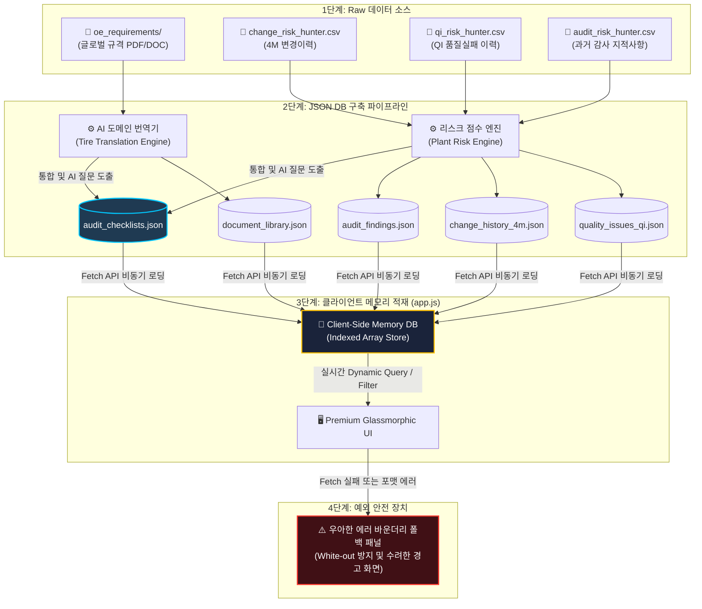

# 📂 18_resource_json_database_transition_spec

본 문서는 전사 공통 완성차 고객사(OEM) 기술 규격서 자원(Resource Data)뿐만 아니라, 생산 공장별 과거 품질 실패 이력(QI), 4M 공정 변경점(4M Change), 과거 감사 지적사항(Audit Findings) 및 통합 감사 체크리스트(Unified Checklists) 등 **시스템의 전체 이종 데이터 리소스(All Raw Resources)를 고성능 정적 JSON 데이터베이스 구조 및 클라이언트 인메모리 스키마로 완전히 전환(Transition)하기 위한 기술 스펙과 설계 매핑 프레임워크**를 정의합니다.

---

## 🚀 1. 배경 및 목적 (Background & Objectives)

### ① 기존의 문제점 (As-Is Limitations)
- **정보의 파편화 및 평면성**: 기존 데이터소스들은 산재된 CSV/엑셀 형태로 존재하여 브라우저에서 무지연 검색 및 정밀 필터링 연산을 수행하기에 성능적 한계가 존재했습니다.
- **물리 DB 커넥션의 위험성**: 브라우저 환경에서 SQLite WASM 모듈을 직접 로드하거나 동적 SQL Parser를 구현하는 것은 샌드박스 안정성을 위협하고 구동 지연을 유발합니다.
- **도메인 번역 레이어의 부재**: 글로벌 OEM 표준서(BMW, GM 등)는 자동차 시스템 및 범용 부품 수준(Generic System Level)으로 저술되어, 타이어 제조공정 현장의 핵심 설비 제어 파라미터 및 결함 리스크와 연계되지 못해 오디터에게 실무적 변별력을 주지 못했습니다.

### ② 전체 리소스 .json 전환 해결책 및 목적 (To-Be Comprehensive JSON Transition Goal)
- **정적 가상 DB 아키텍처 수립 (All Resources to JSON Database)**: 단순 문서 리스트 및 로우 데이터를 **프론트엔드 최적화형 정적 JSON 데이터베이스 구조**로 전면 마이그레이션합니다.
- **메모리 기반 무지연 연산 및 보안 확보**: 모든 마스터 리소스가 JSON 배열 구조로 클라이언트 메모리에 온디맨드 로드되어, 브라우저가 제공하는 초고속 루프와 인덱싱을 통해 수만 건의 데이터를 동적 렌더링하고 필터링합니다.
- **타이어 도메인 역해석 이식 (Tire Process Translation)**: 범용 시스템 규격을 타이어 7대 핵심 공정(Incoming, Mixing, Extrusion, Calendaring, Bead, Building, Curing, Inspection)과 직결시키고, 이력 데이터 기반의 리스크 가중치를 정밀 계량화하여 DB에 직접 주입합니다.
- **수입검사(Incoming) 및 전 공정 공통(Site-Wide) 정합성 명확화**: 공정능력(Cpk) 보증 요구사항은 전 공정 공통으로 가시화하고, 화학물질 유해 규격은 수입검사(`Incoming`) 공정에 정밀 매핑하여 데이터 왜곡을 원천 차단합니다.

---

## 🔄 2. 전체 리소스 DB 가상화 아키텍처 및 로딩 전략 (Architecture & Loading Strategy)



### 💡 데이터 에러 바운더리 헨들링 (Data Error Boundary Handling)
- 정적 리소스 파일 로드 실패(HTTP 404), 파일 파싱 에러(JSON Format Error) 등 어떠한 예외 상황에서도 시스템이 완전히 백화(White-out)되어 멈추는 현상을 원천 방지합니다.
- `try-catch` 블록으로 fetch 프로세스를 감싸고, 실패 시 화면에 "정적 리소스를 로딩할 수 없습니다. 로컬 data/ 폴더 및 파일명을 확인해 주십시오."라는 테크니컬 경고 패널 및 예외 세부 내용을 오디팅 테마 스타일로 렌더링하여 시스템 예외 안전 설계 수준을 강력하게 어필합니다.

---

## 🗄️ 3. 전체 리소스 JSON 스키마 정의 (Unified JSON Database Schemas)

`data/` 디렉토리에 위치한 모든 정적 JSON 파일은 다음 정의된 스키마 구조와 타입 사양을 100% 만족해야 합니다.

### ① 완제품 규격서 라이브러리 스키마 (`data/document_library.json`)

*   **설명**: 완성차 고객사별 최신 기술 규격서 메타정보와 타이어 제조공정 역해석 번역 데이터가 구조화되어 있는 마스터 리소스입니다.

```json
[
  {
    "id": 1,
    "filename": "BMW_GS_98000.pdf",
    "customer": "BMW",
    "doc_code": "GS 98000",
    "doc_name": "Statistical Process Capability Studies (공정능력 연구)",
    "revision_date": "2024-11-19",
    "doc_type": "품질 표준",
    "file_size": "3.03 MB",
    "review_summary": {
      "overview": "BMW에 부품을 공급하기 전 혹은 공급하는 도중 통계적 공정능력(Cpk >= 1.33)을 보증하기 위한 세부 기준을 정의하는 표준 문서입니다.",
      "key_clauses": [
        "초기 샘플링 및 장기 통계적 공정 능력 연구 수립 의무",
        "특수 특성(Special Characteristics) 식별 및 전수 제어 조건",
        "공정 산포 모니터링 및 비정상 상태(OCAP) 개선 시나리오 작성"
      ],
      "applicable_processes": [
        "Mixing",
        "Extrusion",
        "Curing",
        "Inspection"
      ],
      "required_evidences": [
        "공정별 일일 SPC 트래킹 차트",
        "중요 특성(Key Characteristics) 측정 보고서 및 Cpk 연산 결과",
        "이상발생 조치 지침서(OCAP)"
      ]
    },
    "tire_process_translation": {
      "focus_process": "전 공정 공통 (Site-Wide Process Capability)",
      "process_param_check": "배합(Mixing) Mooney 점도 Cpk 제어, 압출(Extrusion) 트레드 단면 두께 Cpk 제어, 가황(Curing) 고무 경화성 계수 Cpk 제어, 최종검사(Inspection) 완제품 유니포미티 Cpk 실시간 점검",
      "quality_defect_risk": "공정 능력 미달 시 전 배합 및 가압 가혹 산포 누적으로 완제품 균일성(Uniformity) 파괴 및 주행 쏠림, 드럼 고속 파괴 시험 중 조기 이탈 발생",
      "action_sop_guide": "공장 종합 SPC 표준 지침서 내 '전 공정 핵심 4M 파라미터별 일일 Cpk 점검 기준' 제정 및 미달 시 강제 공정 스톱 및 설비 인터록 규칙 반영"
    },
    "processed_at": "2026-05-26 17:45:00"
  }
]
```

---

### ② 통합 감사 체크리스트 스키마 (`data/audit_checklists.json`)

*   **설명**: 규격 기반(DOCUMENT) 질문과 현장 품질 실패 이력 기반(DATABASE) 질문이 완벽히 병합된 핵심 감사 데이터셋입니다.

```json
[
  {
    "id": 1,
    "source_type": "DATABASE_QI",
    "source_id": "QI-2025-0812",
    "plant_code": "KP",
    "customer": "Hyundai",
    "doc_code": "ES52930-01",
    "doc_name": "Tire Performance Standard (타이어 일반 규격)",
    "section": "Curing (가황공정)",
    "requirement": "타이어 성형 중 Air 배출 불충분으로 가류 후 기포(Blister) 발생 및 필드 반품 클레임 제기",
    "audit_question": "가류 프레스 금형 세정 및 벤트핀 막힘 유무를 교대조별로 전수 확인하는 실시간 모니터링 프로세스가 동작하고 있습니까?",
    "evidence_compliance": "설비별 벤트핀 점검 체크리스트 및 주간 금형 화학 세정 완료 확인서 양식 일치 여부",
    "audit_method": "현장 실사 (Plant Tour) & 오디터 면담",
    "requirement_type": "재발방지 (Recurrence Prevention)",
    "process_category": "Curing",
    "related_4m": "Machine",
    "priority": "High",
    "plant_risk_score": 4.5,
    "processed_at": "2026-05-26 18:00:00"
  }
]
```

---

### ③ 품질 실패 이력 스키마 (`data/quality_issues_qi.json`)

*   **설명**: 공장에서 발생한 대고객 품질 부적합(QI) 및 반품 클레임(Claim) 데이터를 정밀 정리한 데이터셋입니다.

```json
[
  {
    "DOC_NO": "QI-2025-0812",
    "PLANT": "KP",
    "STAGE": "Field Claim",
    "OEM": "Hyundai",
    "VEH": "GV80",
    "PJT": "JX1 FL",
    "OCC_DATE": "2025-01-20",
    "REG_DATE": "2025-01-22",
    "RETURN_YN": "Y",
    "RTN_DATE": "2025-01-25",
    "CTM_DATE": "2025-02-10",
    "HK_FAULT_YN": "Y",
    "COMP_DATE": "2025-02-12",
    "STATUS": "Closed",
    "LOCATION": "트레드 접지부",
    "MARKET": "USA",
    "M_CODE": "M-255-45R19-99V",
    "TYPE_NAME": "외관 불량",
    "CAT_NAME": "기포 (Blister)",
    "SUB_CAT_NAME": "가류 성형 기포",
    "D2_PROBLEM": "Tread blister observed on GV80 highway driving, leading to customer claim.",
    "D0_EMERGENCY": "동일 로트 출하 보류 및 보관 재고 100% 전수 X-ray / 외관 재검사 수립",
    "D4_SMMY": "타이어 성형 중 드럼 밀착 공정에서 에어 배출 불충분 상태로 가류 투입",
    "D4_ROOT_CAUSE": "가류 금형 세정 주기 초과에 따른 에어 배출용 벤트 홀(Vent Hole) 슬러지 막힘 발생",
    "D5_COUNTERMEASURE": "벤트 홀 기계적 세정 주기 단축(250000본에서 150000본) 및 벤트핀 세정 지그 개선",
    "D8_RESULT": "가류 금형 클리닝 프로세스 개선 완료 후 동일 현상 재발율 0.0% 달성 완료",
    "URL": "http://qi.hunter.com/report/view?id=9582"
  }
]
```

---

### ④ 4M 변경점 이력 스키마 (`data/change_history_4m.json`)

*   **설명**: 자사 8개 공장에서 발생한 설비, 재료, 방법, 인력(4M)의 모든 변동 사항을 추적하는 정밀 이력 데이터셋입니다.

```json
[
  {
    "DOC_NO": "4M-2025-DP-0024",
    "PLANT": "DP",
    "PURPOSE": "설비 이설 및 노후 개선에 따른 압출 안정성 격상",
    "SUBJECT": "성형기 No.5 권취 롤러 기구부 개선 및 재질 변동",
    "STATUS": "승인 완료",
    "PROGRESS": "양산 적용 및 검증",
    "REQUESTER": "홍길동 과장(대전성형기술팀)",
    "REG_DATE": "2025-02-15",
    "COMP_DATE": "2025-03-10",
    "URL": "http://gw.hunter.com/change/view/129",
    "CHANGE_ITEM": "설비 기구부 변경",
    "CHANGE_CONTENT": "권취 기어 롤러 표면 코팅 재질 우레탄(Urethane)에서 스틸(Hardened Steel)로 변경",
    "MTL": "MTL-RUBBER-012A"
  }
]
```

---

### ⑤ 과거 감사 지적사항 스키마 (`data/audit_findings.json`)

*   **설명**: 완성차 OEM 및 제3자 품질 심사 기관이 자사 공장에 제기했던 지적사항(Findings)과 개선 완료 정보를 보관하는 데이터셋입니다.

```json
[
  {
    "TYPE": "Customer Audit",
    "SUBJECT": "BMW VDA 6.3 Process Audit 2024",
    "START_DT": "2024-05-10",
    "END_DT": "2024-05-12",
    "OWNER_ID": "이순신 팀장(대전품질)",
    "REG_DT": "2024-05-15",
    "COMP_DT": "2024-06-20",
    "STATUS": "Closed",
    "PLANT": "DP",
    "CAR_MAKER": "BMW",
    "PROJECT": "G45",
    "FINDING_DESC": "압출 튜브 냉각수 온도 조절 장치의 제어 편차가 ±5°C 이상 발생하여 타이어 반제품 수축 산포 제어가 불가함",
    "ROOT_CAUSE": "자동 유량 조절 피드백 밸브의 제어 응답 속도 저하 및 오작동",
    "ACTION_PLAN": "정밀 비례 전자 유량 제어 밸브(Proportional Valve)로 전면 교체 적용",
    "COMP_EVIDENCE": "신규 전자 비례 밸브 부품 설치 사진 및 압출 수축 편차 일별 데이터 대장",
    "GRADE": "Major"
  }
]
```

---

### ⑥ 사용자 및 권한 스키마 (`data/users.json`)

*   **설명**: Admin Settings에서 롤기반 감사 제어(RBAC) 및 보안 데모를 원활히 시연하기 위해 구성된 가상 사용자 계정 데이터셋입니다.

```json
[
  {
    "user_id": "auditor01",
    "user_name": "김감사 부장",
    "department": "글로벌품질보증그룹",
    "role": "Auditor",
    "permissions": ["READ", "WRITE", "RUN_AUDIT"],
    "assigned_plants": ["DP", "KP", "JP"],
    "last_login": "2026-05-28 14:30:22"
  },
  {
    "user_id": "admin01",
    "user_name": "최관리 팀장",
    "department": "IT정보보안팀",
    "role": "Admin",
    "permissions": ["READ", "WRITE", "RUN_AUDIT", "DB_ADMIN"],
    "assigned_plants": ["ALL"],
    "last_login": "2026-05-28 15:01:05"
  }
]
```

---

## ⚙️ 4. 타이어 제조공정 역해석 번역 매트릭스 (Translation Matrix)

글로벌 완성차 요구 사항을 타이어 공장 오디터 관점으로 해석하는 핵심 번역 프레임워크입니다.

```
+------------------------------------+      역해석      +-----------------------------------------+
|     OEM 범용 규격 (System Level)    |   ===========>   |     타이어 공정 및 설비 파라미터 제어     |
+------------------------------------+                  +-----------------------------------------+
|                                    |                  | [Mixing] Mooney 점도 Cpk 제어            |
| 1. 공정능력 보증 (Cpk >= 1.33)      |                  | [Extrusion] 트레드 압출 단면 두께 Cpk     |
|    "전 공정 공통 (Site-Wide)"      |                  | [Curing] 가황 타이어 고무 경화성 Cpk      |
|                                    |                  | [Inspection] 완제품 유니포미티 Cpk       |
+------------------------------------+                  +-----------------------------------------+
|                                    |                  | [Incoming] 입고 원부재 코드/강도 검사    |
| 2. 실수 방지 장치 (Pokayoke)        |                  | [Building] 벨트/카카스 바코드 이종 인터록|
|                                    |                  | [Inspection] 내외관 자동 카메라 검출      |
+------------------------------------+                  +-----------------------------------------+
|                                    |                  | [Incoming] 유해 화학 배합제 COA 검증     |
| 3. 화학/유해 물질 제한 규격        |                  | [Incoming] IMDS 원소재 등록 전산 락       |
+------------------------------------+                  +-----------------------------------------+
```

### 📊 10대 핵심 규격서 역해석 마스터 설계

#### 1) HKMC ES52930-01 (타이어 일반 규격)
- **범용 요건**: 타이어 완제품 치수, 내압 보증 및 고속 내구성 보증.
- **타이어 공정 역해석**:
  - `focus_process`: `Curing (가황공정) & Inspection (최종검사)`
  - `process_param_check`: 가황 스팀 온도 제어(170°C±2°C) 및 최종검사 유니포미티(Uniformity RFV/LFV) 장비 조기 알람 제어.
  - `quality_defect_risk`: 가황 프레스 가압 편차 시 고무 분자 미경화로 드럼 파괴 시험 중 트레드 박리(Tread Separation) 치명 부적합 발생.
  - `action_sop_guide`: 가황 SOP에 '규격별 가황 가압 하한 모니터링 경보치 및 설비 강제 인터록 연동' 표준 추가.

#### 2) BMW GS 98000 (공정능력 연구)
- **범용 요건**: 부품 납품 전/장기 통계적 공정능력(Cpk ≥ 1.33) 검증.
- **타이어 공정 역해석**:
  - `focus_process`: `전 공정 공통 (Site-Wide Process Capability)`
  - `process_param_check`: 배합(Mixing) 공정 Mooney 점도 이력 관리, 압출(Extrusion) Tread 두께 편차 관리, 성형 접합부(Splice) 겹침성 등 주요 특성 통계치 점검.
  - `quality_defect_risk`: 공정 능력 미달 시 전 배합 및 가압 가혹 산포 누적으로 완제품 유니포미티 파괴 및 주행 쏠림으로 대량 불합격 폐기 발생.
  - `action_sop_guide`: 공장 종합 SPC 표준 지침서에 '전 공정 핵심 4M 파라미터별 일일 Cpk 점검 기준' 제정 및 미달 시 개선 가이드(OCAP) 탑재.

#### 3) HKMC MS201-02 (유해물질 제한)
- **범용 요건**: 완제품 및 부품의 환경 규제 유해물질 포함 및 금지 규격 준수.
- **타이어 공정 역해석**:
  - `focus_process`: `Incoming (원부재 수입검사)`
  - `process_param_check`: 가황 가속제, 오일 및 고무 배합 수지 화학 성분 성적서(COA) 검증 및 IMDS(국제재료데이터시스템) 일치성 조회.
  - `quality_defect_risk`: REACH 가소제 및 유해 중금속 미필터링 시, 완제품 타이어 생산 가공 후 유럽/북미 친환경 법규 위배로 즉각 수출 금지 및 전량 폐기 위기 직면.
  - `action_sop_guide`: 원부자재 수입검사 SOP에 '유해물질 금지 전수 COA 대조 전산 락 시스템 적용' 및 'IMDS 정기 승인 업데이트 룰' 추가 반영.

#### 4) BMW GS 93008-1 (화학 물질 규제)
- **범용 요건**: 유해 물질 제한 및 가소제 전수 제한.
- **타이어 공정 역해석**:
  - `focus_process`: `Incoming (원부재 수입검사)`
  - `process_param_check`: 천연고무(NR) 및 합성고무(SBR) 원료 입고 시 다환방향족탄화수소(PAHs) 미검출 증명서 일대일 검사.
  - `quality_defect_risk`: PAHs 오검출 시 친환경 안전 타이어 인증 마크(E-Mark) 박탈 및 BMW OEM 승인 영구 박탈 리스크 발생.
  - `action_sop_guide`: 수입검사 지침 내 '수입 원소재 로트(Lot)별 환경 유해성 날인 합격 태그 부착 의무화' 수립 개정.

#### 5) Honda Session 3.5 (실수방지 장치)
- **범용 요건**: 오조립 및 불량 유출 방지를 위한 Poke-Yoke 설치 및 일일 점검.
- **타이어 공정 역해석**:
  - `focus_process`: `전 공정 공통 (Site-Wide Error-Proofing)`
  - `process_param_check`: 성형(Building) 단계 이종 벨트/플라이 바코드 스캔 인터록 및 수입검사(Incoming) 원자재 바코드 매칭.
  - `quality_defect_risk`: 성형 드럼에 엉뚱한 규격의 코드 및 고무 배합 가공품 조립 시 주행 중 원심력 비대칭으로 사이드월 내부 벨트 박리(Belt Separation) 등 대형 전복 참사 발생.
  - `action_sop_guide`: 성형 작업 SOP 내 '반제품 이종 혼입 방지용 바코드 미스캔 시 구동 드럼 즉시 강제 락(Lock) 체계' 명문화 삽입 및 Red-Rabbit 일일 모의 점검 가이드 삽입.

#### 6) Porsche F_360_101 (초고속 내구 테스트)
- **범용 요건**: 실내 고속 주행 드럼 테스트 합격 요건 준수.
- **타이어 공정 역해석**:
  - `focus_process`: `Test (완제품 신뢰성 시험 공정)`
  - `process_param_check`: 샘플 완제품 타이어 파괴 전 실내 챔버 상온 에이징 대기 시간(24시간) 및 내압 정밀 보정 관리.
  - `quality_defect_risk`: 에이징 안정화 누락 시 물성 조기 항복으로 정격 300km/h 고속 영역에서 트레드 청킹(Tread chunking) 또는 사이드월 파열로 가속 시험 탈락.
  - `action_sop_guide`: 완제품 신뢰성 시험 SOP 내 '포르쉐 전용 가속 평가 대기 시 상온 항온항습실 전용 랙 24시간 계류 필수 규정' 가이드 신설 개정.

#### 7) Audi LAH 893 010 (신규부품 개발 및 양산품질 계약)
- **범용 요건**: 신규 개발품(PPO) 및 초도품 양산 승인(EMPB) 마일스톤 준증.
- **타이어 공정 역해석**:
  - `focus_process`: `System (품질 시스템 및 신규 규격 PPO 승인)`
  - `process_param_check`: 신규 규격 전용 가황 금형(Mold) 세그먼트 얼라인먼트 점검 및 블래더 내 고압 고온 스팀 안정 가열 능력 승인 검토.
  - `quality_defect_risk`: 가황 프레스 세그먼트 밀착 불량 시 조인트 버(Burr) 대량 발생으로 아우디 외관 오딧 C등급(Downgrade)으로 낙인.
  - `action_sop_guide`: 신규 규격 런칭 수검 가이드 내 '가황 프레스 탈착 시 3개 포인트 온도 정밀 열화상 계측 확인서' 양식을 필수 서류로 규정 반영.

#### 8) GM 1927 Global Supplier Manual (글로벌 협력사 가이드)
- **범용 요건**: 양산 승인 런포레이트(Run-at-Rate) 및 초기 전수 검사 GP-12 셋업.
- **타이어 공정 역해석**:
  - `focus_process`: `System (APQP 개발 승인 및 GP-12 유출방지 통제)`
  - `process_param_check`: 최종검사실 앞단 GP-12 오프라인 2차 전수 특별 검사 게이트 설계 및 이력 추적 태그 관리상태 심사.
  - `quality_defect_risk`: 양산 초기 런포레이트 속도 무리한 가속 시 가황 내부 기포 결함(Blister) 발생 및 GP-12 엑스레이 이종 혼입 미필터링 시 대고객 납품 유출 위기 직면.
  - `action_sop_guide`: 최종검사 SOP 지침서 내 'GM 전용 사양 타이어는 양산 승인 통과 즉시 2차 오프라인 특별 검사 대에서 전수 물리 태그 확인 필수' 지침 강제화.

#### 9) Ford SCCAF Handbook (공정 특별특성 관리)
- **범용 요건**: 법규 안전 항목 특별특성(SC/CC) 지정 및 관리계획서 일치성 서명.
- **타이어 공정 역해석**:
  - `focus_process`: `System (전 공정 특별특성 관리체계 동기화)`
  - `process_param_check`: 수입 와이어 비드 부위 턴업 장력 계측값(CC 항목) 및 완제품 최종 내압 누설(Air Leak) 전수 합격 프로파일 점검.
  - `quality_defect_risk`: 비드 와이어의 SCCAF 인장 설계 하한치 미달 시 주행 격열 선회 중 비드 이탈(Bead Unseating) 유발로 치명 전복 사고 직결.
  - `action_sop_guide`: 특별특성 연계 지침에 '포드 SCCAF 전용 ∇(역삼각형) 안전 마크 자동 매핑 전산 처리 절차'를 반영하고 SOP 표준서에 등록.

#### 10) Stellantis PF.90235 (스텔란티스 완제품 표준)
- **범용 요건**: 완제품 유니포미티 및 제동 성능 내마모 수명 한계선 충족.
- **타이어 공정 역해석**:
  - `focus_process`: `Inspection (최종 완제품 검사 및 균일성 교정)`
  - `process_param_check`: 최종 균일성 측정기(TUM) 축 회전 런아웃(Run-out) 계측 실시간 검교정 상태 점검.
  - `quality_defect_risk`: 센서 오인식 발생 시 정상 품질 타이어가 균일성 미달 폐기 처리되는 수율 저하 발생 또는 불량품 유출로 스텔란티스 고성능 차량 조립 시 조향 소음 컴플레인 직면.
  - `action_sop_guide`: 최종 검사실 표준 SOP 내 '스텔란티스 사양 타이어 측정 가동 시 매 8시간 주기로 마스터 표준 타이어 3회 반복 주행을 통한 센서 자동 제로점 교정' 지침 탑재.

---

## 🔒 5. 리소스 가상화 보안 및 쿼리 통제 정책 (Command Restriction)

### SELECT 전용 안전 샌드박스 장착
- SQL 콘솔 화면에서 원천 데이터베이스를 파괴하려는 수동 쿼리 입력 시도를 탐지하면 즉각 차단합니다.
- 사용자가 기입하는 명령어 중 **데이터 쓰기 및 구조 변형 키워드**(`INSERT`, `UPDATE`, `DELETE`, `DROP`, `ALTER`, `CREATE`, `REPLACE` 등)가 검출되면, 대소문자 무관하게 정규식 스캔으로 실행을 원천 거부합니다.
- 차단 즉시 사용자에게 **"SELECT 전용 안전 샌드박스 상태입니다. 원천 마스터 데이터의 보존을 위해 쓰기 및 파괴 행위는 전면 금지됩니다"**라는 강렬한 다크 테마 경고 모달 창을 띄워 시스템의 정보 안전성 확보 수준을 직관적으로 증명합니다.

---

## 📅 6. 전체 데이터 마이그레이션 및 단계별 로드맵 (Transition Path)

### [Phase 1: 데이터 셋 완전 가상화 배치 단계]
- 마스터 CSV 및 엑셀 데이터 파일들을 파싱하여 상기 정의된 6대 JSON 스키마를 만족하는 `data/*.json` 파일군으로 빌드 완료합니다.
- `app.js`에서 각 정적 데이터 파일들의 비동기 fetch 연결 통로를 개설하고 전역 상태 변수(`window.db_store`)로 인메모리 바인딩 처리를 마무리합니다.

### [Phase 2: 종합 대시보드 리스크 동적 계량 바인딩]
- 대시보드 진입 시 `quality_issues_qi.json`과 `change_history_4m.json`을 분석하여 공장별, 공정별 이벤트 건수를 자동 집계하고, [Context 3]에 설계된 리스크 계량 산출 공식에 따라 종합 리스크 가중치를 산정해 지도 및 카운터 패널에 실시간 렌더링합니다.

### [Phase 3: 감사 일정 등록 및 준비 가이드 연동]
- `audit_checklists.json`에서 공장별 고위험 항목들을 필터링하여 오디터 맞춤형 예방 감사 조항 가이드를 주간 플래닝 시점에 자동 출력합니다.

### [Phase 4 ~ 5: 수검 조치 및 AI 개선 액션 플랜 수립]
- 수검 오딧 중 발견된 지적사항 등록 시, `quality_issues_qi.json` 내의 8D 영구 개선안 히스토리를 대조하여 정밀 템플릿 기반의 개선 대책 및 SOP 개정 가이드를 실시간 추론해 응답 화면을 데모 구현합니다.

### [Phase 6: 완제품 표준 라이브러리 및 파일 인터랙션 렌더링]
- `#sub-tab-content-customer-reqs` 서브 탭 본문 영역에 글로벌 OEM 목록 카드를 렌더링하고, 특정 카드 클릭 시 우측의 `lib-summary-panel`에 역해석 정보(`focus_process`, `process_param_check`, `quality_defect_risk`, `action_sop_guide`)를 부드러운 글래스모피즘 효과로 전개합니다.
- 파일 용량(`file_size`) 정보를 바인딩하여, [다운로드] 버튼 입력 시 실제 브라우저 파일 다운로드 세션을 가상으로 트리거합니다.

### [Phase 7: 안전 가상 SQL 콘솔 및 계정 권한 데모 실행]
- `users.json` 계정 정보를 연동하여 Auditor 롤과 Admin 롤 전환 시 메뉴 및 쓰기 접근 권한이 동적으로 제어되는 동작과, 가상 SQL 콘솔의 정밀 예시 셀렉트 쿼리 실행 동작 및 안전 쓰기 금지 경고 모듈을 최종 활성화 검증합니다.
